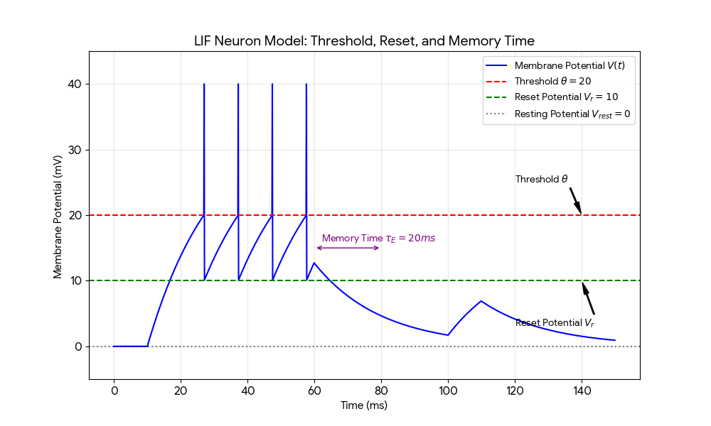

我们将使用 Leaky Integrate-and-Fire (LIF) 模型来模拟神经元的电位变化。在该模型中，神经元像一个漏电的电容器，不断整合输入信号，并在达到阈值时放电。


### 神经元动力学模拟图

在下图中，你可以直观地看到这几个参数如何控制神经元的行为：

1. **Threshold ($\theta = 20$):** 红色虚线。当电位触及此线，神经元发放脉冲（图中垂直的长线）。
2. **Reset Potential ($V_r = 10$):** 绿色虚线。放电结束后，电位立即掉落到的位置。
3. **Memory Time ($\tau_E = 0.02s$):** 紫色双向箭头标注。它决定了电位向静息状态衰减的快慢。



### 画图代码

```python
import numpy as np
import matplotlib.pyplot as plt

# 1. 参数设置
tau_E = 0.02    # 兴奋性神经元时间常数 (20ms)
theta = 20      # 发放阈值 (mV)
V_r = 10        # 复位电位 (mV)
V_rest = 0      # 静息电位 (mV)
dt = 0.0001     # 模拟步长 (0.1ms)
T = 0.15        # 总模拟时间 (150ms)
t = np.arange(0, T, dt)

# 2. 初始化变量
V = np.zeros_like(t)
V[0] = V_rest
# 设置输入电流：在10ms到60ms之间给予刺激
I = np.zeros_like(t)
I[(t > 0.01) & (t < 0.06)] = 35.0 

# 3. 欧拉法数值模拟 (LIF 模型)
v_val = V_rest
for i in range(1, len(t)):
    # 核心公式: dV = (-(V - V_rest) + I) / tau * dt
    dv = (-(v_val - V_rest) + I[i]) / tau_E * dt
    v_val += dv
    
    # 检查是否达到阈值
    if v_val >= theta:
        V[i] = 40   # 绘制脉冲峰值 (仅用于可视化)
        v_val = V_r # 电位重置
    else:
        V[i] = v_val

# 4. 绘图与标注
plt.figure(figsize=(12, 6))
plt.plot(t * 1000, V, label='Membrane Potential $V(t)$', color='#1f77b4', lw=2)

# 标注阈值和复位电位
plt.axhline(y=theta, color='red', linestyle='--', alpha=0.7)
plt.text(152, theta, r'Threshold $\theta$', color='red', va='center')

plt.axhline(y=V_r, color='green', linestyle='--', alpha=0.7)
plt.text(152, V_r, r'Reset $V_r$', color='green', va='center')

# 标注记忆时间 (Tau) - 展示在刺激停止后的衰减过程
# 时间常数定义为电位下降到 1/e (~37%) 所需的时间
decay_start_t = 60 # ms
plt.annotate('', xy=(decay_start_t, 18), xytext=(decay_start_t + tau_E*1000, 18),
             arrowprops=dict(arrowstyle='<->', color='purple', lw=1.5))
plt.text(decay_start_t + 2, 20, r'Memory Time $\tau_E = 20ms$', color='purple', fontweight='bold')

# 修饰图表
plt.title('LIF Neuron Dynamics Simulation', fontsize=14)
plt.xlabel('Time (ms)')
plt.ylabel('Membrane Potential (mV)')
plt.ylim(-5, 45)
plt.xlim(0, 150)
plt.grid(True, which='both', linestyle=':', alpha=0.5)
plt.legend(loc='upper right')

plt.tight_layout()
plt.show()
```

