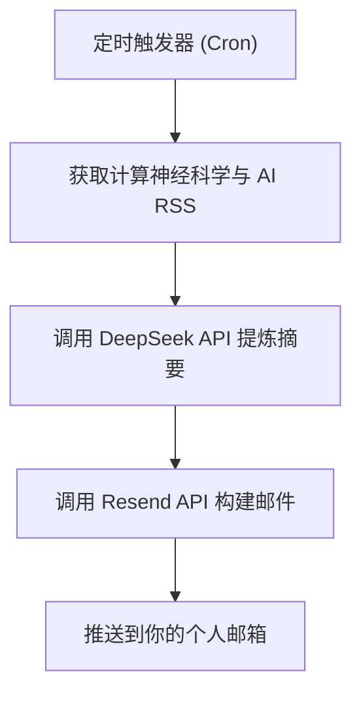

每天只需api费用最多0.35元，平均一个月不到10块（可能只有5块左右？）

这是一个非常极客且高效的方案！将纯代码脚本部署在 **Cloudflare Workers** 上，不仅完全免费、无需维护服务器，还能利用它的 Cron 定时触发器（Cron Triggers）实现完美的自动化。

由于 Cloudflare Workers 原生不支持直接通过 SMTP 发送邮件，我们最优雅的免费方案是结合 **Resend**（一个对开发者极度友好的邮件 API 平台，免费额度每天 100 封，完全足够你一个人使用）。

整体架构如下：

Code snippet



📊 Diagram</> Code

<svg id="mermaid-sltgrfs73" width="100%" xmlns="http://www.w3.org/2000/svg" class="flowchart" style="max-width: 276px; animation: auto ease 0s 1 normal none running none; appearance: none; background: none 0% 0% / auto repeat scroll padding-box border-box rgba(0, 0, 0, 0); border: 0px none rgb(31, 31, 31); inset: auto; clear: none; clip: auto; color: rgb(31, 31, 31); columns: auto; contain: none; container: none; content: normal; cursor: zoom-in; cx: 0px; cy: 0px; d: none; direction: ltr; display: inline; fill: rgb(204, 204, 204); filter: none; flex: 0 1 auto; gap: normal; hyphens: manual; isolation: auto; margin-right: 0px; margin-bottom: 0px; margin-left: 0px; marker: none; mask: none; offset: normal; opacity: 1; order: 0; orphans: 2; outline: rgb(31, 31, 31) none 0px; overlay: none; padding: 0px; page: auto; perspective: none; quotes: auto; r: 0px; resize: none; rotate: none; rx: auto; ry: auto; scale: none; speak: normal; stroke: none; transform: none; transition: all; translate: none; visibility: visible; widows: 2; x: 0px; y: 0px; zoom: 1; margin-top: 0px !important; font-family: &quot;Google Sans Text&quot;, sans-serif !important; line-height: 1.15 !important;" viewBox="0.0000152587890625 0 276.00006103515625 486.0000305175781" role="graphics-document document" aria-roledescription="flowchart-v2"><g style="animation: auto ease 0s 1 normal none running none; appearance: none; background: none 0% 0% / auto repeat scroll padding-box border-box rgba(0, 0, 0, 0); border: 0px none rgb(31, 31, 31); inset: auto; clear: none; clip: auto; color: rgb(31, 31, 31); columns: auto; contain: none; container: none; content: normal; cursor: zoom-in; cx: 0px; cy: 0px; d: none; direction: ltr; display: inline; fill: rgb(204, 204, 204); filter: none; flex: 0 1 auto; float: none; gap: normal; hyphens: manual; interactivity: auto; isolation: auto; margin-top: 0px !important; margin-right: 0px; margin-bottom: 0px; margin-left: 0px; marker: none; mask: none; offset: normal; opacity: 1; order: 0; orphans: 2; outline: rgb(31, 31, 31) none 0px; overlay: none; padding: 0px; page: auto; perspective: none; position: static; quotes: auto; r: 0px; resize: none; rotate: none; rx: auto; ry: auto; scale: none; speak: normal; stroke: none; transform: none; transition: all; translate: none; visibility: visible; widows: 2; x: 0px; y: 0px; zoom: 1; font-family: &quot;Google Sans Text&quot;, sans-serif !important; line-height: 1.15 !important;"><marker id="mermaid-sltgrfs73_flowchart-v2-pointEnd" class="marker flowchart-v2" viewBox="0 0 10 10" refX="5" refY="5" markerUnits="userSpaceOnUse" markerWidth="8" markerHeight="8" orient="auto" style="animation: auto ease 0s 1 normal none running none; appearance: none; background: none 0% 0% / auto repeat scroll padding-box border-box rgba(0, 0, 0, 0); border: 0px none rgb(31, 31, 31); inset: auto; clear: none; clip: auto; color: rgb(31, 31, 31); columns: auto; contain: none; container: none; content: normal; cursor: zoom-in; cx: 0px; cy: 0px; d: none; direction: ltr; display: inline; fill: rgb(211, 211, 211); filter: none; flex: 0 1 auto; float: none; gap: normal; hyphens: manual; interactivity: auto; isolation: auto; margin-top: 0px !important; margin-right: 0px; margin-bottom: 0px; margin-left: 0px; marker: none; mask: none; offset: normal; opacity: 1; order: 0; orphans: 2; outline: rgb(31, 31, 31) none 0px; overlay: none; padding: 0px; page: auto; perspective: none; position: static; quotes: auto; r: 0px; resize: none; rotate: none; rx: auto; ry: auto; scale: none; speak: normal; stroke: rgb(211, 211, 211); transform: none; transition: all; translate: none; visibility: visible; widows: 2; x: 0px; y: 0px; zoom: 1; font-family: &quot;Google Sans Text&quot;, sans-serif !important; line-height: 1.15 !important;"><path d="M 0 0 L 10 5 L 0 10 z" class="arrowMarkerPath" style="stroke-width: 1; stroke-dasharray: 1, 0; animation: auto ease 0s 1 normal none running none; appearance: none; background: none 0% 0% / auto repeat scroll padding-box border-box rgba(0, 0, 0, 0); border: 0px none rgb(31, 31, 31); inset: auto; clear: none; clip: auto; color: rgb(31, 31, 31); columns: auto; contain: none; container: none; content: normal; cursor: zoom-in; cx: 0px; cy: 0px; d: path(&quot;M 0 0 L 10 5 L 0 10 Z&quot;); direction: ltr; display: inline; fill: rgb(211, 211, 211); filter: none; flex: 0 1 auto; float: none; gap: normal; hyphens: manual; interactivity: auto; isolation: auto; margin-top: 0px !important; margin-right: 0px; margin-bottom: 0px; margin-left: 0px; marker: none; mask: none; offset: normal; opacity: 1; order: 0; orphans: 2; outline: rgb(31, 31, 31) none 0px; overlay: none; padding: 0px; page: auto; perspective: none; position: static; quotes: auto; r: 0px; resize: none; rotate: none; rx: auto; ry: auto; scale: none; speak: normal; stroke: rgb(211, 211, 211); transform: none; transition: all; translate: none; visibility: visible; widows: 2; x: 0px; y: 0px; zoom: 1; font-family: &quot;Google Sans Text&quot;, sans-serif !important; line-height: 1.15 !important;"></path></marker><marker id="mermaid-sltgrfs73_flowchart-v2-pointStart" class="marker flowchart-v2" viewBox="0 0 10 10" refX="4.5" refY="5" markerUnits="userSpaceOnUse" markerWidth="8" markerHeight="8" orient="auto" style="animation: auto ease 0s 1 normal none running none; appearance: none; background: none 0% 0% / auto repeat scroll padding-box border-box rgba(0, 0, 0, 0); border: 0px none rgb(31, 31, 31); inset: auto; clear: none; clip: auto; color: rgb(31, 31, 31); columns: auto; contain: none; container: none; content: normal; cursor: zoom-in; cx: 0px; cy: 0px; d: none; direction: ltr; display: inline; fill: rgb(211, 211, 211); filter: none; flex: 0 1 auto; float: none; gap: normal; hyphens: manual; interactivity: auto; isolation: auto; margin-top: 0px !important; margin-right: 0px; margin-bottom: 0px; margin-left: 0px; marker: none; mask: none; offset: normal; opacity: 1; order: 0; orphans: 2; outline: rgb(31, 31, 31) none 0px; overlay: none; padding: 0px; page: auto; perspective: none; position: static; quotes: auto; r: 0px; resize: none; rotate: none; rx: auto; ry: auto; scale: none; speak: normal; stroke: rgb(211, 211, 211); transform: none; transition: all; translate: none; visibility: visible; widows: 2; x: 0px; y: 0px; zoom: 1; font-family: &quot;Google Sans Text&quot;, sans-serif !important; line-height: 1.15 !important;"><path d="M 0 5 L 10 10 L 10 0 z" class="arrowMarkerPath" style="stroke-width: 1; stroke-dasharray: 1, 0; animation: auto ease 0s 1 normal none running none; appearance: none; background: none 0% 0% / auto repeat scroll padding-box border-box rgba(0, 0, 0, 0); border: 0px none rgb(31, 31, 31); inset: auto; clear: none; clip: auto; color: rgb(31, 31, 31); columns: auto; contain: none; container: none; content: normal; cursor: zoom-in; cx: 0px; cy: 0px; d: path(&quot;M 0 5 L 10 10 L 10 0 Z&quot;); direction: ltr; display: inline; fill: rgb(211, 211, 211); filter: none; flex: 0 1 auto; float: none; gap: normal; hyphens: manual; interactivity: auto; isolation: auto; margin-top: 0px !important; margin-right: 0px; margin-bottom: 0px; margin-left: 0px; marker: none; mask: none; offset: normal; opacity: 1; order: 0; orphans: 2; outline: rgb(31, 31, 31) none 0px; overlay: none; padding: 0px; page: auto; perspective: none; position: static; quotes: auto; r: 0px; resize: none; rotate: none; rx: auto; ry: auto; scale: none; speak: normal; stroke: rgb(211, 211, 211); transform: none; transition: all; translate: none; visibility: visible; widows: 2; x: 0px; y: 0px; zoom: 1; font-family: &quot;Google Sans Text&quot;, sans-serif !important; line-height: 1.15 !important;"></path></marker><marker id="mermaid-sltgrfs73_flowchart-v2-circleEnd" class="marker flowchart-v2" viewBox="0 0 10 10" refX="11" refY="5" markerUnits="userSpaceOnUse" markerWidth="11" markerHeight="11" orient="auto" style="animation: auto ease 0s 1 normal none running none; appearance: none; background: none 0% 0% / auto repeat scroll padding-box border-box rgba(0, 0, 0, 0); border: 0px none rgb(31, 31, 31); inset: auto; clear: none; clip: auto; color: rgb(31, 31, 31); columns: auto; contain: none; container: none; content: normal; cursor: zoom-in; cx: 0px; cy: 0px; d: none; direction: ltr; display: inline; fill: rgb(211, 211, 211); filter: none; flex: 0 1 auto; float: none; gap: normal; hyphens: manual; interactivity: auto; isolation: auto; margin-top: 0px !important; margin-right: 0px; margin-bottom: 0px; margin-left: 0px; marker: none; mask: none; offset: normal; opacity: 1; order: 0; orphans: 2; outline: rgb(31, 31, 31) none 0px; overlay: none; padding: 0px; page: auto; perspective: none; position: static; quotes: auto; r: 0px; resize: none; rotate: none; rx: auto; ry: auto; scale: none; speak: normal; stroke: rgb(211, 211, 211); transform: none; transition: all; translate: none; visibility: visible; widows: 2; x: 0px; y: 0px; zoom: 1; font-family: &quot;Google Sans Text&quot;, sans-serif !important; line-height: 1.15 !important;"><circle cx="5" cy="5" r="5" class="arrowMarkerPath" style="stroke-width: 1; stroke-dasharray: 1, 0; animation: auto ease 0s 1 normal none running none; appearance: none; background: none 0% 0% / auto repeat scroll padding-box border-box rgba(0, 0, 0, 0); border: 0px none rgb(31, 31, 31); inset: auto; clear: none; clip: auto; color: rgb(31, 31, 31); columns: auto; contain: none; container: none; content: normal; cursor: zoom-in; cx: 5px; cy: 5px; d: none; direction: ltr; display: inline; fill: rgb(211, 211, 211); filter: none; flex: 0 1 auto; float: none; gap: normal; hyphens: manual; interactivity: auto; isolation: auto; margin-top: 0px !important; margin-right: 0px; margin-bottom: 0px; margin-left: 0px; marker: none; mask: none; offset: normal; opacity: 1; order: 0; orphans: 2; outline: rgb(31, 31, 31) none 0px; overlay: none; padding: 0px; page: auto; perspective: none; position: static; quotes: auto; r: 5px; resize: none; rotate: none; rx: auto; ry: auto; scale: none; speak: normal; stroke: rgb(211, 211, 211); transform: none; transition: all; translate: none; visibility: visible; widows: 2; x: 0px; y: 0px; zoom: 1; font-family: &quot;Google Sans Text&quot;, sans-serif !important; line-height: 1.15 !important;"></circle></marker><marker id="mermaid-sltgrfs73_flowchart-v2-circleStart" class="marker flowchart-v2" viewBox="0 0 10 10" refX="-1" refY="5" markerUnits="userSpaceOnUse" markerWidth="11" markerHeight="11" orient="auto" style="animation: auto ease 0s 1 normal none running none; appearance: none; background: none 0% 0% / auto repeat scroll padding-box border-box rgba(0, 0, 0, 0); border: 0px none rgb(31, 31, 31); inset: auto; clear: none; clip: auto; color: rgb(31, 31, 31); columns: auto; contain: none; container: none; content: normal; cursor: zoom-in; cx: 0px; cy: 0px; d: none; direction: ltr; display: inline; fill: rgb(211, 211, 211); filter: none; flex: 0 1 auto; float: none; gap: normal; hyphens: manual; interactivity: auto; isolation: auto; margin-top: 0px !important; margin-right: 0px; margin-bottom: 0px; margin-left: 0px; marker: none; mask: none; offset: normal; opacity: 1; order: 0; orphans: 2; outline: rgb(31, 31, 31) none 0px; overlay: none; padding: 0px; page: auto; perspective: none; position: static; quotes: auto; r: 0px; resize: none; rotate: none; rx: auto; ry: auto; scale: none; speak: normal; stroke: rgb(211, 211, 211); transform: none; transition: all; translate: none; visibility: visible; widows: 2; x: 0px; y: 0px; zoom: 1; font-family: &quot;Google Sans Text&quot;, sans-serif !important; line-height: 1.15 !important;"><circle cx="5" cy="5" r="5" class="arrowMarkerPath" style="stroke-width: 1; stroke-dasharray: 1, 0; animation: auto ease 0s 1 normal none running none; appearance: none; background: none 0% 0% / auto repeat scroll padding-box border-box rgba(0, 0, 0, 0); border: 0px none rgb(31, 31, 31); inset: auto; clear: none; clip: auto; color: rgb(31, 31, 31); columns: auto; contain: none; container: none; content: normal; cursor: zoom-in; cx: 5px; cy: 5px; d: none; direction: ltr; display: inline; fill: rgb(211, 211, 211); filter: none; flex: 0 1 auto; float: none; gap: normal; hyphens: manual; interactivity: auto; isolation: auto; margin-top: 0px !important; margin-right: 0px; margin-bottom: 0px; margin-left: 0px; marker: none; mask: none; offset: normal; opacity: 1; order: 0; orphans: 2; outline: rgb(31, 31, 31) none 0px; overlay: none; padding: 0px; page: auto; perspective: none; position: static; quotes: auto; r: 5px; resize: none; rotate: none; rx: auto; ry: auto; scale: none; speak: normal; stroke: rgb(211, 211, 211); transform: none; transition: all; translate: none; visibility: visible; widows: 2; x: 0px; y: 0px; zoom: 1; font-family: &quot;Google Sans Text&quot;, sans-serif !important; line-height: 1.15 !important;"></circle></marker><marker id="mermaid-sltgrfs73_flowchart-v2-crossEnd" class="marker cross flowchart-v2" viewBox="0 0 11 11" refX="12" refY="5.2" markerUnits="userSpaceOnUse" markerWidth="11" markerHeight="11" orient="auto" style="animation: auto ease 0s 1 normal none running none; appearance: none; background: none 0% 0% / auto repeat scroll padding-box border-box rgba(0, 0, 0, 0); border: 0px none rgb(31, 31, 31); inset: auto; clear: none; clip: auto; color: rgb(31, 31, 31); columns: auto; contain: none; container: none; content: normal; cursor: zoom-in; cx: 0px; cy: 0px; d: none; direction: ltr; display: inline; fill: rgb(211, 211, 211); filter: none; flex: 0 1 auto; float: none; gap: normal; hyphens: manual; interactivity: auto; isolation: auto; margin-top: 0px !important; margin-right: 0px; margin-bottom: 0px; margin-left: 0px; marker: none; mask: none; offset: normal; opacity: 1; order: 0; orphans: 2; outline: rgb(31, 31, 31) none 0px; overlay: none; padding: 0px; page: auto; perspective: none; position: static; quotes: auto; r: 0px; resize: none; rotate: none; rx: auto; ry: auto; scale: none; speak: normal; stroke: rgb(211, 211, 211); transform: none; transition: all; translate: none; visibility: visible; widows: 2; x: 0px; y: 0px; zoom: 1; font-family: &quot;Google Sans Text&quot;, sans-serif !important; line-height: 1.15 !important;"><path d="M 1,1 l 9,9 M 10,1 l -9,9" class="arrowMarkerPath" style="stroke-width: 2; stroke-dasharray: 1, 0; animation: auto ease 0s 1 normal none running none; appearance: none; background: none 0% 0% / auto repeat scroll padding-box border-box rgba(0, 0, 0, 0); border: 0px none rgb(31, 31, 31); inset: auto; clear: none; clip: auto; color: rgb(31, 31, 31); columns: auto; contain: none; container: none; content: normal; cursor: zoom-in; cx: 0px; cy: 0px; d: path(&quot;M 1 1 L 10 10 M 10 1 L 1 10&quot;); direction: ltr; display: inline; fill: rgb(211, 211, 211); filter: none; flex: 0 1 auto; float: none; gap: normal; hyphens: manual; interactivity: auto; isolation: auto; margin-top: 0px !important; margin-right: 0px; margin-bottom: 0px; margin-left: 0px; marker: none; mask: none; offset: normal; opacity: 1; order: 0; orphans: 2; outline: rgb(31, 31, 31) none 0px; overlay: none; padding: 0px; page: auto; perspective: none; position: static; quotes: auto; r: 0px; resize: none; rotate: none; rx: auto; ry: auto; scale: none; speak: normal; stroke: rgb(211, 211, 211); transform: none; transition: all; translate: none; visibility: visible; widows: 2; x: 0px; y: 0px; zoom: 1; font-family: &quot;Google Sans Text&quot;, sans-serif !important; line-height: 1.15 !important;"></path></marker><marker id="mermaid-sltgrfs73_flowchart-v2-crossStart" class="marker cross flowchart-v2" viewBox="0 0 11 11" refX="-1" refY="5.2" markerUnits="userSpaceOnUse" markerWidth="11" markerHeight="11" orient="auto" style="animation: auto ease 0s 1 normal none running none; appearance: none; background: none 0% 0% / auto repeat scroll padding-box border-box rgba(0, 0, 0, 0); border: 0px none rgb(31, 31, 31); inset: auto; clear: none; clip: auto; color: rgb(31, 31, 31); columns: auto; contain: none; container: none; content: normal; cursor: zoom-in; cx: 0px; cy: 0px; d: none; direction: ltr; display: inline; fill: rgb(211, 211, 211); filter: none; flex: 0 1 auto; float: none; gap: normal; hyphens: manual; interactivity: auto; isolation: auto; margin-top: 0px !important; margin-right: 0px; margin-bottom: 0px; margin-left: 0px; marker: none; mask: none; offset: normal; opacity: 1; order: 0; orphans: 2; outline: rgb(31, 31, 31) none 0px; overlay: none; padding: 0px; page: auto; perspective: none; position: static; quotes: auto; r: 0px; resize: none; rotate: none; rx: auto; ry: auto; scale: none; speak: normal; stroke: rgb(211, 211, 211); transform: none; transition: all; translate: none; visibility: visible; widows: 2; x: 0px; y: 0px; zoom: 1; font-family: &quot;Google Sans Text&quot;, sans-serif !important; line-height: 1.15 !important;"><path d="M 1,1 l 9,9 M 10,1 l -9,9" class="arrowMarkerPath" style="stroke-width: 2; stroke-dasharray: 1, 0; animation: auto ease 0s 1 normal none running none; appearance: none; background: none 0% 0% / auto repeat scroll padding-box border-box rgba(0, 0, 0, 0); border: 0px none rgb(31, 31, 31); inset: auto; clear: none; clip: auto; color: rgb(31, 31, 31); columns: auto; contain: none; container: none; content: normal; cursor: zoom-in; cx: 0px; cy: 0px; d: path(&quot;M 1 1 L 10 10 M 10 1 L 1 10&quot;); direction: ltr; display: inline; fill: rgb(211, 211, 211); filter: none; flex: 0 1 auto; float: none; gap: normal; hyphens: manual; interactivity: auto; isolation: auto; margin-top: 0px !important; margin-right: 0px; margin-bottom: 0px; margin-left: 0px; marker: none; mask: none; offset: normal; opacity: 1; order: 0; orphans: 2; outline: rgb(31, 31, 31) none 0px; overlay: none; padding: 0px; page: auto; perspective: none; position: static; quotes: auto; r: 0px; resize: none; rotate: none; rx: auto; ry: auto; scale: none; speak: normal; stroke: rgb(211, 211, 211); transform: none; transition: all; translate: none; visibility: visible; widows: 2; x: 0px; y: 0px; zoom: 1; font-family: &quot;Google Sans Text&quot;, sans-serif !important; line-height: 1.15 !important;"></path></marker><g class="root" style="animation: auto ease 0s 1 normal none running none; appearance: none; background: none 0% 0% / auto repeat scroll padding-box border-box rgba(0, 0, 0, 0); border: 0px none rgb(31, 31, 31); inset: auto; clear: none; clip: auto; color: rgb(31, 31, 31); columns: auto; contain: none; container: none; content: normal; cursor: zoom-in; cx: 0px; cy: 0px; d: none; direction: ltr; display: inline; fill: rgb(204, 204, 204); filter: none; flex: 0 1 auto; float: none; gap: normal; hyphens: manual; interactivity: auto; isolation: auto; margin-top: 0px !important; margin-right: 0px; margin-bottom: 0px; margin-left: 0px; marker: none; mask: none; offset: normal; opacity: 1; order: 0; orphans: 2; outline: rgb(31, 31, 31) none 0px; overlay: none; padding: 0px; page: auto; perspective: none; position: static; quotes: auto; r: 0px; resize: none; rotate: none; rx: auto; ry: auto; scale: none; speak: normal; stroke: none; transform: none; transition: all; translate: none; visibility: visible; widows: 2; x: 0px; y: 0px; zoom: 1; font-family: &quot;Google Sans Text&quot;, sans-serif !important; line-height: 1.15 !important;"><g class="clusters" style="animation: auto ease 0s 1 normal none running none; appearance: none; background: none 0% 0% / auto repeat scroll padding-box border-box rgba(0, 0, 0, 0); border: 0px none rgb(31, 31, 31); inset: auto; clear: none; clip: auto; color: rgb(31, 31, 31); columns: auto; contain: none; container: none; content: normal; cursor: zoom-in; cx: 0px; cy: 0px; d: none; direction: ltr; display: inline; fill: rgb(204, 204, 204); filter: none; flex: 0 1 auto; float: none; gap: normal; hyphens: manual; interactivity: auto; isolation: auto; margin-top: 0px !important; margin-right: 0px; margin-bottom: 0px; margin-left: 0px; marker: none; mask: none; offset: normal; opacity: 1; order: 0; orphans: 2; outline: rgb(31, 31, 31) none 0px; overlay: none; padding: 0px; page: auto; perspective: none; position: static; quotes: auto; r: 0px; resize: none; rotate: none; rx: auto; ry: auto; scale: none; speak: normal; stroke: none; transform: none; transition: all; translate: none; visibility: visible; widows: 2; x: 0px; y: 0px; zoom: 1; font-family: &quot;Google Sans Text&quot;, sans-serif !important; line-height: 1.15 !important;"></g><g class="edgePaths" style="animation: auto ease 0s 1 normal none running none; appearance: none; background: none 0% 0% / auto repeat scroll padding-box border-box rgba(0, 0, 0, 0); border: 0px none rgb(31, 31, 31); inset: auto; clear: none; clip: auto; color: rgb(31, 31, 31); columns: auto; contain: none; container: none; content: normal; cursor: zoom-in; cx: 0px; cy: 0px; d: none; direction: ltr; display: inline; fill: rgb(204, 204, 204); filter: none; flex: 0 1 auto; float: none; gap: normal; hyphens: manual; interactivity: auto; isolation: auto; margin-top: 0px !important; margin-right: 0px; margin-bottom: 0px; margin-left: 0px; marker: none; mask: none; offset: normal; opacity: 1; order: 0; orphans: 2; outline: rgb(31, 31, 31) none 0px; overlay: none; padding: 0px; page: auto; perspective: none; position: static; quotes: auto; r: 0px; resize: none; rotate: none; rx: auto; ry: auto; scale: none; speak: normal; stroke: none; transform: none; transition: all; translate: none; visibility: visible; widows: 2; x: 0px; y: 0px; zoom: 1; font-family: &quot;Google Sans Text&quot;, sans-serif !important; line-height: 1.15 !important;"><path d="M138,62L138,66.167C138,70.333,138,78.667,138,86.333C138,94,138,101,138,104.5L138,108" id="L_A_B_0" class=" edge-thickness-normal edge-pattern-solid edge-thickness-normal edge-pattern-solid flowchart-link" style="animation: auto ease 0s 1 normal none running none; appearance: none; background: none 0% 0% / auto repeat scroll padding-box border-box rgba(0, 0, 0, 0); border: 0px none rgb(31, 31, 31); inset: auto; clear: none; clip: auto; color: rgb(31, 31, 31); columns: auto; contain: none; container: none; content: normal; cursor: zoom-in; cx: 0px; cy: 0px; d: path(&quot;M 138 62 L 138 66.167 C 138 70.333 138 78.667 138 86.333 C 138 94 138 101 138 104.5 L 138 108&quot;); direction: ltr; display: inline; fill: none; filter: none; flex: 0 1 auto; float: none; gap: normal; hyphens: manual; interactivity: auto; isolation: auto; margin-top: 0px !important; margin-right: 0px; margin-bottom: 0px; margin-left: 0px; mask: none; offset: normal; opacity: 1; order: 0; orphans: 2; outline: rgb(31, 31, 31) none 0px; overlay: none; padding: 0px; page: auto; perspective: none; position: static; quotes: auto; r: 0px; resize: none; rotate: none; rx: auto; ry: auto; scale: none; speak: normal; stroke: rgb(211, 211, 211); transform: none; transition: all; translate: none; visibility: visible; widows: 2; x: 0px; y: 0px; zoom: 1; font-family: &quot;Google Sans Text&quot;, sans-serif !important; line-height: 1.15 !important;" data-edge="true" data-et="edge" data-id="L_A_B_0" data-points="W3sieCI6MTM4LjAwMDAxNTI1ODc4OTA2LCJ5Ijo2Mn0seyJ4IjoxMzguMDAwMDE1MjU4Nzg5MDYsInkiOjg3fSx7IngiOjEzOC4wMDAwMTUyNTg3ODkwNiwieSI6MTEyfV0=" marker-end="url(#mermaid-sltgrfs73_flowchart-v2-pointEnd)"></path><path d="M138,166L138,170.167C138,174.333,138,182.667,138,190.333C138,198,138,205,138,208.5L138,212" id="L_B_C_0" class=" edge-thickness-normal edge-pattern-solid edge-thickness-normal edge-pattern-solid flowchart-link" style="animation: auto ease 0s 1 normal none running none; appearance: none; background: none 0% 0% / auto repeat scroll padding-box border-box rgba(0, 0, 0, 0); border: 0px none rgb(31, 31, 31); inset: auto; clear: none; clip: auto; color: rgb(31, 31, 31); columns: auto; contain: none; container: none; content: normal; cursor: zoom-in; cx: 0px; cy: 0px; d: path(&quot;M 138 166 L 138 170.167 C 138 174.333 138 182.667 138 190.333 C 138 198 138 205 138 208.5 L 138 212&quot;); direction: ltr; display: inline; fill: none; filter: none; flex: 0 1 auto; float: none; gap: normal; hyphens: manual; interactivity: auto; isolation: auto; margin-top: 0px !important; margin-right: 0px; margin-bottom: 0px; margin-left: 0px; mask: none; offset: normal; opacity: 1; order: 0; orphans: 2; outline: rgb(31, 31, 31) none 0px; overlay: none; padding: 0px; page: auto; perspective: none; position: static; quotes: auto; r: 0px; resize: none; rotate: none; rx: auto; ry: auto; scale: none; speak: normal; stroke: rgb(211, 211, 211); transform: none; transition: all; translate: none; visibility: visible; widows: 2; x: 0px; y: 0px; zoom: 1; font-family: &quot;Google Sans Text&quot;, sans-serif !important; line-height: 1.15 !important;" data-edge="true" data-et="edge" data-id="L_B_C_0" data-points="W3sieCI6MTM4LjAwMDAxNTI1ODc4OTA2LCJ5IjoxNjZ9LHsieCI6MTM4LjAwMDAxNTI1ODc4OTA2LCJ5IjoxOTF9LHsieCI6MTM4LjAwMDAxNTI1ODc4OTA2LCJ5IjoyMTZ9XQ==" marker-end="url(#mermaid-sltgrfs73_flowchart-v2-pointEnd)"></path><path d="M138,270L138,274.167C138,278.333,138,286.667,138,294.333C138,302,138,309,138,312.5L138,316" id="L_C_D_0" class=" edge-thickness-normal edge-pattern-solid edge-thickness-normal edge-pattern-solid flowchart-link" style="animation: auto ease 0s 1 normal none running none; appearance: none; background: none 0% 0% / auto repeat scroll padding-box border-box rgba(0, 0, 0, 0); border: 0px none rgb(31, 31, 31); inset: auto; clear: none; clip: auto; color: rgb(31, 31, 31); columns: auto; contain: none; container: none; content: normal; cursor: zoom-in; cx: 0px; cy: 0px; d: path(&quot;M 138 270 L 138 274.167 C 138 278.333 138 286.667 138 294.333 C 138 302 138 309 138 312.5 L 138 316&quot;); direction: ltr; display: inline; fill: none; filter: none; flex: 0 1 auto; float: none; gap: normal; hyphens: manual; interactivity: auto; isolation: auto; margin-top: 0px !important; margin-right: 0px; margin-bottom: 0px; margin-left: 0px; mask: none; offset: normal; opacity: 1; order: 0; orphans: 2; outline: rgb(31, 31, 31) none 0px; overlay: none; padding: 0px; page: auto; perspective: none; position: static; quotes: auto; r: 0px; resize: none; rotate: none; rx: auto; ry: auto; scale: none; speak: normal; stroke: rgb(211, 211, 211); transform: none; transition: all; translate: none; visibility: visible; widows: 2; x: 0px; y: 0px; zoom: 1; font-family: &quot;Google Sans Text&quot;, sans-serif !important; line-height: 1.15 !important;" data-edge="true" data-et="edge" data-id="L_C_D_0" data-points="W3sieCI6MTM4LjAwMDAxNTI1ODc4OTA2LCJ5IjoyNzB9LHsieCI6MTM4LjAwMDAxNTI1ODc4OTA2LCJ5IjoyOTV9LHsieCI6MTM4LjAwMDAxNTI1ODc4OTA2LCJ5IjozMjB9XQ==" marker-end="url(#mermaid-sltgrfs73_flowchart-v2-pointEnd)"></path><path d="M138,374L138,378.167C138,382.333,138,390.667,138,398.333C138,406,138,413,138,416.5L138,420" id="L_D_E_0" class=" edge-thickness-normal edge-pattern-solid edge-thickness-normal edge-pattern-solid flowchart-link" style="animation: auto ease 0s 1 normal none running none; appearance: none; background: none 0% 0% / auto repeat scroll padding-box border-box rgba(0, 0, 0, 0); border: 0px none rgb(31, 31, 31); inset: auto; clear: none; clip: auto; color: rgb(31, 31, 31); columns: auto; contain: none; container: none; content: normal; cursor: zoom-in; cx: 0px; cy: 0px; d: path(&quot;M 138 374 L 138 378.167 C 138 382.333 138 390.667 138 398.333 C 138 406 138 413 138 416.5 L 138 420&quot;); direction: ltr; display: inline; fill: none; filter: none; flex: 0 1 auto; float: none; gap: normal; hyphens: manual; interactivity: auto; isolation: auto; margin-top: 0px !important; margin-right: 0px; margin-bottom: 0px; margin-left: 0px; mask: none; offset: normal; opacity: 1; order: 0; orphans: 2; outline: rgb(31, 31, 31) none 0px; overlay: none; padding: 0px; page: auto; perspective: none; position: static; quotes: auto; r: 0px; resize: none; rotate: none; rx: auto; ry: auto; scale: none; speak: normal; stroke: rgb(211, 211, 211); transform: none; transition: all; translate: none; visibility: visible; widows: 2; x: 0px; y: 0px; zoom: 1; font-family: &quot;Google Sans Text&quot;, sans-serif !important; line-height: 1.15 !important;" data-edge="true" data-et="edge" data-id="L_D_E_0" data-points="W3sieCI6MTM4LjAwMDAxNTI1ODc4OTA2LCJ5IjozNzR9LHsieCI6MTM4LjAwMDAxNTI1ODc4OTA2LCJ5IjozOTl9LHsieCI6MTM4LjAwMDAxNTI1ODc4OTA2LCJ5Ijo0MjR9XQ==" marker-end="url(#mermaid-sltgrfs73_flowchart-v2-pointEnd)"></path></g><g class="edgeLabels" style="animation: auto ease 0s 1 normal none running none; appearance: none; background: none 0% 0% / auto repeat scroll padding-box border-box rgba(0, 0, 0, 0); border: 0px none rgb(31, 31, 31); inset: auto; clear: none; clip: auto; color: rgb(31, 31, 31); columns: auto; contain: none; container: none; content: normal; cursor: zoom-in; cx: 0px; cy: 0px; d: none; direction: ltr; display: inline; fill: rgb(204, 204, 204); filter: none; flex: 0 1 auto; float: none; gap: normal; hyphens: manual; interactivity: auto; isolation: auto; margin-top: 0px !important; margin-right: 0px; margin-bottom: 0px; margin-left: 0px; marker: none; mask: none; offset: normal; opacity: 1; order: 0; orphans: 2; outline: rgb(31, 31, 31) none 0px; overlay: none; padding: 0px; page: auto; perspective: none; position: static; quotes: auto; r: 0px; resize: none; rotate: none; rx: auto; ry: auto; scale: none; speak: normal; stroke: none; transform: none; transition: all; translate: none; visibility: visible; widows: 2; x: 0px; y: 0px; zoom: 1; font-family: &quot;Google Sans Text&quot;, sans-serif !important; line-height: 1.15 !important;"><g class="edgeLabel" style="animation: auto ease 0s 1 normal none running none; appearance: none; background: none 0% 0% / auto repeat scroll padding-box border-box rgb(88, 88, 88); border: 0px none rgb(31, 31, 31); inset: auto; clear: none; clip: auto; color: rgb(31, 31, 31); columns: auto; contain: none; container: none; content: normal; cursor: zoom-in; cx: 0px; cy: 0px; d: none; direction: ltr; display: inline; fill: rgb(204, 204, 204); filter: none; flex: 0 1 auto; float: none; gap: normal; hyphens: manual; interactivity: auto; isolation: auto; margin-top: 0px !important; margin-right: 0px; margin-bottom: 0px; margin-left: 0px; marker: none; mask: none; offset: normal; opacity: 1; order: 0; orphans: 2; outline: rgb(31, 31, 31) none 0px; overlay: none; padding: 0px; page: auto; perspective: none; position: static; quotes: auto; r: 0px; resize: none; rotate: none; rx: auto; ry: auto; scale: none; speak: normal; stroke: none; transform: none; transition: all; translate: none; visibility: visible; widows: 2; x: 0px; y: 0px; zoom: 1; font-family: &quot;Google Sans Text&quot;, sans-serif !important; line-height: 1.15 !important;"><g class="label" data-id="L_A_B_0" transform="translate(0, 0)" style="animation: auto ease 0s 1 normal none running none; appearance: none; background: none 0% 0% / auto repeat scroll padding-box border-box rgba(0, 0, 0, 0); border: 0px none rgb(204, 204, 204); inset: auto; clear: none; clip: auto; color: rgb(204, 204, 204); columns: auto; contain: none; container: none; content: normal; cursor: zoom-in; cx: 0px; cy: 0px; d: none; direction: ltr; display: inline; fill: rgb(204, 204, 204); filter: none; flex: 0 1 auto; float: none; gap: normal; hyphens: manual; interactivity: auto; isolation: auto; margin-top: 0px !important; margin-right: 0px; margin-bottom: 0px; margin-left: 0px; marker: none; mask: none; offset: normal; opacity: 1; order: 0; orphans: 2; outline: rgb(204, 204, 204) none 0px; overlay: none; padding: 0px; page: auto; perspective: none; position: static; quotes: auto; r: 0px; resize: none; rotate: none; rx: auto; ry: auto; scale: none; speak: normal; stroke: none; transform: matrix(1, 0, 0, 1, 0, 0); transition: all; translate: none; visibility: visible; widows: 2; x: 0px; y: 0px; zoom: 1; font-family: &quot;Google Sans Text&quot;, sans-serif !important; line-height: 1.15 !important;"><foreignObject width="0" height="0" style="animation: auto ease 0s 1 normal none running none; appearance: none; background: none 0% 0% / auto repeat scroll padding-box border-box rgba(0, 0, 0, 0); border: 0px none rgb(204, 204, 204); inset: auto; clear: none; clip: auto; color: rgb(204, 204, 204); columns: auto; contain: none; container: none; content: normal; cursor: zoom-in; cx: 0px; cy: 0px; d: none; direction: ltr; display: block; fill: rgb(204, 204, 204); filter: none; flex: 0 1 auto; float: none; gap: normal; hyphens: manual; interactivity: auto; isolation: auto; margin-top: 0px !important; margin-right: 0px; margin-bottom: 0px; margin-left: 0px; marker: none; mask: none; offset: normal; opacity: 1; order: 0; orphans: 2; outline: rgb(204, 204, 204) none 0px; overlay: none; padding: 0px; page: auto; perspective: none; position: static; quotes: auto; r: 0px; resize: none; rotate: none; rx: auto; ry: auto; scale: none; speak: normal; stroke: none; transform: none; transition: all; translate: none; visibility: visible; widows: 2; x: 0px; y: 0px; zoom: 1; font-family: &quot;Google Sans Text&quot;, sans-serif !important; line-height: 1.15 !important;"><div xmlns="http://www.w3.org/1999/xhtml" class="labelBkg" style="display: table-cell; white-space: nowrap; line-height: 1.15 !important; max-width: 200px; text-align: center; animation: auto ease 0s 1 normal none running none; appearance: none; background: none 0% 0% / auto repeat scroll padding-box border-box rgba(88, 88, 88, 0.5); border: 0px none rgb(204, 204, 204); inset: auto; clear: none; clip: auto; color: rgb(204, 204, 204); columns: auto; contain: none; container: none; content: normal; cursor: zoom-in; cx: 0px; cy: 0px; d: none; direction: ltr; fill: rgb(204, 204, 204); filter: none; flex: 0 1 auto; float: none; gap: normal; hyphens: manual; interactivity: auto; isolation: auto; margin-top: 0px !important; margin-right: 0px; margin-bottom: 0px; margin-left: 0px; marker: none; mask: none; offset: normal; opacity: 1; order: 0; orphans: 2; outline: rgb(204, 204, 204) none 0px; overlay: none; padding: 0px; page: auto; perspective: none; position: static; quotes: auto; r: 0px; resize: none; rotate: none; rx: auto; ry: auto; scale: none; speak: normal; stroke: none; transform: none; transition: all; translate: none; visibility: visible; widows: 2; x: 0px; y: 0px; zoom: 1; font-family: &quot;Google Sans Text&quot;, sans-serif !important;"><span class="edgeLabel " style="animation: auto ease 0s 1 normal none running none; appearance: none; background: none 0% 0% / auto repeat scroll padding-box border-box rgb(88, 88, 88); border: 0px none rgb(204, 204, 204); inset: auto; clear: none; clip: auto; color: rgb(204, 204, 204); columns: auto; contain: none; container: none; content: normal; cursor: zoom-in; cx: 0px; cy: 0px; d: none; direction: ltr; display: inline; fill: rgb(204, 204, 204); filter: none; flex: 0 1 auto; float: none; gap: normal; hyphens: manual; interactivity: auto; isolation: auto; margin-top: 0px !important; margin-right: 0px; margin-bottom: 0px; margin-left: 0px; marker: none; mask: none; offset: normal; opacity: 1; order: 0; orphans: 2; outline: rgb(204, 204, 204) none 0px; overlay: none; padding: 0px; page: auto; perspective: none; position: static; quotes: auto; r: 0px; resize: none; rotate: none; rx: auto; ry: auto; scale: none; speak: normal; stroke: none; transform: none; transition: all; translate: none; visibility: visible; widows: 2; x: 0px; y: 0px; zoom: 1; font-family: &quot;Google Sans Text&quot;, sans-serif !important; line-height: 1.15 !important;"></span></div></foreignObject></g></g><g class="edgeLabel" style="animation: auto ease 0s 1 normal none running none; appearance: none; background: none 0% 0% / auto repeat scroll padding-box border-box rgb(88, 88, 88); border: 0px none rgb(31, 31, 31); inset: auto; clear: none; clip: auto; color: rgb(31, 31, 31); columns: auto; contain: none; container: none; content: normal; cursor: zoom-in; cx: 0px; cy: 0px; d: none; direction: ltr; display: inline; fill: rgb(204, 204, 204); filter: none; flex: 0 1 auto; float: none; gap: normal; hyphens: manual; interactivity: auto; isolation: auto; margin-top: 0px !important; margin-right: 0px; margin-bottom: 0px; margin-left: 0px; marker: none; mask: none; offset: normal; opacity: 1; order: 0; orphans: 2; outline: rgb(31, 31, 31) none 0px; overlay: none; padding: 0px; page: auto; perspective: none; position: static; quotes: auto; r: 0px; resize: none; rotate: none; rx: auto; ry: auto; scale: none; speak: normal; stroke: none; transform: none; transition: all; translate: none; visibility: visible; widows: 2; x: 0px; y: 0px; zoom: 1; font-family: &quot;Google Sans Text&quot;, sans-serif !important; line-height: 1.15 !important;"><g class="label" data-id="L_B_C_0" transform="translate(0, 0)" style="animation: auto ease 0s 1 normal none running none; appearance: none; background: none 0% 0% / auto repeat scroll padding-box border-box rgba(0, 0, 0, 0); border: 0px none rgb(204, 204, 204); inset: auto; clear: none; clip: auto; color: rgb(204, 204, 204); columns: auto; contain: none; container: none; content: normal; cursor: zoom-in; cx: 0px; cy: 0px; d: none; direction: ltr; display: inline; fill: rgb(204, 204, 204); filter: none; flex: 0 1 auto; float: none; gap: normal; hyphens: manual; interactivity: auto; isolation: auto; margin-top: 0px !important; margin-right: 0px; margin-bottom: 0px; margin-left: 0px; marker: none; mask: none; offset: normal; opacity: 1; order: 0; orphans: 2; outline: rgb(204, 204, 204) none 0px; overlay: none; padding: 0px; page: auto; perspective: none; position: static; quotes: auto; r: 0px; resize: none; rotate: none; rx: auto; ry: auto; scale: none; speak: normal; stroke: none; transform: matrix(1, 0, 0, 1, 0, 0); transition: all; translate: none; visibility: visible; widows: 2; x: 0px; y: 0px; zoom: 1; font-family: &quot;Google Sans Text&quot;, sans-serif !important; line-height: 1.15 !important;"><foreignObject width="0" height="0" style="animation: auto ease 0s 1 normal none running none; appearance: none; background: none 0% 0% / auto repeat scroll padding-box border-box rgba(0, 0, 0, 0); border: 0px none rgb(204, 204, 204); inset: auto; clear: none; clip: auto; color: rgb(204, 204, 204); columns: auto; contain: none; container: none; content: normal; cursor: zoom-in; cx: 0px; cy: 0px; d: none; direction: ltr; display: block; fill: rgb(204, 204, 204); filter: none; flex: 0 1 auto; float: none; gap: normal; hyphens: manual; interactivity: auto; isolation: auto; margin-top: 0px !important; margin-right: 0px; margin-bottom: 0px; margin-left: 0px; marker: none; mask: none; offset: normal; opacity: 1; order: 0; orphans: 2; outline: rgb(204, 204, 204) none 0px; overlay: none; padding: 0px; page: auto; perspective: none; position: static; quotes: auto; r: 0px; resize: none; rotate: none; rx: auto; ry: auto; scale: none; speak: normal; stroke: none; transform: none; transition: all; translate: none; visibility: visible; widows: 2; x: 0px; y: 0px; zoom: 1; font-family: &quot;Google Sans Text&quot;, sans-serif !important; line-height: 1.15 !important;"><div xmlns="http://www.w3.org/1999/xhtml" class="labelBkg" style="display: table-cell; white-space: nowrap; line-height: 1.15 !important; max-width: 200px; text-align: center; animation: auto ease 0s 1 normal none running none; appearance: none; background: none 0% 0% / auto repeat scroll padding-box border-box rgba(88, 88, 88, 0.5); border: 0px none rgb(204, 204, 204); inset: auto; clear: none; clip: auto; color: rgb(204, 204, 204); columns: auto; contain: none; container: none; content: normal; cursor: zoom-in; cx: 0px; cy: 0px; d: none; direction: ltr; fill: rgb(204, 204, 204); filter: none; flex: 0 1 auto; float: none; gap: normal; hyphens: manual; interactivity: auto; isolation: auto; margin-top: 0px !important; margin-right: 0px; margin-bottom: 0px; margin-left: 0px; marker: none; mask: none; offset: normal; opacity: 1; order: 0; orphans: 2; outline: rgb(204, 204, 204) none 0px; overlay: none; padding: 0px; page: auto; perspective: none; position: static; quotes: auto; r: 0px; resize: none; rotate: none; rx: auto; ry: auto; scale: none; speak: normal; stroke: none; transform: none; transition: all; translate: none; visibility: visible; widows: 2; x: 0px; y: 0px; zoom: 1; font-family: &quot;Google Sans Text&quot;, sans-serif !important;"><span class="edgeLabel " style="animation: auto ease 0s 1 normal none running none; appearance: none; background: none 0% 0% / auto repeat scroll padding-box border-box rgb(88, 88, 88); border: 0px none rgb(204, 204, 204); inset: auto; clear: none; clip: auto; color: rgb(204, 204, 204); columns: auto; contain: none; container: none; content: normal; cursor: zoom-in; cx: 0px; cy: 0px; d: none; direction: ltr; display: inline; fill: rgb(204, 204, 204); filter: none; flex: 0 1 auto; float: none; gap: normal; hyphens: manual; interactivity: auto; isolation: auto; margin-top: 0px !important; margin-right: 0px; margin-bottom: 0px; margin-left: 0px; marker: none; mask: none; offset: normal; opacity: 1; order: 0; orphans: 2; outline: rgb(204, 204, 204) none 0px; overlay: none; padding: 0px; page: auto; perspective: none; position: static; quotes: auto; r: 0px; resize: none; rotate: none; rx: auto; ry: auto; scale: none; speak: normal; stroke: none; transform: none; transition: all; translate: none; visibility: visible; widows: 2; x: 0px; y: 0px; zoom: 1; font-family: &quot;Google Sans Text&quot;, sans-serif !important; line-height: 1.15 !important;"></span></div></foreignObject></g></g><g class="edgeLabel" style="animation: auto ease 0s 1 normal none running none; appearance: none; background: none 0% 0% / auto repeat scroll padding-box border-box rgb(88, 88, 88); border: 0px none rgb(31, 31, 31); inset: auto; clear: none; clip: auto; color: rgb(31, 31, 31); columns: auto; contain: none; container: none; content: normal; cursor: zoom-in; cx: 0px; cy: 0px; d: none; direction: ltr; display: inline; fill: rgb(204, 204, 204); filter: none; flex: 0 1 auto; float: none; gap: normal; hyphens: manual; interactivity: auto; isolation: auto; margin-top: 0px !important; margin-right: 0px; margin-bottom: 0px; margin-left: 0px; marker: none; mask: none; offset: normal; opacity: 1; order: 0; orphans: 2; outline: rgb(31, 31, 31) none 0px; overlay: none; padding: 0px; page: auto; perspective: none; position: static; quotes: auto; r: 0px; resize: none; rotate: none; rx: auto; ry: auto; scale: none; speak: normal; stroke: none; transform: none; transition: all; translate: none; visibility: visible; widows: 2; x: 0px; y: 0px; zoom: 1; font-family: &quot;Google Sans Text&quot;, sans-serif !important; line-height: 1.15 !important;"><g class="label" data-id="L_C_D_0" transform="translate(0, 0)" style="animation: auto ease 0s 1 normal none running none; appearance: none; background: none 0% 0% / auto repeat scroll padding-box border-box rgba(0, 0, 0, 0); border: 0px none rgb(204, 204, 204); inset: auto; clear: none; clip: auto; color: rgb(204, 204, 204); columns: auto; contain: none; container: none; content: normal; cursor: zoom-in; cx: 0px; cy: 0px; d: none; direction: ltr; display: inline; fill: rgb(204, 204, 204); filter: none; flex: 0 1 auto; float: none; gap: normal; hyphens: manual; interactivity: auto; isolation: auto; margin-top: 0px !important; margin-right: 0px; margin-bottom: 0px; margin-left: 0px; marker: none; mask: none; offset: normal; opacity: 1; order: 0; orphans: 2; outline: rgb(204, 204, 204) none 0px; overlay: none; padding: 0px; page: auto; perspective: none; position: static; quotes: auto; r: 0px; resize: none; rotate: none; rx: auto; ry: auto; scale: none; speak: normal; stroke: none; transform: matrix(1, 0, 0, 1, 0, 0); transition: all; translate: none; visibility: visible; widows: 2; x: 0px; y: 0px; zoom: 1; font-family: &quot;Google Sans Text&quot;, sans-serif !important; line-height: 1.15 !important;"><foreignObject width="0" height="0" style="animation: auto ease 0s 1 normal none running none; appearance: none; background: none 0% 0% / auto repeat scroll padding-box border-box rgba(0, 0, 0, 0); border: 0px none rgb(204, 204, 204); inset: auto; clear: none; clip: auto; color: rgb(204, 204, 204); columns: auto; contain: none; container: none; content: normal; cursor: zoom-in; cx: 0px; cy: 0px; d: none; direction: ltr; display: block; fill: rgb(204, 204, 204); filter: none; flex: 0 1 auto; float: none; gap: normal; hyphens: manual; interactivity: auto; isolation: auto; margin-top: 0px !important; margin-right: 0px; margin-bottom: 0px; margin-left: 0px; marker: none; mask: none; offset: normal; opacity: 1; order: 0; orphans: 2; outline: rgb(204, 204, 204) none 0px; overlay: none; padding: 0px; page: auto; perspective: none; position: static; quotes: auto; r: 0px; resize: none; rotate: none; rx: auto; ry: auto; scale: none; speak: normal; stroke: none; transform: none; transition: all; translate: none; visibility: visible; widows: 2; x: 0px; y: 0px; zoom: 1; font-family: &quot;Google Sans Text&quot;, sans-serif !important; line-height: 1.15 !important;"><div xmlns="http://www.w3.org/1999/xhtml" class="labelBkg" style="display: table-cell; white-space: nowrap; line-height: 1.15 !important; max-width: 200px; text-align: center; animation: auto ease 0s 1 normal none running none; appearance: none; background: none 0% 0% / auto repeat scroll padding-box border-box rgba(88, 88, 88, 0.5); border: 0px none rgb(204, 204, 204); inset: auto; clear: none; clip: auto; color: rgb(204, 204, 204); columns: auto; contain: none; container: none; content: normal; cursor: zoom-in; cx: 0px; cy: 0px; d: none; direction: ltr; fill: rgb(204, 204, 204); filter: none; flex: 0 1 auto; float: none; gap: normal; hyphens: manual; interactivity: auto; isolation: auto; margin-top: 0px !important; margin-right: 0px; margin-bottom: 0px; margin-left: 0px; marker: none; mask: none; offset: normal; opacity: 1; order: 0; orphans: 2; outline: rgb(204, 204, 204) none 0px; overlay: none; padding: 0px; page: auto; perspective: none; position: static; quotes: auto; r: 0px; resize: none; rotate: none; rx: auto; ry: auto; scale: none; speak: normal; stroke: none; transform: none; transition: all; translate: none; visibility: visible; widows: 2; x: 0px; y: 0px; zoom: 1; font-family: &quot;Google Sans Text&quot;, sans-serif !important;"><span class="edgeLabel " style="animation: auto ease 0s 1 normal none running none; appearance: none; background: none 0% 0% / auto repeat scroll padding-box border-box rgb(88, 88, 88); border: 0px none rgb(204, 204, 204); inset: auto; clear: none; clip: auto; color: rgb(204, 204, 204); columns: auto; contain: none; container: none; content: normal; cursor: zoom-in; cx: 0px; cy: 0px; d: none; direction: ltr; display: inline; fill: rgb(204, 204, 204); filter: none; flex: 0 1 auto; float: none; gap: normal; hyphens: manual; interactivity: auto; isolation: auto; margin-top: 0px !important; margin-right: 0px; margin-bottom: 0px; margin-left: 0px; marker: none; mask: none; offset: normal; opacity: 1; order: 0; orphans: 2; outline: rgb(204, 204, 204) none 0px; overlay: none; padding: 0px; page: auto; perspective: none; position: static; quotes: auto; r: 0px; resize: none; rotate: none; rx: auto; ry: auto; scale: none; speak: normal; stroke: none; transform: none; transition: all; translate: none; visibility: visible; widows: 2; x: 0px; y: 0px; zoom: 1; font-family: &quot;Google Sans Text&quot;, sans-serif !important; line-height: 1.15 !important;"></span></div></foreignObject></g></g><g class="edgeLabel" style="animation: auto ease 0s 1 normal none running none; appearance: none; background: none 0% 0% / auto repeat scroll padding-box border-box rgb(88, 88, 88); border: 0px none rgb(31, 31, 31); inset: auto; clear: none; clip: auto; color: rgb(31, 31, 31); columns: auto; contain: none; container: none; content: normal; cursor: zoom-in; cx: 0px; cy: 0px; d: none; direction: ltr; display: inline; fill: rgb(204, 204, 204); filter: none; flex: 0 1 auto; float: none; gap: normal; hyphens: manual; interactivity: auto; isolation: auto; margin-top: 0px !important; margin-right: 0px; margin-bottom: 0px; margin-left: 0px; marker: none; mask: none; offset: normal; opacity: 1; order: 0; orphans: 2; outline: rgb(31, 31, 31) none 0px; overlay: none; padding: 0px; page: auto; perspective: none; position: static; quotes: auto; r: 0px; resize: none; rotate: none; rx: auto; ry: auto; scale: none; speak: normal; stroke: none; transform: none; transition: all; translate: none; visibility: visible; widows: 2; x: 0px; y: 0px; zoom: 1; font-family: &quot;Google Sans Text&quot;, sans-serif !important; line-height: 1.15 !important;"><g class="label" data-id="L_D_E_0" transform="translate(0, 0)" style="animation: auto ease 0s 1 normal none running none; appearance: none; background: none 0% 0% / auto repeat scroll padding-box border-box rgba(0, 0, 0, 0); border: 0px none rgb(204, 204, 204); inset: auto; clear: none; clip: auto; color: rgb(204, 204, 204); columns: auto; contain: none; container: none; content: normal; cursor: zoom-in; cx: 0px; cy: 0px; d: none; direction: ltr; display: inline; fill: rgb(204, 204, 204); filter: none; flex: 0 1 auto; float: none; gap: normal; hyphens: manual; interactivity: auto; isolation: auto; margin-top: 0px !important; margin-right: 0px; margin-bottom: 0px; margin-left: 0px; marker: none; mask: none; offset: normal; opacity: 1; order: 0; orphans: 2; outline: rgb(204, 204, 204) none 0px; overlay: none; padding: 0px; page: auto; perspective: none; position: static; quotes: auto; r: 0px; resize: none; rotate: none; rx: auto; ry: auto; scale: none; speak: normal; stroke: none; transform: matrix(1, 0, 0, 1, 0, 0); transition: all; translate: none; visibility: visible; widows: 2; x: 0px; y: 0px; zoom: 1; font-family: &quot;Google Sans Text&quot;, sans-serif !important; line-height: 1.15 !important;"><foreignObject width="0" height="0" style="animation: auto ease 0s 1 normal none running none; appearance: none; background: none 0% 0% / auto repeat scroll padding-box border-box rgba(0, 0, 0, 0); border: 0px none rgb(204, 204, 204); inset: auto; clear: none; clip: auto; color: rgb(204, 204, 204); columns: auto; contain: none; container: none; content: normal; cursor: zoom-in; cx: 0px; cy: 0px; d: none; direction: ltr; display: block; fill: rgb(204, 204, 204); filter: none; flex: 0 1 auto; float: none; gap: normal; hyphens: manual; interactivity: auto; isolation: auto; margin-top: 0px !important; margin-right: 0px; margin-bottom: 0px; margin-left: 0px; marker: none; mask: none; offset: normal; opacity: 1; order: 0; orphans: 2; outline: rgb(204, 204, 204) none 0px; overlay: none; padding: 0px; page: auto; perspective: none; position: static; quotes: auto; r: 0px; resize: none; rotate: none; rx: auto; ry: auto; scale: none; speak: normal; stroke: none; transform: none; transition: all; translate: none; visibility: visible; widows: 2; x: 0px; y: 0px; zoom: 1; font-family: &quot;Google Sans Text&quot;, sans-serif !important; line-height: 1.15 !important;"><div xmlns="http://www.w3.org/1999/xhtml" class="labelBkg" style="display: table-cell; white-space: nowrap; line-height: 1.15 !important; max-width: 200px; text-align: center; animation: auto ease 0s 1 normal none running none; appearance: none; background: none 0% 0% / auto repeat scroll padding-box border-box rgba(88, 88, 88, 0.5); border: 0px none rgb(204, 204, 204); inset: auto; clear: none; clip: auto; color: rgb(204, 204, 204); columns: auto; contain: none; container: none; content: normal; cursor: zoom-in; cx: 0px; cy: 0px; d: none; direction: ltr; fill: rgb(204, 204, 204); filter: none; flex: 0 1 auto; float: none; gap: normal; hyphens: manual; interactivity: auto; isolation: auto; margin-top: 0px !important; margin-right: 0px; margin-bottom: 0px; margin-left: 0px; marker: none; mask: none; offset: normal; opacity: 1; order: 0; orphans: 2; outline: rgb(204, 204, 204) none 0px; overlay: none; padding: 0px; page: auto; perspective: none; position: static; quotes: auto; r: 0px; resize: none; rotate: none; rx: auto; ry: auto; scale: none; speak: normal; stroke: none; transform: none; transition: all; translate: none; visibility: visible; widows: 2; x: 0px; y: 0px; zoom: 1; font-family: &quot;Google Sans Text&quot;, sans-serif !important;"><span class="edgeLabel " style="animation: auto ease 0s 1 normal none running none; appearance: none; background: none 0% 0% / auto repeat scroll padding-box border-box rgb(88, 88, 88); border: 0px none rgb(204, 204, 204); inset: auto; clear: none; clip: auto; color: rgb(204, 204, 204); columns: auto; contain: none; container: none; content: normal; cursor: zoom-in; cx: 0px; cy: 0px; d: none; direction: ltr; display: inline; fill: rgb(204, 204, 204); filter: none; flex: 0 1 auto; float: none; gap: normal; hyphens: manual; interactivity: auto; isolation: auto; margin-top: 0px !important; margin-right: 0px; margin-bottom: 0px; margin-left: 0px; marker: none; mask: none; offset: normal; opacity: 1; order: 0; orphans: 2; outline: rgb(204, 204, 204) none 0px; overlay: none; padding: 0px; page: auto; perspective: none; position: static; quotes: auto; r: 0px; resize: none; rotate: none; rx: auto; ry: auto; scale: none; speak: normal; stroke: none; transform: none; transition: all; translate: none; visibility: visible; widows: 2; x: 0px; y: 0px; zoom: 1; font-family: &quot;Google Sans Text&quot;, sans-serif !important; line-height: 1.15 !important;"></span></div></foreignObject></g></g></g><g class="nodes" style="animation: auto ease 0s 1 normal none running none; appearance: none; background: none 0% 0% / auto repeat scroll padding-box border-box rgba(0, 0, 0, 0); border: 0px none rgb(31, 31, 31); inset: auto; clear: none; clip: auto; color: rgb(31, 31, 31); columns: auto; contain: none; container: none; content: normal; cursor: zoom-in; cx: 0px; cy: 0px; d: none; direction: ltr; display: inline; fill: rgb(204, 204, 204); filter: none; flex: 0 1 auto; float: none; gap: normal; hyphens: manual; interactivity: auto; isolation: auto; margin-top: 0px !important; margin-right: 0px; margin-bottom: 0px; margin-left: 0px; marker: none; mask: none; offset: normal; opacity: 1; order: 0; orphans: 2; outline: rgb(31, 31, 31) none 0px; overlay: none; padding: 0px; page: auto; perspective: none; position: static; quotes: auto; r: 0px; resize: none; rotate: none; rx: auto; ry: auto; scale: none; speak: normal; stroke: none; transform: none; transition: all; translate: none; visibility: visible; widows: 2; x: 0px; y: 0px; zoom: 1; font-family: &quot;Google Sans Text&quot;, sans-serif !important; line-height: 1.15 !important;"><g class="node default  " id="flowchart-A-0" transform="translate(138.00001525878906, 35)" style="animation: auto ease 0s 1 normal none running none; appearance: none; background: none 0% 0% / auto repeat scroll padding-box border-box rgba(0, 0, 0, 0); border: 0px none rgb(31, 31, 31); inset: auto; clear: none; clip: auto; color: rgb(31, 31, 31); columns: auto; contain: none; container: none; content: normal; cursor: zoom-in; cx: 0px; cy: 0px; d: none; direction: ltr; display: inline; fill: rgb(204, 204, 204); filter: none; flex: 0 1 auto; float: none; gap: normal; hyphens: manual; interactivity: auto; isolation: auto; margin-top: 0px !important; margin-right: 0px; margin-bottom: 0px; margin-left: 0px; marker: none; mask: none; offset: normal; opacity: 1; order: 0; orphans: 2; outline: rgb(31, 31, 31) none 0px; overlay: none; padding: 0px; page: auto; perspective: none; position: static; quotes: auto; r: 0px; resize: none; rotate: none; rx: auto; ry: auto; scale: none; speak: normal; stroke: none; transform: matrix(1, 0, 0, 1, 138, 35); transition: all; translate: none; visibility: visible; widows: 2; x: 0px; y: 0px; zoom: 1; font-family: &quot;Google Sans Text&quot;, sans-serif !important; line-height: 1.15 !important;"><rect class="basic label-container" style="animation: auto ease 0s 1 normal none running none; appearance: none; background: none 0% 0% / auto repeat scroll padding-box border-box rgba(0, 0, 0, 0); border: 0px none rgb(31, 31, 31); inset: auto; clear: none; clip: auto; color: rgb(31, 31, 31); columns: auto; contain: none; container: none; content: normal; cursor: zoom-in; cx: 0px; cy: 0px; d: none; direction: ltr; display: inline; fill: rgb(31, 32, 32); filter: none; flex: 0 1 auto; float: none; gap: normal; hyphens: manual; interactivity: auto; isolation: auto; margin-top: 0px !important; margin-right: 0px; margin-bottom: 0px; margin-left: 0px; marker: none; mask: none; offset: normal; opacity: 1; order: 0; orphans: 2; outline: rgb(31, 31, 31) none 0px; overlay: none; padding: 0px; page: auto; perspective: none; position: static; quotes: auto; r: 0px; resize: none; rotate: none; rx: auto; ry: auto; scale: none; speak: normal; stroke: rgb(204, 204, 204); transform: none; transition: all; translate: none; visibility: visible; widows: 2; x: -95.2009px; y: -27px; zoom: 1; font-family: &quot;Google Sans Text&quot;, sans-serif !important; line-height: 1.15 !important;" x="-95.20089721679688" y="-27.000000953674316" width="190.40179443359375" height="54.00000190734863"></rect><g class="label" style="animation: auto ease 0s 1 normal none running none; appearance: none; background: none 0% 0% / auto repeat scroll padding-box border-box rgba(0, 0, 0, 0); border: 0px none rgb(204, 204, 204); inset: auto; clear: none; clip: auto; color: rgb(204, 204, 204); columns: auto; contain: none; container: none; content: normal; cursor: zoom-in; cx: 0px; cy: 0px; d: none; direction: ltr; display: inline; fill: rgb(204, 204, 204); filter: none; flex: 0 1 auto; float: none; gap: normal; hyphens: manual; interactivity: auto; isolation: auto; margin-top: 0px !important; margin-right: 0px; margin-bottom: 0px; margin-left: 0px; marker: none; mask: none; offset: normal; opacity: 1; order: 0; orphans: 2; outline: rgb(204, 204, 204) none 0px; overlay: none; padding: 0px; page: auto; perspective: none; position: static; quotes: auto; r: 0px; resize: none; rotate: none; rx: auto; ry: auto; scale: none; speak: normal; stroke: none; transform: matrix(1, 0, 0, 1, -65.2009, -12); transition: all; translate: none; visibility: visible; widows: 2; x: 0px; y: 0px; zoom: 1; font-family: &quot;Google Sans Text&quot;, sans-serif !important; line-height: 1.15 !important;" transform="translate(-65.20089721679688, -12.000000953674316)"><rect style="animation: auto ease 0s 1 normal none running none; appearance: none; background: none 0% 0% / auto repeat scroll padding-box border-box rgba(0, 0, 0, 0); border: 0px none rgb(204, 204, 204); inset: auto; clear: none; clip: auto; color: rgb(204, 204, 204); columns: auto; contain: none; container: none; content: normal; cursor: zoom-in; cx: 0px; cy: 0px; d: none; direction: ltr; display: inline; fill: rgb(31, 32, 32); filter: none; flex: 0 1 auto; float: none; gap: normal; hyphens: manual; interactivity: auto; isolation: auto; margin-top: 0px !important; margin-right: 0px; margin-bottom: 0px; margin-left: 0px; marker: none; mask: none; offset: normal; opacity: 1; order: 0; orphans: 2; outline: rgb(204, 204, 204) none 0px; overlay: none; padding: 0px; page: auto; perspective: none; position: static; quotes: auto; r: 0px; resize: none; rotate: none; rx: auto; ry: auto; scale: none; speak: normal; stroke: rgb(204, 204, 204); transform: none; transition: all; translate: none; visibility: visible; widows: 2; x: 0px; y: 0px; zoom: 1; font-family: &quot;Google Sans Text&quot;, sans-serif !important; line-height: 1.15 !important;"></rect><foreignObject width="130.40179443359375" height="24.000001907348633" style="animation: auto ease 0s 1 normal none running none; appearance: none; background: none 0% 0% / auto repeat scroll padding-box border-box rgba(0, 0, 0, 0); border: 0px none rgb(204, 204, 204); inset: auto; clear: none; clip: auto; color: rgb(204, 204, 204); columns: auto; contain: none; container: none; content: normal; cursor: zoom-in; cx: 0px; cy: 0px; d: none; direction: ltr; display: block; fill: rgb(204, 204, 204); filter: none; flex: 0 1 auto; float: none; gap: normal; hyphens: manual; interactivity: auto; isolation: auto; margin-top: 0px !important; margin-right: 0px; margin-bottom: 0px; margin-left: 0px; marker: none; mask: none; offset: normal; opacity: 1; order: 0; orphans: 2; outline: rgb(204, 204, 204) none 0px; overlay: none; padding: 0px; page: auto; perspective: none; position: static; quotes: auto; r: 0px; resize: none; rotate: none; rx: auto; ry: auto; scale: none; speak: normal; stroke: none; transform: none; transition: all; translate: none; visibility: visible; widows: 2; x: 0px; y: 0px; zoom: 1; font-family: &quot;Google Sans Text&quot;, sans-serif !important; line-height: 1.15 !important;"><div xmlns="http://www.w3.org/1999/xhtml" style="display: table-cell; white-space: nowrap; line-height: 1.15 !important; max-width: 200px; text-align: center; animation: auto ease 0s 1 normal none running none; appearance: none; background: none 0% 0% / auto repeat scroll padding-box border-box rgba(0, 0, 0, 0); border: 0px none rgb(204, 204, 204); inset: auto; clear: none; clip: auto; color: rgb(204, 204, 204); columns: auto; contain: none; container: none; content: normal; cursor: zoom-in; cx: 0px; cy: 0px; d: none; direction: ltr; fill: rgb(204, 204, 204); filter: none; flex: 0 1 auto; float: none; gap: normal; hyphens: manual; interactivity: auto; isolation: auto; margin-top: 0px !important; margin-right: 0px; margin-bottom: 0px; margin-left: 0px; marker: none; mask: none; offset: normal; opacity: 1; order: 0; orphans: 2; outline: rgb(204, 204, 204) none 0px; overlay: none; padding: 0px; page: auto; perspective: none; position: static; quotes: auto; r: 0px; resize: none; rotate: none; rx: auto; ry: auto; scale: none; speak: normal; stroke: none; transform: none; transition: all; translate: none; visibility: visible; widows: 2; x: 0px; y: 0px; zoom: 1; font-family: &quot;Google Sans Text&quot;, sans-serif !important;"><span class="nodeLabel " style="animation: auto ease 0s 1 normal none running none; appearance: none; background: none 0% 0% / auto repeat scroll padding-box border-box rgba(0, 0, 0, 0); border: 0px none rgb(204, 204, 204); inset: auto; clear: none; clip: auto; color: rgb(204, 204, 204); columns: auto; contain: none; container: none; content: normal; cursor: zoom-in; cx: 0px; cy: 0px; d: none; direction: ltr; display: inline; fill: rgb(204, 204, 204); filter: none; flex: 0 1 auto; float: none; gap: normal; hyphens: manual; interactivity: auto; isolation: auto; margin-top: 0px !important; margin-right: 0px; margin-bottom: 0px; margin-left: 0px; marker: none; mask: none; offset: normal; opacity: 1; order: 0; orphans: 2; outline: rgb(204, 204, 204) none 0px; overlay: none; padding: 0px; page: auto; perspective: none; position: static; quotes: auto; r: 0px; resize: none; rotate: none; rx: auto; ry: auto; scale: none; speak: normal; stroke: none; transform: none; transition: all; translate: none; visibility: visible; widows: 2; x: 0px; y: 0px; zoom: 1; font-family: &quot;Google Sans Text&quot;, sans-serif !important; line-height: 1.15 !important;"><p style="animation: auto ease 0s 1 normal none running none; appearance: none; background: none 0% 0% / auto repeat scroll padding-box border-box rgba(0, 0, 0, 0); border: 0px none rgb(204, 204, 204); inset: auto; clear: none; clip: auto; color: rgb(204, 204, 204); columns: auto; contain: none; container: none; content: normal; cursor: zoom-in; cx: 0px; cy: 0px; d: none; direction: ltr; display: block; fill: rgb(204, 204, 204); filter: none; flex: 0 1 auto; float: none; gap: normal; hyphens: manual; interactivity: auto; isolation: auto; margin-top: 0px !important; margin-right: 0px; margin-bottom: 0px; margin-left: 0px; marker: none; mask: none; offset: normal; opacity: 1; order: 0; orphans: 2; outline: rgb(204, 204, 204) none 0px; overlay: none; padding: 0px; page: auto; perspective: none; position: static; quotes: auto; r: 0px; resize: none; rotate: none; rx: auto; ry: auto; scale: none; speak: normal; stroke: none; transform: none; transition: all; translate: none; visibility: visible; widows: 2; x: 0px; y: 0px; zoom: 1; font-family: &quot;Google Sans Text&quot;, sans-serif !important; line-height: 1.15 !important;">定时触发器 (Cron)</p></span></div></foreignObject></g></g><g class="node default  " id="flowchart-B-1" transform="translate(138.00001525878906, 139)" style="animation: auto ease 0s 1 normal none running none; appearance: none; background: none 0% 0% / auto repeat scroll padding-box border-box rgba(0, 0, 0, 0); border: 0px none rgb(31, 31, 31); inset: auto; clear: none; clip: auto; color: rgb(31, 31, 31); columns: auto; contain: none; container: none; content: normal; cursor: zoom-in; cx: 0px; cy: 0px; d: none; direction: ltr; display: inline; fill: rgb(204, 204, 204); filter: none; flex: 0 1 auto; float: none; gap: normal; hyphens: manual; interactivity: auto; isolation: auto; margin-top: 0px !important; margin-right: 0px; margin-bottom: 0px; margin-left: 0px; marker: none; mask: none; offset: normal; opacity: 1; order: 0; orphans: 2; outline: rgb(31, 31, 31) none 0px; overlay: none; padding: 0px; page: auto; perspective: none; position: static; quotes: auto; r: 0px; resize: none; rotate: none; rx: auto; ry: auto; scale: none; speak: normal; stroke: none; transform: matrix(1, 0, 0, 1, 138, 139); transition: all; translate: none; visibility: visible; widows: 2; x: 0px; y: 0px; zoom: 1; font-family: &quot;Google Sans Text&quot;, sans-serif !important; line-height: 1.15 !important;"><rect class="basic label-container" style="animation: auto ease 0s 1 normal none running none; appearance: none; background: none 0% 0% / auto repeat scroll padding-box border-box rgba(0, 0, 0, 0); border: 0px none rgb(31, 31, 31); inset: auto; clear: none; clip: auto; color: rgb(31, 31, 31); columns: auto; contain: none; container: none; content: normal; cursor: zoom-in; cx: 0px; cy: 0px; d: none; direction: ltr; display: inline; fill: rgb(31, 32, 32); filter: none; flex: 0 1 auto; float: none; gap: normal; hyphens: manual; interactivity: auto; isolation: auto; margin-top: 0px !important; margin-right: 0px; margin-bottom: 0px; margin-left: 0px; marker: none; mask: none; offset: normal; opacity: 1; order: 0; orphans: 2; outline: rgb(31, 31, 31) none 0px; overlay: none; padding: 0px; page: auto; perspective: none; position: static; quotes: auto; r: 0px; resize: none; rotate: none; rx: auto; ry: auto; scale: none; speak: normal; stroke: rgb(204, 204, 204); transform: none; transition: all; translate: none; visibility: visible; widows: 2; x: -127.746px; y: -27px; zoom: 1; font-family: &quot;Google Sans Text&quot;, sans-serif !important; line-height: 1.15 !important;" x="-127.74553680419922" y="-27.000000953674316" width="255.49107360839844" height="54.00000190734863"></rect><g class="label" style="animation: auto ease 0s 1 normal none running none; appearance: none; background: none 0% 0% / auto repeat scroll padding-box border-box rgba(0, 0, 0, 0); border: 0px none rgb(204, 204, 204); inset: auto; clear: none; clip: auto; color: rgb(204, 204, 204); columns: auto; contain: none; container: none; content: normal; cursor: zoom-in; cx: 0px; cy: 0px; d: none; direction: ltr; display: inline; fill: rgb(204, 204, 204); filter: none; flex: 0 1 auto; float: none; gap: normal; hyphens: manual; interactivity: auto; isolation: auto; margin-top: 0px !important; margin-right: 0px; margin-bottom: 0px; margin-left: 0px; marker: none; mask: none; offset: normal; opacity: 1; order: 0; orphans: 2; outline: rgb(204, 204, 204) none 0px; overlay: none; padding: 0px; page: auto; perspective: none; position: static; quotes: auto; r: 0px; resize: none; rotate: none; rx: auto; ry: auto; scale: none; speak: normal; stroke: none; transform: matrix(1, 0, 0, 1, -97.7455, -12); transition: all; translate: none; visibility: visible; widows: 2; x: 0px; y: 0px; zoom: 1; font-family: &quot;Google Sans Text&quot;, sans-serif !important; line-height: 1.15 !important;" transform="translate(-97.74553680419922, -12.000000953674316)"><rect style="animation: auto ease 0s 1 normal none running none; appearance: none; background: none 0% 0% / auto repeat scroll padding-box border-box rgba(0, 0, 0, 0); border: 0px none rgb(204, 204, 204); inset: auto; clear: none; clip: auto; color: rgb(204, 204, 204); columns: auto; contain: none; container: none; content: normal; cursor: zoom-in; cx: 0px; cy: 0px; d: none; direction: ltr; display: inline; fill: rgb(31, 32, 32); filter: none; flex: 0 1 auto; float: none; gap: normal; hyphens: manual; interactivity: auto; isolation: auto; margin-top: 0px !important; margin-right: 0px; margin-bottom: 0px; margin-left: 0px; marker: none; mask: none; offset: normal; opacity: 1; order: 0; orphans: 2; outline: rgb(204, 204, 204) none 0px; overlay: none; padding: 0px; page: auto; perspective: none; position: static; quotes: auto; r: 0px; resize: none; rotate: none; rx: auto; ry: auto; scale: none; speak: normal; stroke: rgb(204, 204, 204); transform: none; transition: all; translate: none; visibility: visible; widows: 2; x: 0px; y: 0px; zoom: 1; font-family: &quot;Google Sans Text&quot;, sans-serif !important; line-height: 1.15 !important;"></rect><foreignObject width="195.49107360839844" height="24.000001907348633" style="animation: auto ease 0s 1 normal none running none; appearance: none; background: none 0% 0% / auto repeat scroll padding-box border-box rgba(0, 0, 0, 0); border: 0px none rgb(204, 204, 204); inset: auto; clear: none; clip: auto; color: rgb(204, 204, 204); columns: auto; contain: none; container: none; content: normal; cursor: zoom-in; cx: 0px; cy: 0px; d: none; direction: ltr; display: block; fill: rgb(204, 204, 204); filter: none; flex: 0 1 auto; float: none; gap: normal; hyphens: manual; interactivity: auto; isolation: auto; margin-top: 0px !important; margin-right: 0px; margin-bottom: 0px; margin-left: 0px; marker: none; mask: none; offset: normal; opacity: 1; order: 0; orphans: 2; outline: rgb(204, 204, 204) none 0px; overlay: none; padding: 0px; page: auto; perspective: none; position: static; quotes: auto; r: 0px; resize: none; rotate: none; rx: auto; ry: auto; scale: none; speak: normal; stroke: none; transform: none; transition: all; translate: none; visibility: visible; widows: 2; x: 0px; y: 0px; zoom: 1; font-family: &quot;Google Sans Text&quot;, sans-serif !important; line-height: 1.15 !important;"><div xmlns="http://www.w3.org/1999/xhtml" style="display: table-cell; white-space: nowrap; line-height: 1.15 !important; max-width: 200px; text-align: center; animation: auto ease 0s 1 normal none running none; appearance: none; background: none 0% 0% / auto repeat scroll padding-box border-box rgba(0, 0, 0, 0); border: 0px none rgb(204, 204, 204); inset: auto; clear: none; clip: auto; color: rgb(204, 204, 204); columns: auto; contain: none; container: none; content: normal; cursor: zoom-in; cx: 0px; cy: 0px; d: none; direction: ltr; fill: rgb(204, 204, 204); filter: none; flex: 0 1 auto; float: none; gap: normal; hyphens: manual; interactivity: auto; isolation: auto; margin-top: 0px !important; margin-right: 0px; margin-bottom: 0px; margin-left: 0px; marker: none; mask: none; offset: normal; opacity: 1; order: 0; orphans: 2; outline: rgb(204, 204, 204) none 0px; overlay: none; padding: 0px; page: auto; perspective: none; position: static; quotes: auto; r: 0px; resize: none; rotate: none; rx: auto; ry: auto; scale: none; speak: normal; stroke: none; transform: none; transition: all; translate: none; visibility: visible; widows: 2; x: 0px; y: 0px; zoom: 1; font-family: &quot;Google Sans Text&quot;, sans-serif !important;"><span class="nodeLabel " style="animation: auto ease 0s 1 normal none running none; appearance: none; background: none 0% 0% / auto repeat scroll padding-box border-box rgba(0, 0, 0, 0); border: 0px none rgb(204, 204, 204); inset: auto; clear: none; clip: auto; color: rgb(204, 204, 204); columns: auto; contain: none; container: none; content: normal; cursor: zoom-in; cx: 0px; cy: 0px; d: none; direction: ltr; display: inline; fill: rgb(204, 204, 204); filter: none; flex: 0 1 auto; float: none; gap: normal; hyphens: manual; interactivity: auto; isolation: auto; margin-top: 0px !important; margin-right: 0px; margin-bottom: 0px; margin-left: 0px; marker: none; mask: none; offset: normal; opacity: 1; order: 0; orphans: 2; outline: rgb(204, 204, 204) none 0px; overlay: none; padding: 0px; page: auto; perspective: none; position: static; quotes: auto; r: 0px; resize: none; rotate: none; rx: auto; ry: auto; scale: none; speak: normal; stroke: none; transform: none; transition: all; translate: none; visibility: visible; widows: 2; x: 0px; y: 0px; zoom: 1; font-family: &quot;Google Sans Text&quot;, sans-serif !important; line-height: 1.15 !important;"><p style="animation: auto ease 0s 1 normal none running none; appearance: none; background: none 0% 0% / auto repeat scroll padding-box border-box rgba(0, 0, 0, 0); border: 0px none rgb(204, 204, 204); inset: auto; clear: none; clip: auto; color: rgb(204, 204, 204); columns: auto; contain: none; container: none; content: normal; cursor: zoom-in; cx: 0px; cy: 0px; d: none; direction: ltr; display: block; fill: rgb(204, 204, 204); filter: none; flex: 0 1 auto; float: none; gap: normal; hyphens: manual; interactivity: auto; isolation: auto; margin-top: 0px !important; margin-right: 0px; margin-bottom: 0px; margin-left: 0px; marker: none; mask: none; offset: normal; opacity: 1; order: 0; orphans: 2; outline: rgb(204, 204, 204) none 0px; overlay: none; padding: 0px; page: auto; perspective: none; position: static; quotes: auto; r: 0px; resize: none; rotate: none; rx: auto; ry: auto; scale: none; speak: normal; stroke: none; transform: none; transition: all; translate: none; visibility: visible; widows: 2; x: 0px; y: 0px; zoom: 1; font-family: &quot;Google Sans Text&quot;, sans-serif !important; line-height: 1.15 !important;">获取计算神经科学与 AI RSS</p></span></div></foreignObject></g></g><g class="node default  " id="flowchart-C-3" transform="translate(138.00001525878906, 243)" style="animation: auto ease 0s 1 normal none running none; appearance: none; background: none 0% 0% / auto repeat scroll padding-box border-box rgba(0, 0, 0, 0); border: 0px none rgb(31, 31, 31); inset: auto; clear: none; clip: auto; color: rgb(31, 31, 31); columns: auto; contain: none; container: none; content: normal; cursor: zoom-in; cx: 0px; cy: 0px; d: none; direction: ltr; display: inline; fill: rgb(204, 204, 204); filter: none; flex: 0 1 auto; float: none; gap: normal; hyphens: manual; interactivity: auto; isolation: auto; margin-top: 0px !important; margin-right: 0px; margin-bottom: 0px; margin-left: 0px; marker: none; mask: none; offset: normal; opacity: 1; order: 0; orphans: 2; outline: rgb(31, 31, 31) none 0px; overlay: none; padding: 0px; page: auto; perspective: none; position: static; quotes: auto; r: 0px; resize: none; rotate: none; rx: auto; ry: auto; scale: none; speak: normal; stroke: none; transform: matrix(1, 0, 0, 1, 138, 243); transition: all; translate: none; visibility: visible; widows: 2; x: 0px; y: 0px; zoom: 1; font-family: &quot;Google Sans Text&quot;, sans-serif !important; line-height: 1.15 !important;"><rect class="basic label-container" style="animation: auto ease 0s 1 normal none running none; appearance: none; background: none 0% 0% / auto repeat scroll padding-box border-box rgba(0, 0, 0, 0); border: 0px none rgb(31, 31, 31); inset: auto; clear: none; clip: auto; color: rgb(31, 31, 31); columns: auto; contain: none; container: none; content: normal; cursor: zoom-in; cx: 0px; cy: 0px; d: none; direction: ltr; display: inline; fill: rgb(31, 32, 32); filter: none; flex: 0 1 auto; float: none; gap: normal; hyphens: manual; interactivity: auto; isolation: auto; margin-top: 0px !important; margin-right: 0px; margin-bottom: 0px; margin-left: 0px; marker: none; mask: none; offset: normal; opacity: 1; order: 0; orphans: 2; outline: rgb(31, 31, 31) none 0px; overlay: none; padding: 0px; page: auto; perspective: none; position: static; quotes: auto; r: 0px; resize: none; rotate: none; rx: auto; ry: auto; scale: none; speak: normal; stroke: rgb(204, 204, 204); transform: none; transition: all; translate: none; visibility: visible; widows: 2; x: -130px; y: -27px; zoom: 1; font-family: &quot;Google Sans Text&quot;, sans-serif !important; line-height: 1.15 !important;" x="-130.00001525878906" y="-27.000000953674316" width="260.0000305175781" height="54.00000190734863"></rect><g class="label" style="animation: auto ease 0s 1 normal none running none; appearance: none; background: none 0% 0% / auto repeat scroll padding-box border-box rgba(0, 0, 0, 0); border: 0px none rgb(204, 204, 204); inset: auto; clear: none; clip: auto; color: rgb(204, 204, 204); columns: auto; contain: none; container: none; content: normal; cursor: zoom-in; cx: 0px; cy: 0px; d: none; direction: ltr; display: inline; fill: rgb(204, 204, 204); filter: none; flex: 0 1 auto; float: none; gap: normal; hyphens: manual; interactivity: auto; isolation: auto; margin-top: 0px !important; margin-right: 0px; margin-bottom: 0px; margin-left: 0px; marker: none; mask: none; offset: normal; opacity: 1; order: 0; orphans: 2; outline: rgb(204, 204, 204) none 0px; overlay: none; padding: 0px; page: auto; perspective: none; position: static; quotes: auto; r: 0px; resize: none; rotate: none; rx: auto; ry: auto; scale: none; speak: normal; stroke: none; transform: matrix(1, 0, 0, 1, -100, -12); transition: all; translate: none; visibility: visible; widows: 2; x: 0px; y: 0px; zoom: 1; font-family: &quot;Google Sans Text&quot;, sans-serif !important; line-height: 1.15 !important;" transform="translate(-100.00001525878906, -12.000000953674316)"><rect style="animation: auto ease 0s 1 normal none running none; appearance: none; background: none 0% 0% / auto repeat scroll padding-box border-box rgba(0, 0, 0, 0); border: 0px none rgb(204, 204, 204); inset: auto; clear: none; clip: auto; color: rgb(204, 204, 204); columns: auto; contain: none; container: none; content: normal; cursor: zoom-in; cx: 0px; cy: 0px; d: none; direction: ltr; display: inline; fill: rgb(31, 32, 32); filter: none; flex: 0 1 auto; float: none; gap: normal; hyphens: manual; interactivity: auto; isolation: auto; margin-top: 0px !important; margin-right: 0px; margin-bottom: 0px; margin-left: 0px; marker: none; mask: none; offset: normal; opacity: 1; order: 0; orphans: 2; outline: rgb(204, 204, 204) none 0px; overlay: none; padding: 0px; page: auto; perspective: none; position: static; quotes: auto; r: 0px; resize: none; rotate: none; rx: auto; ry: auto; scale: none; speak: normal; stroke: rgb(204, 204, 204); transform: none; transition: all; translate: none; visibility: visible; widows: 2; x: 0px; y: 0px; zoom: 1; font-family: &quot;Google Sans Text&quot;, sans-serif !important; line-height: 1.15 !important;"></rect><foreignObject width="200.00003051757812" height="24.000001907348633" style="animation: auto ease 0s 1 normal none running none; appearance: none; background: none 0% 0% / auto repeat scroll padding-box border-box rgba(0, 0, 0, 0); border: 0px none rgb(204, 204, 204); inset: auto; clear: none; clip: auto; color: rgb(204, 204, 204); columns: auto; contain: none; container: none; content: normal; cursor: zoom-in; cx: 0px; cy: 0px; d: none; direction: ltr; display: block; fill: rgb(204, 204, 204); filter: none; flex: 0 1 auto; float: none; gap: normal; hyphens: manual; interactivity: auto; isolation: auto; margin-top: 0px !important; margin-right: 0px; margin-bottom: 0px; margin-left: 0px; marker: none; mask: none; offset: normal; opacity: 1; order: 0; orphans: 2; outline: rgb(204, 204, 204) none 0px; overlay: none; padding: 0px; page: auto; perspective: none; position: static; quotes: auto; r: 0px; resize: none; rotate: none; rx: auto; ry: auto; scale: none; speak: normal; stroke: none; transform: none; transition: all; translate: none; visibility: visible; widows: 2; x: 0px; y: 0px; zoom: 1; font-family: &quot;Google Sans Text&quot;, sans-serif !important; line-height: 1.15 !important;"><div xmlns="http://www.w3.org/1999/xhtml" style="display: table-cell; white-space: nowrap; line-height: 1.15 !important; max-width: 200px; text-align: center; animation: auto ease 0s 1 normal none running none; appearance: none; background: none 0% 0% / auto repeat scroll padding-box border-box rgba(0, 0, 0, 0); border: 0px none rgb(204, 204, 204); inset: auto; clear: none; clip: auto; color: rgb(204, 204, 204); columns: auto; contain: none; container: none; content: normal; cursor: zoom-in; cx: 0px; cy: 0px; d: none; direction: ltr; fill: rgb(204, 204, 204); filter: none; flex: 0 1 auto; float: none; gap: normal; hyphens: manual; interactivity: auto; isolation: auto; margin-top: 0px !important; margin-right: 0px; margin-bottom: 0px; margin-left: 0px; marker: none; mask: none; offset: normal; opacity: 1; order: 0; orphans: 2; outline: rgb(204, 204, 204) none 0px; overlay: none; padding: 0px; page: auto; perspective: none; position: static; quotes: auto; r: 0px; resize: none; rotate: none; rx: auto; ry: auto; scale: none; speak: normal; stroke: none; transform: none; transition: all; translate: none; visibility: visible; widows: 2; x: 0px; y: 0px; zoom: 1; font-family: &quot;Google Sans Text&quot;, sans-serif !important;"><span class="nodeLabel " style="animation: auto ease 0s 1 normal none running none; appearance: none; background: none 0% 0% / auto repeat scroll padding-box border-box rgba(0, 0, 0, 0); border: 0px none rgb(204, 204, 204); inset: auto; clear: none; clip: auto; color: rgb(204, 204, 204); columns: auto; contain: none; container: none; content: normal; cursor: zoom-in; cx: 0px; cy: 0px; d: none; direction: ltr; display: inline; fill: rgb(204, 204, 204); filter: none; flex: 0 1 auto; float: none; gap: normal; hyphens: manual; interactivity: auto; isolation: auto; margin-top: 0px !important; margin-right: 0px; margin-bottom: 0px; margin-left: 0px; marker: none; mask: none; offset: normal; opacity: 1; order: 0; orphans: 2; outline: rgb(204, 204, 204) none 0px; overlay: none; padding: 0px; page: auto; perspective: none; position: static; quotes: auto; r: 0px; resize: none; rotate: none; rx: auto; ry: auto; scale: none; speak: normal; stroke: none; transform: none; transition: all; translate: none; visibility: visible; widows: 2; x: 0px; y: 0px; zoom: 1; font-family: &quot;Google Sans Text&quot;, sans-serif !important; line-height: 1.15 !important;"><p style="animation: auto ease 0s 1 normal none running none; appearance: none; background: none 0% 0% / auto repeat scroll padding-box border-box rgba(0, 0, 0, 0); border: 0px none rgb(204, 204, 204); inset: auto; clear: none; clip: auto; color: rgb(204, 204, 204); columns: auto; contain: none; container: none; content: normal; cursor: zoom-in; cx: 0px; cy: 0px; d: none; direction: ltr; display: block; fill: rgb(204, 204, 204); filter: none; flex: 0 1 auto; float: none; gap: normal; hyphens: manual; interactivity: auto; isolation: auto; margin-top: 0px !important; margin-right: 0px; margin-bottom: 0px; margin-left: 0px; marker: none; mask: none; offset: normal; opacity: 1; order: 0; orphans: 2; outline: rgb(204, 204, 204) none 0px; overlay: none; padding: 0px; page: auto; perspective: none; position: static; quotes: auto; r: 0px; resize: none; rotate: none; rx: auto; ry: auto; scale: none; speak: normal; stroke: none; transform: none; transition: all; translate: none; visibility: visible; widows: 2; x: 0px; y: 0px; zoom: 1; font-family: &quot;Google Sans Text&quot;, sans-serif !important; line-height: 1.15 !important;">调用 DeepSeek API 提炼摘要</p></span></div></foreignObject></g></g><g class="node default  " id="flowchart-D-5" transform="translate(138.00001525878906, 347)" style="animation: auto ease 0s 1 normal none running none; appearance: none; background: none 0% 0% / auto repeat scroll padding-box border-box rgba(0, 0, 0, 0); border: 0px none rgb(31, 31, 31); inset: auto; clear: none; clip: auto; color: rgb(31, 31, 31); columns: auto; contain: none; container: none; content: normal; cursor: zoom-in; cx: 0px; cy: 0px; d: none; direction: ltr; display: inline; fill: rgb(204, 204, 204); filter: none; flex: 0 1 auto; float: none; gap: normal; hyphens: manual; interactivity: auto; isolation: auto; margin-top: 0px !important; margin-right: 0px; margin-bottom: 0px; margin-left: 0px; marker: none; mask: none; offset: normal; opacity: 1; order: 0; orphans: 2; outline: rgb(31, 31, 31) none 0px; overlay: none; padding: 0px; page: auto; perspective: none; position: static; quotes: auto; r: 0px; resize: none; rotate: none; rx: auto; ry: auto; scale: none; speak: normal; stroke: none; transform: matrix(1, 0, 0, 1, 138, 347); transition: all; translate: none; visibility: visible; widows: 2; x: 0px; y: 0px; zoom: 1; font-family: &quot;Google Sans Text&quot;, sans-serif !important; line-height: 1.15 !important;"><rect class="basic label-container" style="animation: auto ease 0s 1 normal none running none; appearance: none; background: none 0% 0% / auto repeat scroll padding-box border-box rgba(0, 0, 0, 0); border: 0px none rgb(31, 31, 31); inset: auto; clear: none; clip: auto; color: rgb(31, 31, 31); columns: auto; contain: none; container: none; content: normal; cursor: zoom-in; cx: 0px; cy: 0px; d: none; direction: ltr; display: inline; fill: rgb(31, 32, 32); filter: none; flex: 0 1 auto; float: none; gap: normal; hyphens: manual; interactivity: auto; isolation: auto; margin-top: 0px !important; margin-right: 0px; margin-bottom: 0px; margin-left: 0px; marker: none; mask: none; offset: normal; opacity: 1; order: 0; orphans: 2; outline: rgb(31, 31, 31) none 0px; overlay: none; padding: 0px; page: auto; perspective: none; position: static; quotes: auto; r: 0px; resize: none; rotate: none; rx: auto; ry: auto; scale: none; speak: normal; stroke: rgb(204, 204, 204); transform: none; transition: all; translate: none; visibility: visible; widows: 2; x: -123.027px; y: -27px; zoom: 1; font-family: &quot;Google Sans Text&quot;, sans-serif !important; line-height: 1.15 !important;" x="-123.02678680419922" y="-27.000000953674316" width="246.05357360839844" height="54.00000190734863"></rect><g class="label" style="animation: auto ease 0s 1 normal none running none; appearance: none; background: none 0% 0% / auto repeat scroll padding-box border-box rgba(0, 0, 0, 0); border: 0px none rgb(204, 204, 204); inset: auto; clear: none; clip: auto; color: rgb(204, 204, 204); columns: auto; contain: none; container: none; content: normal; cursor: zoom-in; cx: 0px; cy: 0px; d: none; direction: ltr; display: inline; fill: rgb(204, 204, 204); filter: none; flex: 0 1 auto; float: none; gap: normal; hyphens: manual; interactivity: auto; isolation: auto; margin-top: 0px !important; margin-right: 0px; margin-bottom: 0px; margin-left: 0px; marker: none; mask: none; offset: normal; opacity: 1; order: 0; orphans: 2; outline: rgb(204, 204, 204) none 0px; overlay: none; padding: 0px; page: auto; perspective: none; position: static; quotes: auto; r: 0px; resize: none; rotate: none; rx: auto; ry: auto; scale: none; speak: normal; stroke: none; transform: matrix(1, 0, 0, 1, -93.0268, -12); transition: all; translate: none; visibility: visible; widows: 2; x: 0px; y: 0px; zoom: 1; font-family: &quot;Google Sans Text&quot;, sans-serif !important; line-height: 1.15 !important;" transform="translate(-93.02678680419922, -12.000000953674316)"><rect style="animation: auto ease 0s 1 normal none running none; appearance: none; background: none 0% 0% / auto repeat scroll padding-box border-box rgba(0, 0, 0, 0); border: 0px none rgb(204, 204, 204); inset: auto; clear: none; clip: auto; color: rgb(204, 204, 204); columns: auto; contain: none; container: none; content: normal; cursor: zoom-in; cx: 0px; cy: 0px; d: none; direction: ltr; display: inline; fill: rgb(31, 32, 32); filter: none; flex: 0 1 auto; float: none; gap: normal; hyphens: manual; interactivity: auto; isolation: auto; margin-top: 0px !important; margin-right: 0px; margin-bottom: 0px; margin-left: 0px; marker: none; mask: none; offset: normal; opacity: 1; order: 0; orphans: 2; outline: rgb(204, 204, 204) none 0px; overlay: none; padding: 0px; page: auto; perspective: none; position: static; quotes: auto; r: 0px; resize: none; rotate: none; rx: auto; ry: auto; scale: none; speak: normal; stroke: rgb(204, 204, 204); transform: none; transition: all; translate: none; visibility: visible; widows: 2; x: 0px; y: 0px; zoom: 1; font-family: &quot;Google Sans Text&quot;, sans-serif !important; line-height: 1.15 !important;"></rect><foreignObject width="186.05357360839844" height="24.000001907348633" style="animation: auto ease 0s 1 normal none running none; appearance: none; background: none 0% 0% / auto repeat scroll padding-box border-box rgba(0, 0, 0, 0); border: 0px none rgb(204, 204, 204); inset: auto; clear: none; clip: auto; color: rgb(204, 204, 204); columns: auto; contain: none; container: none; content: normal; cursor: zoom-in; cx: 0px; cy: 0px; d: none; direction: ltr; display: block; fill: rgb(204, 204, 204); filter: none; flex: 0 1 auto; float: none; gap: normal; hyphens: manual; interactivity: auto; isolation: auto; margin-top: 0px !important; margin-right: 0px; margin-bottom: 0px; margin-left: 0px; marker: none; mask: none; offset: normal; opacity: 1; order: 0; orphans: 2; outline: rgb(204, 204, 204) none 0px; overlay: none; padding: 0px; page: auto; perspective: none; position: static; quotes: auto; r: 0px; resize: none; rotate: none; rx: auto; ry: auto; scale: none; speak: normal; stroke: none; transform: none; transition: all; translate: none; visibility: visible; widows: 2; x: 0px; y: 0px; zoom: 1; font-family: &quot;Google Sans Text&quot;, sans-serif !important; line-height: 1.15 !important;"><div xmlns="http://www.w3.org/1999/xhtml" style="display: table-cell; white-space: nowrap; line-height: 1.15 !important; max-width: 200px; text-align: center; animation: auto ease 0s 1 normal none running none; appearance: none; background: none 0% 0% / auto repeat scroll padding-box border-box rgba(0, 0, 0, 0); border: 0px none rgb(204, 204, 204); inset: auto; clear: none; clip: auto; color: rgb(204, 204, 204); columns: auto; contain: none; container: none; content: normal; cursor: zoom-in; cx: 0px; cy: 0px; d: none; direction: ltr; fill: rgb(204, 204, 204); filter: none; flex: 0 1 auto; float: none; gap: normal; hyphens: manual; interactivity: auto; isolation: auto; margin-top: 0px !important; margin-right: 0px; margin-bottom: 0px; margin-left: 0px; marker: none; mask: none; offset: normal; opacity: 1; order: 0; orphans: 2; outline: rgb(204, 204, 204) none 0px; overlay: none; padding: 0px; page: auto; perspective: none; position: static; quotes: auto; r: 0px; resize: none; rotate: none; rx: auto; ry: auto; scale: none; speak: normal; stroke: none; transform: none; transition: all; translate: none; visibility: visible; widows: 2; x: 0px; y: 0px; zoom: 1; font-family: &quot;Google Sans Text&quot;, sans-serif !important;"><span class="nodeLabel " style="animation: auto ease 0s 1 normal none running none; appearance: none; background: none 0% 0% / auto repeat scroll padding-box border-box rgba(0, 0, 0, 0); border: 0px none rgb(204, 204, 204); inset: auto; clear: none; clip: auto; color: rgb(204, 204, 204); columns: auto; contain: none; container: none; content: normal; cursor: zoom-in; cx: 0px; cy: 0px; d: none; direction: ltr; display: inline; fill: rgb(204, 204, 204); filter: none; flex: 0 1 auto; float: none; gap: normal; hyphens: manual; interactivity: auto; isolation: auto; margin-top: 0px !important; margin-right: 0px; margin-bottom: 0px; margin-left: 0px; marker: none; mask: none; offset: normal; opacity: 1; order: 0; orphans: 2; outline: rgb(204, 204, 204) none 0px; overlay: none; padding: 0px; page: auto; perspective: none; position: static; quotes: auto; r: 0px; resize: none; rotate: none; rx: auto; ry: auto; scale: none; speak: normal; stroke: none; transform: none; transition: all; translate: none; visibility: visible; widows: 2; x: 0px; y: 0px; zoom: 1; font-family: &quot;Google Sans Text&quot;, sans-serif !important; line-height: 1.15 !important;"><p style="animation: auto ease 0s 1 normal none running none; appearance: none; background: none 0% 0% / auto repeat scroll padding-box border-box rgba(0, 0, 0, 0); border: 0px none rgb(204, 204, 204); inset: auto; clear: none; clip: auto; color: rgb(204, 204, 204); columns: auto; contain: none; container: none; content: normal; cursor: zoom-in; cx: 0px; cy: 0px; d: none; direction: ltr; display: block; fill: rgb(204, 204, 204); filter: none; flex: 0 1 auto; float: none; gap: normal; hyphens: manual; interactivity: auto; isolation: auto; margin-top: 0px !important; margin-right: 0px; margin-bottom: 0px; margin-left: 0px; marker: none; mask: none; offset: normal; opacity: 1; order: 0; orphans: 2; outline: rgb(204, 204, 204) none 0px; overlay: none; padding: 0px; page: auto; perspective: none; position: static; quotes: auto; r: 0px; resize: none; rotate: none; rx: auto; ry: auto; scale: none; speak: normal; stroke: none; transform: none; transition: all; translate: none; visibility: visible; widows: 2; x: 0px; y: 0px; zoom: 1; font-family: &quot;Google Sans Text&quot;, sans-serif !important; line-height: 1.15 !important;">调用 Resend API 构建邮件</p></span></div></foreignObject></g></g><g class="node default  " id="flowchart-E-7" transform="translate(138.00001525878906, 451)" style="animation: auto ease 0s 1 normal none running none; appearance: none; background: none 0% 0% / auto repeat scroll padding-box border-box rgba(0, 0, 0, 0); border: 0px none rgb(31, 31, 31); inset: auto; clear: none; clip: auto; color: rgb(31, 31, 31); columns: auto; contain: none; container: none; content: normal; cursor: zoom-in; cx: 0px; cy: 0px; d: none; direction: ltr; display: inline; fill: rgb(204, 204, 204); filter: none; flex: 0 1 auto; float: none; gap: normal; hyphens: manual; interactivity: auto; isolation: auto; margin-top: 0px !important; margin-right: 0px; margin-bottom: 0px; margin-left: 0px; marker: none; mask: none; offset: normal; opacity: 1; order: 0; orphans: 2; outline: rgb(31, 31, 31) none 0px; overlay: none; padding: 0px; page: auto; perspective: none; position: static; quotes: auto; r: 0px; resize: none; rotate: none; rx: auto; ry: auto; scale: none; speak: normal; stroke: none; transform: matrix(1, 0, 0, 1, 138, 451); transition: all; translate: none; visibility: visible; widows: 2; x: 0px; y: 0px; zoom: 1; font-family: &quot;Google Sans Text&quot;, sans-serif !important; line-height: 1.15 !important;"><rect class="basic label-container" style="animation: auto ease 0s 1 normal none running none; appearance: none; background: none 0% 0% / auto repeat scroll padding-box border-box rgba(0, 0, 0, 0); border: 0px none rgb(31, 31, 31); inset: auto; clear: none; clip: auto; color: rgb(31, 31, 31); columns: auto; contain: none; container: none; content: normal; cursor: zoom-in; cx: 0px; cy: 0px; d: none; direction: ltr; display: inline; fill: rgb(31, 32, 32); filter: none; flex: 0 1 auto; float: none; gap: normal; hyphens: manual; interactivity: auto; isolation: auto; margin-top: 0px !important; margin-right: 0px; margin-bottom: 0px; margin-left: 0px; marker: none; mask: none; offset: normal; opacity: 1; order: 0; orphans: 2; outline: rgb(31, 31, 31) none 0px; overlay: none; padding: 0px; page: auto; perspective: none; position: static; quotes: auto; r: 0px; resize: none; rotate: none; rx: auto; ry: auto; scale: none; speak: normal; stroke: rgb(204, 204, 204); transform: none; transition: all; translate: none; visibility: visible; widows: 2; x: -102px; y: -27px; zoom: 1; font-family: &quot;Google Sans Text&quot;, sans-serif !important; line-height: 1.15 !important;" x="-102" y="-27.000000953674316" width="204" height="54.00000190734863"></rect><g class="label" style="animation: auto ease 0s 1 normal none running none; appearance: none; background: none 0% 0% / auto repeat scroll padding-box border-box rgba(0, 0, 0, 0); border: 0px none rgb(204, 204, 204); inset: auto; clear: none; clip: auto; color: rgb(204, 204, 204); columns: auto; contain: none; container: none; content: normal; cursor: zoom-in; cx: 0px; cy: 0px; d: none; direction: ltr; display: inline; fill: rgb(204, 204, 204); filter: none; flex: 0 1 auto; float: none; gap: normal; hyphens: manual; interactivity: auto; isolation: auto; margin-top: 0px !important; margin-right: 0px; margin-bottom: 0px; margin-left: 0px; marker: none; mask: none; offset: normal; opacity: 1; order: 0; orphans: 2; outline: rgb(204, 204, 204) none 0px; overlay: none; padding: 0px; page: auto; perspective: none; position: static; quotes: auto; r: 0px; resize: none; rotate: none; rx: auto; ry: auto; scale: none; speak: normal; stroke: none; transform: matrix(1, 0, 0, 1, -72, -12); transition: all; translate: none; visibility: visible; widows: 2; x: 0px; y: 0px; zoom: 1; font-family: &quot;Google Sans Text&quot;, sans-serif !important; line-height: 1.15 !important;" transform="translate(-72, -12.000000953674316)"><rect style="animation: auto ease 0s 1 normal none running none; appearance: none; background: none 0% 0% / auto repeat scroll padding-box border-box rgba(0, 0, 0, 0); border: 0px none rgb(204, 204, 204); inset: auto; clear: none; clip: auto; color: rgb(204, 204, 204); columns: auto; contain: none; container: none; content: normal; cursor: zoom-in; cx: 0px; cy: 0px; d: none; direction: ltr; display: inline; fill: rgb(31, 32, 32); filter: none; flex: 0 1 auto; float: none; gap: normal; hyphens: manual; interactivity: auto; isolation: auto; margin-top: 0px !important; margin-right: 0px; margin-bottom: 0px; margin-left: 0px; marker: none; mask: none; offset: normal; opacity: 1; order: 0; orphans: 2; outline: rgb(204, 204, 204) none 0px; overlay: none; padding: 0px; page: auto; perspective: none; position: static; quotes: auto; r: 0px; resize: none; rotate: none; rx: auto; ry: auto; scale: none; speak: normal; stroke: rgb(204, 204, 204); transform: none; transition: all; translate: none; visibility: visible; widows: 2; x: 0px; y: 0px; zoom: 1; font-family: &quot;Google Sans Text&quot;, sans-serif !important; line-height: 1.15 !important;"></rect><foreignObject width="144" height="24.000001907348633" style="animation: auto ease 0s 1 normal none running none; appearance: none; background: none 0% 0% / auto repeat scroll padding-box border-box rgba(0, 0, 0, 0); border: 0px none rgb(204, 204, 204); inset: auto; clear: none; clip: auto; color: rgb(204, 204, 204); columns: auto; contain: none; container: none; content: normal; cursor: zoom-in; cx: 0px; cy: 0px; d: none; direction: ltr; display: block; fill: rgb(204, 204, 204); filter: none; flex: 0 1 auto; float: none; gap: normal; hyphens: manual; interactivity: auto; isolation: auto; margin-top: 0px !important; margin-right: 0px; margin-bottom: 0px; margin-left: 0px; marker: none; mask: none; offset: normal; opacity: 1; order: 0; orphans: 2; outline: rgb(204, 204, 204) none 0px; overlay: none; padding: 0px; page: auto; perspective: none; position: static; quotes: auto; r: 0px; resize: none; rotate: none; rx: auto; ry: auto; scale: none; speak: normal; stroke: none; transform: none; transition: all; translate: none; visibility: visible; widows: 2; x: 0px; y: 0px; zoom: 1; font-family: &quot;Google Sans Text&quot;, sans-serif !important; line-height: 1.15 !important;"><div xmlns="http://www.w3.org/1999/xhtml" style="display: table-cell; white-space: nowrap; line-height: 1.15 !important; max-width: 200px; text-align: center; animation: auto ease 0s 1 normal none running none; appearance: none; background: none 0% 0% / auto repeat scroll padding-box border-box rgba(0, 0, 0, 0); border: 0px none rgb(204, 204, 204); inset: auto; clear: none; clip: auto; color: rgb(204, 204, 204); columns: auto; contain: none; container: none; content: normal; cursor: zoom-in; cx: 0px; cy: 0px; d: none; direction: ltr; fill: rgb(204, 204, 204); filter: none; flex: 0 1 auto; float: none; gap: normal; hyphens: manual; interactivity: auto; isolation: auto; margin-top: 0px !important; margin-right: 0px; margin-bottom: 0px; margin-left: 0px; marker: none; mask: none; offset: normal; opacity: 1; order: 0; orphans: 2; outline: rgb(204, 204, 204) none 0px; overlay: none; padding: 0px; page: auto; perspective: none; position: static; quotes: auto; r: 0px; resize: none; rotate: none; rx: auto; ry: auto; scale: none; speak: normal; stroke: none; transform: none; transition: all; translate: none; visibility: visible; widows: 2; x: 0px; y: 0px; zoom: 1; font-family: &quot;Google Sans Text&quot;, sans-serif !important;"><span class="nodeLabel " style="animation: auto ease 0s 1 normal none running none; appearance: none; background: none 0% 0% / auto repeat scroll padding-box border-box rgba(0, 0, 0, 0); border: 0px none rgb(204, 204, 204); inset: auto; clear: none; clip: auto; color: rgb(204, 204, 204); columns: auto; contain: none; container: none; content: normal; cursor: zoom-in; cx: 0px; cy: 0px; d: none; direction: ltr; display: inline; fill: rgb(204, 204, 204); filter: none; flex: 0 1 auto; float: none; gap: normal; hyphens: manual; interactivity: auto; isolation: auto; margin-top: 0px !important; margin-right: 0px; margin-bottom: 0px; margin-left: 0px; marker: none; mask: none; offset: normal; opacity: 1; order: 0; orphans: 2; outline: rgb(204, 204, 204) none 0px; overlay: none; padding: 0px; page: auto; perspective: none; position: static; quotes: auto; r: 0px; resize: none; rotate: none; rx: auto; ry: auto; scale: none; speak: normal; stroke: none; transform: none; transition: all; translate: none; visibility: visible; widows: 2; x: 0px; y: 0px; zoom: 1; font-family: &quot;Google Sans Text&quot;, sans-serif !important; line-height: 1.15 !important;"><p style="animation: auto ease 0s 1 normal none running none; appearance: none; background: none 0% 0% / auto repeat scroll padding-box border-box rgba(0, 0, 0, 0); border: 0px none rgb(204, 204, 204); inset: auto; clear: none; clip: auto; color: rgb(204, 204, 204); columns: auto; contain: none; container: none; content: normal; cursor: zoom-in; cx: 0px; cy: 0px; d: none; direction: ltr; display: block; fill: rgb(204, 204, 204); filter: none; flex: 0 1 auto; float: none; gap: normal; hyphens: manual; interactivity: auto; isolation: auto; margin-top: 0px !important; margin-right: 0px; margin-bottom: 0px; margin-left: 0px; marker: none; mask: none; offset: normal; opacity: 1; order: 0; orphans: 2; outline: rgb(204, 204, 204) none 0px; overlay: none; padding: 0px; page: auto; perspective: none; position: static; quotes: auto; r: 0px; resize: none; rotate: none; rx: auto; ry: auto; scale: none; speak: normal; stroke: none; transform: none; transition: all; translate: none; visibility: visible; widows: 2; x: 0px; y: 0px; zoom: 1; font-family: &quot;Google Sans Text&quot;, sans-serif !important; line-height: 1.15 !important;">推送到你的个人邮箱</p></span></div></foreignObject></g></g></g></g></g></svg>

以下是手把手带你搭建这套“零成本学术晨报”流的详细步骤：

### Step 1: 准备好免费的 API Keys

1. **AI 模型 (DeepSeek)**：前往 DeepSeek 开放平台，生成一个 API Key（因为它的模型能力极强且 API 极其便宜/兼容 OpenAI 格式）。但我选择kimi。
2. **邮件服务 (Resend)**：
   * 前往 [Resend.com](https://resend.com/) 注册账号。
   * 在 `API Keys` 页面生成一个秘钥。
   * （可选但推荐）在 `Domains` 验证你的个人域名（比如你之前提到的 zikaifang.link），这样发件人看起来更正式。如果不验证，也可以使用 Resend 提供的测试域名发送到你注册时的邮箱。

### Step 2: 初始化 Cloudflare Worker 项目

在你电脑的本地终端执行以下命令来初始化项目：

Bash

```powershell
# 使用官方工具创建 Worker，起名为 my-rss-digest
npm create cloudflare@latest my-rss-digest

# 在提示中选择：
# - What would you like to start with? : Hello World Example
# - Which template would you like to use? : Scheduled Worker (Cron Trigger)
# - Which language do you want to use? : Typescript
# - Do you want to add an AGENTs.md file to help AI coding tools understand Cloudflare APIs? ：Yes
# - Do you want to use git for version control? ：Yes
# - Do you want to deploy your application? ：No

cd my-rss-digest
```

为了方便解析 RSS 的 XML 格式，我们可以安装一个轻量级的解析库：

Bash

```powershell
npm install fast-xml-parser
```

### Step 3: 编写核心逻辑代码

打开 `src/index.ts`（或者 `index.js`），将里面的代码替换为以下核心逻辑。这段代码实现了“抓取 -> 让 AI 总结 -> 发邮件”的完整流水线：

TypeScript

```
import { XMLParser } from "fast-xml-parser";
import MarkdownIt from "markdown-it";

/**
 * Environment variables required by both Cloudflare Worker and GitHub Actions.
 * We keep one shared contract so the same pipeline runs in both runtimes.
 */
export interface BriefingEnv {
  OPENAI_API_KEY: string;
  RESEND_API_KEY: string;
  TARGET_EMAIL: string;
  OPENAI_MODEL?: string;
  RESEND_FROM_EMAIL?: string;
}

type Category =
  | "脑机接口与神经信号解码 (BCI & Decoding)"
  | "计算神经科学与网络建模 (Computational Modeling)"
  | "视觉与感知机制 (Vision & Perception)"
  | "其他神经科学研究 (Others)";

interface FeedSource {
  name: string;
  url: string;
}

interface PaperItem {
  title: string;
  link: string;
  source: string;
  abstract: string;
  publishedAt: Date | null;
  category: Category;
}

interface ParsedFeedItem {
  title: string;
  link: string;
  description: string;
  publishedAt: Date | null;
}

const LLM_MAX_RETRIES = 10;
const LLM_RETRYABLE_STATUS = new Set([429, 503]);
const LLM_SUMMARY_PARSE_RETRIES = 3;
const DETAIL_ANCHOR_MARKER_PREFIX = "MBRIEF_ANCHOR";
const CATEGORY_ANCHOR_MARKER_PREFIX = "MBRIEF_CAT_ANCHOR";

const FEED_SOURCES: FeedSource[] = [
  // Preprint hubs
  {
    name: "bioRxiv Neuroscience",
    url: "https://connect.biorxiv.org/biorxiv_xml.php?subject=neuroscience&num=50",
  },
  {
    name: "arXiv q-bio.NC",
    url: "https://export.arxiv.org/api/query?search_query=cat:q-bio.NC&sortBy=submittedDate&sortOrder=descending&max_results=50",
  },
  {
    name: "arXiv cs.NE",
    url: "https://export.arxiv.org/api/query?search_query=cat:cs.NE&sortBy=submittedDate&sortOrder=descending&max_results=50",
  },
  {
    name: "arXiv eess.SP",
    url: "https://export.arxiv.org/api/query?search_query=cat:eess.SP+AND+(all:brain+OR+all:neural+OR+all:eeg+OR+all:ecog+OR+all:bci+OR+all:neuroscience)+ANDNOT+(all:6g+OR+all:beamforming+OR+all:mimo+OR+all:wireless+OR+all:ofdm)&sortBy=submittedDate&sortOrder=descending&max_results=50",
  },

  // BCI / Computational core journals
  {
    name: "Journal of Neural Engineering (JNE)",
    url: "https://iopscience.iop.org/journal/rss/1741-2552",
  },
  {
    name: "PLOS Computational Biology",
    url: "https://journals.plos.org/ploscompbiol/feed/atom",
  },
  {
    name: "PubMed Vision Journals (JOV OR Vision Research)",
    url: "https://pubmed.ncbi.nlm.nih.gov/rss/search/1nySOMllQ3nTCgGvgS4mtzYiMqeRod5AxvgxheX4UZ6D2GTg8M/?limit=50&utm_campaign=pubmed-2&fc=20260222084416",
  },
  {
    name: "PubMed IEEE TNSRE",
    url: "https://pubmed.ncbi.nlm.nih.gov/rss/search/1jS5MbkSM6VHZrUQk7Pq4EaiWJttA7n3uNPDd4_XDXFBJN7gsP/?limit=50&utm_campaign=pubmed-2&fc=20260222085959",
  },

  // High-impact neuroscience journals
  {
    name: "Nature Neuroscience",
    url: "https://www.nature.com/neuro.rss",
  },
  {
    name: "Neuron (Current)",
    url: "https://www.cell.com/neuron/current.rss",
  },
  {
    name: "Neuron (In Press)",
    url: "https://www.cell.com/neuron/inpress.rss",
  },
  {
    name: "Journal of Neuroscience (JNeurosci)",
    url: "https://pubmed.ncbi.nlm.nih.gov/rss/search/1PUPW_FOWnJMTnoPaQkJiAPo7laTd7VRJ7xTHY3zqCrnRsMsHv/?limit=50&utm_campaign=pubmed-2&fc=20260222094859", 
  },
  {
    name: "eLife Neuroscience",
    url: "https://elifesciences.org/rss/subject/neuroscience.xml",
  },
];

/**
 * Some journal RSS endpoints reject default runtime user agents.
 * We mimic a common desktop browser UA to reduce 403 responses.
 */
const RSS_FETCH_HEADERS: HeadersInit = {
  "User-Agent":
    "Mozilla/5.0 (Windows NT 10.0; Win64; x64) AppleWebKit/537.36 (KHTML, like Gecko) Chrome/122.0.0.0 Safari/537.36",
  Accept: "application/rss+xml, application/xml, text/xml;q=0.9, */*;q=0.8",
  "Accept-Language": "en-US,en;q=0.9,zh-CN;q=0.8",
  Connection: "keep-alive",
};

const RSS_HEADER_PROFILES: Array<{ name: string; headers?: HeadersInit }> = [
  { name: "xml-strict", headers: RSS_FETCH_HEADERS },
  {
    name: "xml-relaxed",
    headers: {
      "User-Agent":
        "Mozilla/5.0 (Windows NT 10.0; Win64; x64) AppleWebKit/537.36 (KHTML, like Gecko) Chrome/122.0.0.0 Safari/537.36",
      Accept: "*/*",
      "Accept-Language": "en-US,en;q=0.9",
    },
  },
  {
    name: "minimal-ua",
    headers: {
      "User-Agent":
        "Mozilla/5.0 (Windows NT 10.0; Win64; x64) AppleWebKit/537.36 (KHTML, like Gecko) Chrome/122.0.0.0 Safari/537.36",
    },
  },
  { name: "runtime-default", headers: undefined },
];

const CATEGORY_KEYWORDS: Record<Category, string[]> = {
  "脑机接口与神经信号解码 (BCI & Decoding)": [
    "brain-computer",
    "brain computer",
    "bci",
    "neural interface",
    "neuroprost",
    "intracortical",
    "eeg decoding",
    "brain signal decoding",
    "neural decoding",
    "spike decoding",
    "ecog",
    "motor imagery",
  ],
  "视觉与感知机制 (Vision & Perception)": [
    "visual",
    "vision",
    "retina",
    "v1",
    "cortical",
    "perception",
    "optic",
    "orientation selectivity",
  ],
  "计算神经科学与网络建模 (Computational Modeling)": [
    "computational",
    "model",
    "modeling",
    "modelling",
    "simulation",
    "bayesian",
    "dynamical",
    "decoding",
    "encoding",
    "reinforcement learning",
    "graph neural",
    "network analysis",
    "neural network",
    "differential equation",
    "dynamical system",
    "latent variable",
    "bayes",
    "decoder",
  ],
  "其他神经科学研究 (Others)": [],
};

const WET_LAB_SIGNALS = [
  "microglia",
  "mitochondria",
  "synaptic",
  "mouse model",
  "histone",
  "protein",
  "phosphorylation",
  "gene expression",
  "knockout",
  "crisp",
  "cellular",
  "molecular",
  "pathogenesis",
  "alzheimer",
  "immun",
  "genetic",
  "genome",
  "transcript",
  "rna-seq",
  "metabol",
  "biomarker",
  "pathology",
  "disease",
];

// Absolute whitelist for your core interests. If matched, we bypass blacklist drops.
const PRIORITY_WHITELIST = [
  "spatial organization",
  "orientation selectivity",
  "attractor network",
  "visual cortex",
  "v1",
  "eeg",
  "electrophysiology",
  "spike sorting",
  "decoding",
  "brain-computer",
  "neural decoding",
  "computational model",
  "network model",
  "simulation",
  "BCI", 
];

// Strong out-of-scope signals for this specific morning brief.
const OUT_OF_SCOPE_NEGATIVE_KEYWORDS = [
  "tau pathology",
  "aβ",
  "apoe",
  "neuroinflammation",
  "microglia",
  "autophagy",
  "gwas",
  "risk loci",
  "genetic variants",
  "clinical trial",
  "patient cohort",
  "neuromuscular junction",
  "blood-brain barrier",
  "alzheimer",
  "amyotrophic",
  "amyloid",
  "epilepsy",
  "seizure",
  "cancer",
  "tumor",
  "brachytherapy",
  "dementia",
  "schizophrenia",
  "autism",
  "protein design",
  "nanopore",
  "biosensor",
  "peptide",
  "astrocyte",
  "myelination",
  "stem cell",
  "progenitor",
  "radar",
  "sar imaging",
  "3d printing",
  "plant disease",
  "fault detection",
  "clip-based",
  "multimodal summarization",
  "heuristic search",
  "language-guided",
  "program optimization",
  "social dominance",
  "transcranial magnetic stimulation", 
  "tms coil", 
];

// Extra hard filter for arXiv eess.SP, which is dominated by communication papers.
const EESS_SP_INCLUDE_KEYWORDS = [
  "brain",
  "neural",
  "neuroscience",
  "eeg",
  "ecog",
  "meg",
  "bci",
  "brain-computer",
  "electrophysiology",
  "spike",
  "neuro",
];

const EESS_SP_EXCLUDE_KEYWORDS = [
  "6g",
  "beamforming",
  "massive mimo",
  "mimo",
  "ofdm",
  "base station",
  "wireless",
  "cell-free",
  "channel estimation",
  "reconfigurable intelligent surface",
  "irs",
  "mmwave",
  "terahertz",
  "satellite",
  "noma",
  "semantic communication",
  "symbol error rate",
  "bit error rate",
];

const KEYWORD_CLOUD_RULES: Array<{ label: string; patterns: string[] }> = [
  { label: "脑机接口", patterns: ["brain-computer", "bci", "neural interface", "neuroprost"] },
  { label: "视觉皮层", patterns: ["visual cortex", "v1", "visual", "orientation"] },
  { label: "空间组织建模", patterns: ["spatial", "topographic", "map", "organization"] },
  { label: "神经编码", patterns: ["encoding", "decoding", "code", "representation"] },
  { label: "神经动力学", patterns: ["dynamical", "oscillation", "attractor", "state space"] },
  { label: "突触可塑性", patterns: ["plasticity", "synaptic", "ltp", "ltd"] },
  { label: "学习与记忆", patterns: ["learning", "memory", "reward"] },
  { label: "神经影像", patterns: ["fmri", "eeg", "meg", "neuroimaging"] },
];

// Render LLM markdown to HTML so email clients display structured content.
const markdownRenderer = new MarkdownIt({
  html: false,
  linkify: true,
  breaks: true,
});

/**
 * Runs the end-to-end morning brief pipeline:
 * 1) collect multi-source feeds, 2) filter past 24h, 3) categorize,
 * 4) summarize with OpenAI, 5) email through Resend.
 */
export async function runMorningBriefing(env: BriefingEnv): Promise<void> {
  const now = new Date();
  const windowStart = new Date(now.getTime() - 7 * 24 * 60 * 60 * 1000);

  console.log(`[MorningBrief] Start at ${now.toISOString()}`);
  const papers = await collectPapers(windowStart, now);
  console.log(`[MorningBrief] Papers in 24h window: ${papers.length}`);

  const reportDate = now.toISOString().slice(0, 10);
  const finalReport =
    papers.length > 0
      ? await buildReportWithFallback(papers, reportDate, env)
      : buildEmptyReport(reportDate);

  await sendReportEmail(finalReport, reportDate, env);
  console.log("[MorningBrief] Email sent successfully.");
}

async function collectPapers(windowStart: Date, windowEnd: Date): Promise<PaperItem[]> {
  const parser = new XMLParser({
    ignoreAttributes: false,
    attributeNamePrefix: "@_",
    trimValues: true,
    parseTagValue: true,
    processEntities: true,
  });

  const allItems = await Promise.all(
    FEED_SOURCES.map(async (source) => {
      try {
        const xmlData = await fetchFeedXmlWithRetry(buildFeedRequestUrl(source.url), source.name);
        const parsed = parser.parse(xmlData);
        const feedItems = parseFeedItems(parsed, source);
        const rawPapers = feedItems.map((item) => ({
          title: item.title,
          link: item.link,
          source: source.name,
          abstract: normalizeWhitespace(item.description),
          publishedAt: item.publishedAt,
          category: categorizePaper(item.title, item.description),
        }));

        const papers = rawPapers.filter((paper) => shouldKeepPaperBySource(source.name, paper));
        const droppedBySourceFilter = rawPapers.length - papers.length;
        if (droppedBySourceFilter > 0) {
          console.log(
            `[MorningBrief] Feed ${source.name}: source-filter dropped=${droppedBySourceFilter}`,
          );
        }

        const in24h = papers.filter((paper) => {
          if (!paper.publishedAt) {
            return false;
          }
          const ts = paper.publishedAt.getTime();
          return ts >= windowStart.getTime() && ts <= windowEnd.getTime();
        }).length;

        console.log(
          `[MorningBrief] Feed ${source.name}: parsed=${papers.length}, in24h(before_dedup)=${in24h}`,
        );

        return papers;
      } catch (error) {
        console.error(`[MorningBrief] Failed to fetch feed ${source.name}:`, error);
        return [] as PaperItem[];
      }
    }),
  );

  const flattened = allItems.flat();
  const deduped = deduplicateByLink(flattened);
  const filtered = deduped.filter((paper) => {
    if (!paper.publishedAt) {
      return false;
    }
    const ts = paper.publishedAt.getTime();
    return ts >= windowStart.getTime() && ts <= windowEnd.getTime();
  });

  console.log(
    `[MorningBrief] Aggregation: totalParsed=${flattened.length}, deduped=${deduped.length}, in24h=${filtered.length}`,
  );

  const focusFiltered = filtered.filter((paper) => !isOutOfScopeForThisBrief(paper));
  console.log(
    `[MorningBrief] FocusFilter: kept=${focusFiltered.length}, excluded=${filtered.length - focusFiltered.length}`,
  );

  return focusFiltered.sort((a, b) => {
    const aTs = a.publishedAt ? a.publishedAt.getTime() : 0;
    const bTs = b.publishedAt ? b.publishedAt.getTime() : 0;
    return bTs - aTs;
  });
}

function parseFeedItems(parsedFeed: any, source: FeedSource): ParsedFeedItem[] {
  const rssItems = asArray(parsedFeed?.rss?.channel?.item);
  const rdfItems = asArray(parsedFeed?.["rdf:RDF"]?.item);
  const atomEntries = asArray(parsedFeed?.feed?.entry || parsedFeed?.entry);
  const rawItems = [...rssItems, ...rdfItems, ...atomEntries];

  return rawItems
    .map((raw) => normalizeRawItem(raw, source))
    .filter((item): item is ParsedFeedItem => item !== null);
}

function normalizeRawItem(raw: any, source: FeedSource): ParsedFeedItem | null {
  const title = extractText(raw?.title);
  const description = extractText(
    raw?.description ?? raw?.summary ?? raw?.["content:encoded"] ?? raw?.content,
  );
  const link = extractLink(raw?.link, source.url);
  const publishedAt = parseDate(
    extractText(
      raw?.pubDate ??
        raw?.published ??
        raw?.updated ??
        raw?.["dc:date"] ??
        raw?.["prism:coverDate"] ??
        raw?.["prism:publicationDate"],
    ),
  );

  if (!title || !link) {
    return null;
  }

  return { title, link, description, publishedAt };
}

function extractLink(rawLink: unknown, fallbackBase: string): string {
  if (typeof rawLink === "string") {
    return rawLink.trim();
  }

  if (Array.isArray(rawLink)) {
    for (const candidate of rawLink) {
      const link = extractLink(candidate, fallbackBase);
      if (link) {
        return link;
      }
    }
  }

  if (rawLink && typeof rawLink === "object") {
    const href = (rawLink as Record<string, unknown>)["@_href"];
    if (typeof href === "string") {
      return href.trim();
    }
    const text = extractText(rawLink);
    if (text) {
      return text;
    }
  }

  return fallbackBase;
}

function parseDate(value: string): Date | null {
  if (!value) {
    return null;
  }
  const parsed = new Date(value);
  if (Number.isNaN(parsed.getTime())) {
    return null;
  }
  return parsed;
}

function categorizePaper(title: string, abstractText: string): Category {
  const haystack = `${title} ${abstractText}`.toLowerCase();

  // Priority order matters so BCI/vision can override other categories.
  for (const category of [
    "脑机接口与神经信号解码 (BCI & Decoding)",
    "视觉与感知机制 (Vision & Perception)",
  ] as const) {
    if (CATEGORY_KEYWORDS[category].some((kw) => haystack.includes(kw))) {
      return category;
    }
  }

  const computationalHits = CATEGORY_KEYWORDS["计算神经科学与网络建模 (Computational Modeling)"].filter((kw) =>
    haystack.includes(kw),
  ).length;
  const wetLabHits = WET_LAB_SIGNALS.filter((kw) => haystack.includes(kw)).length;

  // Tighten computational category to avoid wet-lab-only papers entering this bucket.
  if (computationalHits >= 2 || (computationalHits >= 1 && wetLabHits === 0)) {
    return "计算神经科学与网络建模 (Computational Modeling)";
  }
  return "其他神经科学研究 (Others)";
}

function isOutOfScopeForThisBrief(paper: PaperItem): boolean {
  const text = `${paper.title} ${paper.abstract}`.toLowerCase();
  const whiteHits = countKeywordHits(text, PRIORITY_WHITELIST);
  if (whiteHits > 0) {
    return false;
  }

  const coreHits = getCoreFocusHits(text);
  const negativeHits = countKeywordHits(text, OUT_OF_SCOPE_NEGATIVE_KEYWORDS);
  const wetLabHits = countKeywordHits(text, WET_LAB_SIGNALS);

  // Relevance-first gating: if paper is clearly non-core and disease/molecular heavy, drop it.
  if (coreHits === 0 && (negativeHits >= 1 || wetLabHits >= 2)) {
    return true;
  }
  if (coreHits <= 1 && negativeHits >= 2) {
    return true;
  }
  return false;
}

function shouldKeepPaperBySource(sourceName: string, paper: PaperItem): boolean {
  if (!sourceName.includes("arXiv eess.SP")) {
    return true;
  }

  const text = `${paper.title} ${paper.abstract}`.toLowerCase();
  const includeHits = countKeywordHits(text, EESS_SP_INCLUDE_KEYWORDS);
  const excludeHits = countKeywordHits(text, EESS_SP_EXCLUDE_KEYWORDS);
  const coreHits = getCoreFocusHits(text);

  // eess.SP requires stronger evidence of neuroscience relevance.
  if (includeHits === 0 && coreHits === 0) {
    return false;
  }
  if (excludeHits > 0 && coreHits < 2) {
    return false;
  }
  return true;
}

async function buildReportWithFallback(
  papers: PaperItem[],
  reportDate: string,
  env: BriefingEnv,
): Promise<string> {
  try {
    return await buildReportWithOpenAI(papers, reportDate, env);
  } catch (error) {
    console.error("[MorningBrief] OpenAI summarization failed, fallback to rule-based report:", error);
    return buildRuleBasedReport(papers, reportDate);
  }
}

async function buildReportWithOpenAI(
  papers: PaperItem[],
  reportDate: string,
  env: BriefingEnv,
): Promise<string> {
  const keywordCloud = buildKeywordCloud(papers);
  const summaries = await summarizePapersInParallel(papers, env);
  return buildLLMComposedReport(summaries, reportDate, keywordCloud);
}

interface PaperSummary {
  paper: PaperItem;
  category: Category;
  translatedTitleZh: string;
  titleEn: string;
  problem: string;
  method: string;
  conclusion: string;
  score: number;
  scoreReason: string;
  fallbackReason?: string;
}

async function summarizePapersInParallel(papers: PaperItem[], env: BriefingEnv): Promise<PaperSummary[]> {
  const concurrency = 4;
  const workers = Array.from({ length: Math.min(concurrency, papers.length) }, async (_, workerIdx) => {
    const results: PaperSummary[] = [];
    for (let i = workerIdx; i < papers.length; i += concurrency) {
      const paper = papers[i];
      results.push(await summarizeSinglePaper(paper, env));
    }
    return results;
  });

  const chunks = await Promise.all(workers);
  const all = chunks.flat();
  const fallbackCountByReason = all.reduce<Map<string, number>>((acc, item) => {
    if (!item.fallbackReason) {
      return acc;
    }
    acc.set(item.fallbackReason, (acc.get(item.fallbackReason) || 0) + 1);
    return acc;
  }, new Map<string, number>());
  const totalFallback = [...fallbackCountByReason.values()].reduce((sum, v) => sum + v, 0);
  if (totalFallback > 0) {
    const detail = [...fallbackCountByReason.entries()]
      .sort((a, b) => b[1] - a[1])
      .map(([reason, count]) => `${reason}:${count}`)
      .join(", ");
    console.warn(`[MorningBrief] LLM summarize fallback stats: total=${totalFallback}; ${detail}`);
  }
  console.log(`[MorningBrief] LLM summarize: input=${papers.length}, output=${all.length}`);
  return all;
}

async function summarizeSinglePaper(paper: PaperItem, env: BriefingEnv): Promise<PaperSummary> {
  const fallback = buildFallbackPaperSummary(paper);

  const systemPrompt =
    "你是神经科学晨报的严格筛选门卫与精读助手。读者是一位计算神经科学领域的研究者，核心关注：1) 脑机接口(BCI)与脑电(EEG/iEEG)解码；2) 视觉皮层的计算建模（如空间组织、方位选择性）；3) 脉冲神经网络、吸引子网络等类脑动力学模型。\n" +
    "对于输入的论文标题和摘要，你必须先判断它是否符合读者的核心关注。\n" +
    "【一票否决规则】：如果论文属于以下任何一类，请直接在所有中文字段返回“REJECT”，并将 score 设为 0：\n" +
    "1. 纯临床疾病诊断/治疗（如癫痫数据集、宫颈癌、痴呆预测）。\n" +
    "2. 纯分子/细胞生物学机制（如蛋白质设计、胶质细胞吞噬、受体分子结构）。\n" +
    "3. 纯计算机科学/工程应用，完全脱离生物脑背景（如用于雷达的神经网络、3D打印检测、纯大语言模型提示词优化、网页摘要）。\n" +
    "4. 偏向脊髓损伤恢复、社会等级演化博弈等边缘主题。\n" +
    "\n" +
    "如果文章合格，请返回严格 JSON（不要 markdown、不要代码块、不要额外文字），字段如下：\n" +
    "{\n" +
    '  "translatedTitleZh": "中文标题",\n' +
    '  "titleEn": "英文原题",\n' +
    '  "category": "脑机接口与神经信号解码 (BCI & Decoding) | 计算神经科学与网络建模 (Computational Modeling) | 视觉与感知机制 (Vision & Perception) | 其他神经科学研究 (Others)",\n' +
    '  "problem": "一句中文，描述核心问题",\n' +
    '  "method": "一句中文，描述研究/实验方法",\n' +
    '  "conclusion": "一句中文，描述关键结论",\n' +
    '  "score": 1-10整数,\n' +
    '  "scoreReason": "一句中文，说明创新性/领域关联度/应用价值"\n' +
    "}\n" +
    "分类规则：\n" +
    "1) 涉及算法、解码、建模、仿真、网络分析，优先放前两类。\n" +
    "2) 纯分子生物学、遗传学、疾病机制类研究，归入“其他神经科学研究 (Others)”。\n" +
    "3) 本晨报不应聚焦纯分子生物学、遗传学、疾病病理论文；除非与神经信号解码/计算建模/视觉机制有直接强关联。\n" +
    "评分规则：\n" +
    "1) 相关性是第一优先级：与脑机接口/解码/计算建模/视觉机制的关联度低时，即使顶刊也不能给高分。\n" +
    "2) 对顶级期刊（如 Nature、Neuron）且在计算建模/脑机接口方向有重大突破的论文，请大胆给 9-10 分。\n" +
    "3) 不要机械保守打分，分数应拉开差异。\n" +
    "格式补充：\n" +
    "1) 若摘要明确提及代码或数据开源（如 GitHub、code available、public repository），请在 conclusion 末尾追加“💻 代码/数据开源”。\n" +
    "2) 专业词汇优先直译：attractor network -> 吸引子网络，decoding -> 解码，orientation selectivity -> 方位选择性。\n" +
    "语言规则：所有字段内容必须中文（titleEn保留英文原题）。";

  const requestInit: RequestInit = {
    method: "POST",
    headers: {
      "Content-Type": "application/json",
      Authorization: `Bearer ${env.OPENAI_API_KEY}`,
    },
    body: JSON.stringify({
      model: env.OPENAI_MODEL || "kimi-k2.5",
      temperature: 0.2,
      messages: [
        { role: "system", content: systemPrompt },
        {
          role: "user",
          content: JSON.stringify({
            title: paper.title,
            abstract: paper.abstract,
            source: paper.source,
            link: paper.link,
            initialCategoryHint: paper.category,
          }),
        },
      ],
    }),
  };

  for (let attempt = 0; attempt < LLM_SUMMARY_PARSE_RETRIES; attempt += 1) {
    let response: Response;
    try {
      response = await fetchWithRetry("https://api.moonshot.cn/v1/chat/completions", requestInit);
    } catch (error) {
      if (attempt === LLM_SUMMARY_PARSE_RETRIES - 1) {
        console.error(`[MorningBrief] Single-paper LLM request errored after retries for ${paper.link}:`, error);
        return withFallbackReason(fallback, "request_exception");
      }
      const waitMs = getJitteredBackoffMs(attempt);
      console.warn(
        `[MorningBrief] Single-paper request exception, retry summarize in ${waitMs}ms... (${attempt + 1}/${LLM_SUMMARY_PARSE_RETRIES})`,
      );
      await sleep(waitMs);
      continue;
    }

    if (!response.ok) {
      const errBody = await response.text();
      if (attempt === LLM_SUMMARY_PARSE_RETRIES - 1) {
        console.error(`[MorningBrief] Single-paper LLM failed for ${paper.link}: ${response.status} ${errBody}`);
        return withFallbackReason(fallback, `http_${response.status}`);
      }
      const waitMs = getRetryDelayMs(response, attempt);
      console.warn(
        `[MorningBrief] Single-paper non-OK response (status=${response.status}), retry summarize in ${waitMs}ms... (${attempt + 1}/${LLM_SUMMARY_PARSE_RETRIES})`,
      );
      await sleep(waitMs);
      continue;
    }

    let data: any;
    try {
      data = await response.json();
    } catch (error) {
      if (attempt === LLM_SUMMARY_PARSE_RETRIES - 1) {
        console.error(`[MorningBrief] Single-paper JSON decode failed for ${paper.link}:`, error);
        return withFallbackReason(fallback, "json_decode_failed");
      }
      const waitMs = getJitteredBackoffMs(attempt);
      console.warn(
        `[MorningBrief] Single-paper JSON decode failed, retry summarize in ${waitMs}ms... (${attempt + 1}/${LLM_SUMMARY_PARSE_RETRIES})`,
      );
      await sleep(waitMs);
      continue;
    }

    const content = data?.choices?.[0]?.message?.content;
    if (!content || typeof content !== "string") {
      if (attempt === LLM_SUMMARY_PARSE_RETRIES - 1) {
        console.error(`[MorningBrief] Single-paper empty LLM content for ${paper.link}`);
        return withFallbackReason(fallback, "empty_content");
      }
      const waitMs = getJitteredBackoffMs(attempt);
      console.warn(
        `[MorningBrief] Single-paper empty content, retry summarize in ${waitMs}ms... (${attempt + 1}/${LLM_SUMMARY_PARSE_RETRIES})`,
      );
      await sleep(waitMs);
      continue;
    }

    // Accept plain-text veto as valid output and skip JSON parsing retries.
    if (isPlainReject(content)) {
      console.log(`[MorningBrief] Single-paper plain REJECT accepted for ${paper.link}`);
      return {
        ...fallback,
        score: 0,
        problem: "无关论文，已被屏蔽",
      };
    }

    const parsed = parseSummaryJson(content);
    if (!parsed) {
      if (attempt === LLM_SUMMARY_PARSE_RETRIES - 1) {
        const preview = content.slice(0, 180).replace(/\s+/g, " ");
        console.error(`[MorningBrief] Single-paper JSON schema parse failed for ${paper.link}; preview=${preview}`);
        return withFallbackReason(fallback, "json_schema_parse_failed");
      }
      const waitMs = getJitteredBackoffMs(attempt);
      console.warn(
        `[MorningBrief] Single-paper JSON schema parse failed, retry summarize in ${waitMs}ms... (${attempt + 1}/${LLM_SUMMARY_PARSE_RETRIES})`,
      );
      await sleep(waitMs);
      continue;
    }

    // Hard reject branch: ensure out-of-scope papers never enter visible report section.
    const zhFields = [parsed.translatedTitleZh, parsed.problem, parsed.method, parsed.conclusion, parsed.scoreReason];
    const hasRejectSignal = zhFields.some(
      (value) => typeof value === "string" && value.trim().toUpperCase() === "REJECT",
    );
    if (hasRejectSignal || Number(parsed.score) === 0) {
      return {
        ...fallback,
        score: 0,
        problem: "无关论文，已被屏蔽",
      };
    }

    const normalizedCategory = normalizeCategory(parsed.category);
    const normalizedScore = normalizeLLMScore(paper, clampScore(parsed.score), normalizedCategory);
    return {
      paper,
      category: normalizedCategory,
      translatedTitleZh: parsed.translatedTitleZh || fallback.translatedTitleZh,
      titleEn: parsed.titleEn || paper.title,
      problem: parsed.problem || fallback.problem,
      method: parsed.method || fallback.method,
      conclusion: parsed.conclusion || fallback.conclusion,
      score: normalizedScore,
      scoreReason: parsed.scoreReason || fallback.scoreReason,
    };
  }

  return withFallbackReason(fallback, "unknown_summary_failure");
}

/**
 * Retry LLM request on transient overload statuses with exponential backoff.
 * This avoids dropping papers immediately when upstream model service is busy.
 */
async function fetchWithRetry(url: string, options: RequestInit, maxRetries = LLM_MAX_RETRIES): Promise<Response> {
  for (let attempt = 0; attempt < maxRetries; attempt += 1) {
    try {
      const response = await fetch(url, options);
      if (!LLM_RETRYABLE_STATUS.has(response.status) || attempt === maxRetries - 1) {
        return response;
      }

      const waitMs = getRetryDelayMs(response, attempt);
      console.warn(
        `[MorningBrief] LLM overloaded (status=${response.status}), retry in ${waitMs}ms... (${attempt + 1}/${maxRetries})`,
      );
      await sleep(waitMs);
    } catch (error) {
      if (attempt === maxRetries - 1) {
        throw error;
      }
      const waitMs = 1.5 ** (attempt + 1) * 1000;
      console.warn(
        `[MorningBrief] LLM request failed, retry in ${waitMs}ms... (${attempt + 1}/${maxRetries})`,
      );
      await sleep(waitMs);
    }
  }

  throw new Error("LLM retry exhausted without response");
}

function getRetryDelayMs(response: Response, attempt: number): number {
  const retryAfter = response.headers.get("Retry-After");
  if (retryAfter) {
    const asSeconds = Number(retryAfter);
    if (Number.isFinite(asSeconds) && asSeconds >= 0) {
      return getJitteredDelay(Math.round(asSeconds * 1000));
    }

    const asDateTs = Date.parse(retryAfter);
    if (Number.isFinite(asDateTs)) {
      return getJitteredDelay(asDateTs - Date.now());
    }
  }
  // 2s, 4s, 8s...
  return getJitteredBackoffMs(attempt);
}

function sleep(ms: number): Promise<void> {
  return new Promise((resolve) => setTimeout(resolve, ms));
}

function getJitteredBackoffMs(attempt: number): number {
  return getJitteredDelay(2 ** (attempt + 1) * 1000);
}

function getJitteredDelay(baseMs: number): number {
  // Add bounded jitter to reduce synchronized retry bursts.
  const factor = 0.8 + Math.random() * 0.4; // 0.8x ~ 1.2x
  return Math.max(1000, Math.round(baseMs * factor));
}

function parseSummaryJson(content: string): Partial<PaperSummary> | null {
  const cleaned = content
    .replace(/```json/gi, "")
    .replace(/```/g, "")
    .trim();

  const direct = tryParseJsonObject(cleaned);
  if (direct) {
    return direct;
  }

  const start = cleaned.indexOf("{");
  const end = cleaned.lastIndexOf("}");
  if (start === -1 || end === -1 || end <= start) {
    return null;
  }
  return tryParseJsonObject(cleaned.slice(start, end + 1));
}

function isPlainReject(content: string): boolean {
  const cleaned = content
    .replace(/```json/gi, "")
    .replace(/```/g, "")
    .trim()
    .toUpperCase();
  return cleaned === "REJECT";
}

function tryParseJsonObject(jsonText: string): Partial<PaperSummary> | null {
  try {
    const parsed = JSON.parse(jsonText);
    if (parsed && typeof parsed === "object") {
      return parsed as Partial<PaperSummary>;
    }
  } catch {
    return null;
  }
  return null;
}

function buildFallbackPaperSummary(paper: PaperItem): PaperSummary {
  const tag = buildTaggedSummary(paper.abstract);
  const score = estimateReadScore(paper);
  return {
    paper,
    category: paper.category,
    translatedTitleZh: `（自动降级）${paper.title}`,
    titleEn: paper.title,
    problem: tag.problem,
    method: tag.method,
    conclusion: tag.conclusion,
    score,
    scoreReason: buildFallbackScoreReason(paper, score),
  };
}

function withFallbackReason(fallback: PaperSummary, reason: string): PaperSummary {
  return {
    ...fallback,
    fallbackReason: reason,
  };
}

function normalizeCategory(raw: unknown): Category {
  if (typeof raw !== "string") {
    return "其他神经科学研究 (Others)";
  }
  if (raw.includes("BCI") || raw.includes("解码") || raw.includes("脑机接口")) {
    return "脑机接口与神经信号解码 (BCI & Decoding)";
  }
  if (raw.includes("建模") || raw.includes("Computational") || raw.includes("计算神经科学")) {
    return "计算神经科学与网络建模 (Computational Modeling)";
  }
  if (raw.includes("视觉") || raw.includes("Perception") || raw.includes("Vision")) {
    return "视觉与感知机制 (Vision & Perception)";
  }
  return "其他神经科学研究 (Others)";
}

function clampScore(rawScore: unknown): number {
  const numeric = typeof rawScore === "number" ? rawScore : Number(rawScore);
  if (!Number.isFinite(numeric)) {
    return 6;
  }
  return Math.max(1, Math.min(10, Math.round(numeric)));
}

function normalizeLLMScore(paper: PaperItem, llmScore: number, category: Category): number {
  const text = `${paper.title} ${paper.abstract}`.toLowerCase();
  const coreHits = getCoreFocusHits(text);
  const whiteHits = countKeywordHits(text, PRIORITY_WHITELIST);
  const negativeHits = countKeywordHits(text, OUT_OF_SCOPE_NEGATIVE_KEYWORDS);
  const isTopJournal = paper.source.includes("Nature") || paper.source.includes("Neuron");
  const isCoreCategory =
    category === "脑机接口与神经信号解码 (BCI & Decoding)" ||
    category === "计算神经科学与网络建模 (Computational Modeling)" ||
    category === "视觉与感知机制 (Vision & Perception)";

  let score = llmScore;

  // Relevance first: cap high scores for non-core disease/molecular work.
  if (!isCoreCategory && coreHits === 0 && negativeHits > 0) {
    score = Math.min(score, 7);
  }
  if (coreHits === 0 && whiteHits === 0) {
    score = Math.min(score, 8);
  }

  // Allow high score only when core relevance is sufficiently strong.
  if (score >= 9 && coreHits + whiteHits < 2) {
    score = 8;
  }

  // Gentle boost for truly relevant top-journal papers.
  if (isTopJournal && isCoreCategory && coreHits + whiteHits >= 2) {
    score = Math.min(10, score + 1);
  }

  return clampScore(score);
}

function buildLLMComposedReport(summaries: PaperSummary[], reportDate: string, keywordCloud: string[]): string {
  const visibleSummaries = summaries.filter((s) => s.score >= 5);
  const grouped = groupSummariesByCategory(visibleSummaries);
  const topPicks = visibleSummaries.filter((s) => s.score >= 9).sort((a, b) => b.score - a.score);
  const orderedCategories: Category[] = [
    "脑机接口与神经信号解码 (BCI & Decoding)",
    "计算神经科学与网络建模 (Computational Modeling)",
    "视觉与感知机制 (Vision & Perception)",
    "其他神经科学研究 (Others)",
  ];
  const categoryAnchorByName = new Map<Category, string>(
    orderedCategories.map((category, idx) => [category, `category-${idx + 1}`]),
  );
  const categoryQuickNav = orderedCategories
    .map((category) => `[${category}](#${categoryAnchorByName.get(category)})`)
    .join(" | ");

  const sections: string[] = [];
  const detailAnchorByLink = new Map<string, string>();
  let detailAnchorSeq = 1;
  for (const category of orderedCategories) {
    const items = grouped[category];
    sections.push(buildCategoryAnchorMarker(categoryAnchorByName.get(category) || "category-fallback"));
    sections.push(`### ${category}`);
    if (!items || items.length === 0) {
      sections.push("* 暂无符合条件的新论文。");
      sections.push("");
      continue;
    }

    items.forEach((item, index) => {
      const anchorId = `detail-${detailAnchorSeq}`;
      detailAnchorSeq += 1;
      detailAnchorByLink.set(item.paper.link, anchorId);
      const title = `${item.translatedTitleZh}（${item.titleEn}）`;
      sections.push(
        `${buildDetailAnchorMarker(anchorId)}\n` +
          `${index + 1}. **[${title}](${item.paper.link})** - *${item.paper.source}*\n` +
          "   * 总结摘要:\n" +
          `     * 🎯 问题: ${item.problem}\n` +
          `     * 🛠️ 方法: ${item.method}\n` +
          `     * 📈 结论: ${item.conclusion}\n` +
          `   * 推荐阅读指数：${item.score}（从1-10打分）\n` +
          `   * 评分理由：${item.scoreReason}`,
      );
    });
    sections.push("");
  }

  const topPickLines =
    topPicks.length > 0
      ? topPicks.slice(0, 10).map((item, idx) => {
          const title = `${item.translatedTitleZh}（${item.titleEn}）`;
          const anchorId = detailAnchorByLink.get(item.paper.link);
          const detailLink = anchorId ? `#${anchorId}` : item.paper.link;
          return (
            `${idx + 1}. **[${title}](${detailLink})**` +
            `（推荐阅读指数：${item.score}，[*原文链接*](${item.paper.link})）`
          );
        })
      : ["* 今日暂无9分以上主推论文。"];

  return [
    `# 🧠 神经科学晨报 (${reportDate})`,
    "",
    "## 📊 今日概览",
    `* 过去 24 小时共收录 **${summaries.length}** 篇相关论文。`,
    `* 评分阈值过滤后展示 **${visibleSummaries.length}** 篇（推荐阅读指数 >= 5）。`,
    `* **关键词云**：${keywordCloud.join("、") || "暂无高频关键词"}`,
    "",
    "## 🏆 今日主推",
    ...topPickLines,
    "",
    "## 🗂️ 分类速览",
    `* 快速跳转：${categoryQuickNav}`,
    "",
    ...sections,
  ].join("\n");
}

function groupSummariesByCategory(summaries: PaperSummary[]): Record<Category, PaperSummary[]> {
  return summaries.reduce<Record<Category, PaperSummary[]>>(
    (acc, item) => {
      acc[item.category].push(item);
      return acc;
    },
    {
      "脑机接口与神经信号解码 (BCI & Decoding)": [],
      "计算神经科学与网络建模 (Computational Modeling)": [],
      "视觉与感知机制 (Vision & Perception)": [],
      "其他神经科学研究 (Others)": [],
    },
  );
}

function buildRuleBasedReport(papers: PaperItem[], reportDate: string): string {
  const keywordCloud = buildKeywordCloud(papers);
  const visiblePapers = papers.filter((paper) => estimateReadScore(paper) >= 5);
  const grouped = groupByCategory(visiblePapers);
  const topPicks = pickTopPapers(visiblePapers);

  const sections: string[] = [];
  const detailAnchorByLink = new Map<string, string>();
  let detailAnchorSeq = 1;
  const orderedCategories: Category[] = [
    "脑机接口与神经信号解码 (BCI & Decoding)",
    "计算神经科学与网络建模 (Computational Modeling)",
    "视觉与感知机制 (Vision & Perception)",
    "其他神经科学研究 (Others)",
  ];
  const categoryAnchorByName = new Map<Category, string>(
    orderedCategories.map((category, idx) => [category, `category-${idx + 1}`]),
  );
  const categoryQuickNav = orderedCategories
    .map((category) => `[${category}](#${categoryAnchorByName.get(category)})`)
    .join(" | ");

  for (const category of orderedCategories) {
    const items = grouped[category] ?? [];
    sections.push(buildCategoryAnchorMarker(categoryAnchorByName.get(category) || "category-fallback"));
    sections.push(`### ${category}`);
    if (items.length === 0) {
      sections.push("* 暂无符合条件的新论文。");
      sections.push("");
      continue;
    }

    items.forEach((paper, index) => {
      const anchorId = `detail-${detailAnchorSeq}`;
      detailAnchorSeq += 1;
      detailAnchorByLink.set(paper.link, anchorId);
      const summary = buildTaggedSummary(paper.abstract);
      const score = estimateReadScore(paper);
      const reason = buildFallbackScoreReason(paper, score);
      sections.push(
        `${buildDetailAnchorMarker(anchorId)}\n` +
          `${index + 1}. **[${paper.title}](${paper.link})** - *${paper.source}*\n` +
          `   * 总结摘要:\n` +
          `     * 🎯 问题: ${summary.problem}\n` +
          `     * 🛠️ 方法: ${summary.method}\n` +
          `     * 📈 结论: ${summary.conclusion}\n` +
          `   * 推荐阅读指数：${score}（从1-10打分）\n` +
          `   * 评分理由：${reason}`,
      );
    });
    sections.push("");
  }

  return [
    `# 🧠 神经科学晨报 (${reportDate})`,
    "",
    "## 📊 今日概览",
    `* 过去 24 小时共收录 **${papers.length}** 篇相关论文。`,
    `* 评分阈值过滤后展示 **${visiblePapers.length}** 篇（推荐阅读指数 >= 5）。`,
    `* **关键词云**：${keywordCloud.join("、") || "暂无高频关键词"}`,
    "",
    "## 🏆 今日主推",
    ...buildTopPicksLines(topPicks, detailAnchorByLink),
    "",
    "## 🗂️ 分类速览",
    `* 快速跳转：${categoryQuickNav}`,
    "",
    ...sections,
  ].join("\n");
}

function buildEmptyReport(reportDate: string): string {
  return [
    `# 🧠 神经科学晨报 (${reportDate})`,
    "",
    "## 📊 今日概览",
    "* 过去 24 小时共收录 **0** 篇相关论文。",
    "* **关键词云**：暂无",
    "",
    "## 🏆 今日主推",
    "* 今日暂无9分以上主推论文。",
    "",
    "## 🗂️ 分类速览",
    "",
    "### 脑机接口与神经信号解码 (BCI & Decoding)",
    "* 暂无符合条件的新论文。",
    "",
    "### 计算神经科学与网络建模 (Computational Modeling)",
    "* 暂无符合条件的新论文。",
    "",
    "### 视觉与感知机制 (Vision & Perception)",
    "* 暂无符合条件的新论文。",
    "",
    "### 其他神经科学研究 (Others)",
    "* 暂无符合条件的新论文。",
  ].join("\n");
}

async function sendReportEmail(reportMarkdown: string, reportDate: string, env: BriefingEnv): Promise<void> {
  const fromAddress = env.RESEND_FROM_EMAIL || "AI Assistant <onboarding@resend.dev>";
  const renderedHtml = markdownRenderer.render(reportMarkdown);
  const renderedHtmlWithAnchors = injectDetailAnchors(renderedHtml);
  const renderedHtmlWithInPageLinks = enforceInPageAnchorLinks(renderedHtmlWithAnchors);
  const textWithoutAnchorMarkers = stripDetailAnchorMarkers(reportMarkdown);
  const html = `
<div style="font-family: -apple-system, BlinkMacSystemFont, 'Segoe UI', sans-serif; line-height: 1.75; color: #111;">
  ${renderedHtmlWithInPageLinks}
</div>`;

  const response = await fetch("https://api.resend.com/emails", {
    method: "POST",
    headers: {
      Authorization: `Bearer ${env.RESEND_API_KEY}`,
      "Content-Type": "application/json",
    },
    body: JSON.stringify({
      from: fromAddress,
      to: env.TARGET_EMAIL,
      subject: `🧠 神经科学晨报 ${reportDate}`,
      html,
      text: textWithoutAnchorMarkers,
    }),
  });

  if (!response.ok) {
    const body = await response.text();
    throw new Error(`Resend failed: ${response.status} ${response.statusText}, body=${body}`);
  }
}

function buildKeywordCloud(papers: PaperItem[]): string[] {
  const score = new Map<string, number>();
  const corpus = papers.map((paper) => `${paper.title} ${paper.abstract}`.toLowerCase()).join("\n");

  for (const rule of KEYWORD_CLOUD_RULES) {
    const count = rule.patterns.reduce((acc, pattern) => {
      const escaped = pattern.replace(/[.*+?^${}()|[\]\\]/g, "\\$&");
      const matches = corpus.match(new RegExp(escaped, "g"));
      return acc + (matches?.length ?? 0);
    }, 0);

    if (count > 0) {
      score.set(rule.label, count);
    }
  }

  return [...score.entries()]
    .sort((a, b) => b[1] - a[1])
    .slice(0, 8)
    .map(([label]) => label);
}

function groupByCategory(papers: PaperItem[]): Record<Category, PaperItem[]> {
  return papers.reduce<Record<Category, PaperItem[]>>(
    (acc, paper) => {
      acc[paper.category].push(paper);
      return acc;
    },
    {
      "脑机接口与神经信号解码 (BCI & Decoding)": [],
      "计算神经科学与网络建模 (Computational Modeling)": [],
      "视觉与感知机制 (Vision & Perception)": [],
      "其他神经科学研究 (Others)": [],
    },
  );
}

function deduplicateByLink(items: PaperItem[]): PaperItem[] {
  const seen = new Set<string>();
  const result: PaperItem[] = [];

  for (const item of items) {
    const key = item.link.trim();
    if (!key || seen.has(key)) {
      continue;
    }
    seen.add(key);
    result.push(item);
  }
  return result;
}

function buildConciseSummary(abstractText: string): string {
  if (!abstractText) {
    return "该条目未提供可用摘要，建议点击原文查看详细研究设计与结论。";
  }
  const normalized = normalizeWhitespace(abstractText).replace(/<[^>]*>/g, "");
  return normalized.length > 240 ? `${normalized.slice(0, 240)}...` : normalized;
}

function estimateReadScore(paper: PaperItem): number {
  // Relevance-first fallback scoring: core topic fit dominates journal prestige.
  let score = 3;
  const text = `${paper.title} ${paper.abstract}`.toLowerCase();
  const coreHits = getCoreFocusHits(text);
  const whiteHits = countKeywordHits(text, PRIORITY_WHITELIST);
  const negativeHits = countKeywordHits(text, OUT_OF_SCOPE_NEGATIVE_KEYWORDS);
  const isTopJournal = paper.source.includes("Nature") || paper.source.includes("Neuron");

  score += Math.min(4, coreHits);
  score += Math.min(2, whiteHits > 0 ? 2 : 0);

  if (isTopJournal && coreHits + whiteHits >= 2) {
    score += 1;
  }

  const highImpactSignals = [
    "randomized",
    "double-blind",
    "causal",
    "longitudinal",
    "prospective",
    "benchmark",
    "state-of-the-art",
    "in vivo",
    "single-cell",
    "closed-loop",
  ];
  const signalHits = highImpactSignals.reduce((acc, kw) => acc + (text.includes(kw) ? 1 : 0), 0);
  score += Math.min(signalHits, 2);

  // Penalize clear out-of-scope disease/molecular papers.
  if (coreHits === 0 && negativeHits > 0) {
    score -= 2;
  }

  // Deterministic small jitter to avoid identical scores on homogeneous batches.
  const jitter = ((paper.title.length + paper.link.length) % 3) - 1; // -1, 0, +1
  score += jitter;

  return Math.max(1, Math.min(10, score));
}

function buildFallbackScoreReason(paper: PaperItem, score: number): string {
  const text = `${paper.title} ${paper.abstract}`.toLowerCase();
  const coreHits = getCoreFocusHits(text);
  const negativeHits = countKeywordHits(text, OUT_OF_SCOPE_NEGATIVE_KEYWORDS);
  const sourceWeight =
    paper.source.includes("Nature") || paper.source.includes("Neuron")
      ? "来源期刊影响力作为次级加分项被考虑"
      : "来源为高活跃神经科学预印本";
  const domainWeight =
    paper.category === "脑机接口与神经信号解码 (BCI & Decoding)" ||
    paper.category === "计算神经科学与网络建模 (Computational Modeling)"
      ? "与脑机接口/计算建模核心方向相关性较强"
      : "与核心方向关联有限";
  const applicationWeight = score >= 7 ? "具备较好的潜在临床或工程应用价值" : "应用价值仍需更多实证验证";
  const scopeNote = coreHits === 0 && negativeHits > 0 ? "该研究偏向分子/疾病机制，已按相关性下调评分" : "评分以任务相关性为第一优先级";
  return `${domainWeight}，${sourceWeight}，${applicationWeight}；${scopeNote}。`;
}

function buildTaggedSummary(abstractText: string): { problem: string; method: string; conclusion: string } {
  if (!abstractText) {
    return {
      problem: "原文未提供明确摘要。",
      method: "方法信息不足，建议查看原文页面。",
      conclusion: "暂无法从摘要提取稳定结论。",
    };
  }

  const clean = normalizeWhitespace(abstractText).replace(/<[^>]*>/g, "");
  const sentences = clean
    .split(/(?<=[.!?。；;])\s+/)
    .map((s) => s.trim())
    .filter(Boolean);

  const problem = sentences[0] ?? "研究围绕神经科学核心问题展开。";
  const method = sentences[1] ?? "采用实验观测或计算分析方法进行验证。";
  const conclusion = sentences[2] ?? "结果支持作者提出的关键假设。";

  return {
    problem: truncateText(problem, 90),
    method: truncateText(method, 90),
    conclusion: truncateText(conclusion, 90),
  };
}

function pickTopPapers(papers: PaperItem[]): Array<{ paper: PaperItem; score: number }> {
  return papers
    .map((paper) => ({ paper, score: estimateReadScore(paper) }))
    .filter((item) => item.score >= 9)
    .sort((a, b) => b.score - a.score);
}

function buildTopPicksLines(
  topPicks: Array<{ paper: PaperItem; score: number }>,
  detailAnchorByLink: Map<string, string>,
): string[] {
  if (topPicks.length === 0) {
    return ["* 今日暂无9分以上主推论文。"];
  }

  return topPicks.slice(0, 8).map((item, idx) => {
    const anchorId = detailAnchorByLink.get(item.paper.link);
    const detailLink = anchorId ? `#${anchorId}` : item.paper.link;
    return (
      `${idx + 1}. **[${item.paper.title}](${detailLink})** - *${item.paper.source}*` +
      `（推荐阅读指数：${item.score}，[*原文链接*](${item.paper.link})）`
    );
  });
}

function truncateText(input: string, maxLen: number): string {
  return input.length > maxLen ? `${input.slice(0, maxLen)}...` : input;
}

function buildFeedRequestUrl(baseUrl: string): string {
  try {
    const url = new URL(baseUrl);
    url.searchParams.set("_ts", `${Date.now()}`);
    return url.toString();
  } catch {
    return baseUrl;
  }
}

async function fetchFeedXmlWithRetry(url: string, sourceName: string): Promise<string> {
  let lastError: string | null = null;

  for (const profile of RSS_HEADER_PROFILES) {
    try {
      const response = await fetch(url, {
        method: "GET",
        headers: profile.headers,
      });
      if (!response.ok) {
        lastError = `${profile.name}: HTTP ${response.status} ${response.statusText}`;
        continue;
      }

      const xmlData = await response.text();
      if (!xmlData || !xmlData.trim()) {
        lastError = `${profile.name}: empty response body`;
        continue;
      }

      if (!/<(rss|feed|rdf:RDF)/i.test(xmlData)) {
        lastError = `${profile.name}: non-feed response`;
        continue;
      }

      if (profile.name !== "xml-strict") {
        console.log(`[MorningBrief] Feed ${sourceName}: fallback profile succeeded -> ${profile.name}`);
      }
      return xmlData;
    } catch (error) {
      lastError = `${profile.name}: ${error instanceof Error ? error.message : String(error)}`;
    }
  }

  throw new Error(lastError || "all fetch profiles failed");
}

function getCoreFocusHits(text: string): number {
  const bci = countKeywordHits(text, CATEGORY_KEYWORDS["脑机接口与神经信号解码 (BCI & Decoding)"]);
  const comp = countKeywordHits(text, CATEGORY_KEYWORDS["计算神经科学与网络建模 (Computational Modeling)"]);
  const vision = countKeywordHits(text, CATEGORY_KEYWORDS["视觉与感知机制 (Vision & Perception)"]);
  return bci + comp + vision;
}

function countKeywordHits(text: string, keywords: string[]): number {
  return keywords.reduce((acc, kw) => acc + (text.includes(kw) ? 1 : 0), 0);
}

function extractText(value: unknown): string {
  if (typeof value === "string") {
    return value.trim();
  }
  if (typeof value === "number" || typeof value === "boolean") {
    return String(value);
  }
  if (Array.isArray(value)) {
    for (const item of value) {
      const text = extractText(item);
      if (text) {
        return text;
      }
    }
    return "";
  }
  if (value && typeof value === "object") {
    const objectValue = value as Record<string, unknown>;
    const candidateKeys = ["#text", "__cdata", "value", "@_value", "content"];
    for (const key of candidateKeys) {
      const text = extractText(objectValue[key]);
      if (text) {
        return text;
      }
    }
    for (const nestedValue of Object.values(objectValue)) {
      const text = extractText(nestedValue);
      if (text) {
        return text;
      }
    }
  }
  return "";
}

function asArray<T>(value: T | T[] | undefined): T[] {
  if (!value) {
    return [];
  }
  return Array.isArray(value) ? value : [value];
}

function normalizeWhitespace(input: string): string {
  return input.replace(/\s+/g, " ").trim();
}

function buildDetailAnchorMarker(anchorId: string): string {
  return `${DETAIL_ANCHOR_MARKER_PREFIX}(${anchorId})`;
}

function buildCategoryAnchorMarker(anchorId: string): string {
  return `${CATEGORY_ANCHOR_MARKER_PREFIX}(${anchorId})`;
}

function injectDetailAnchors(renderedHtml: string): string {
  return renderedHtml.replace(
    /(?:MBRIEF_ANCHOR|MBRIEF_CAT_ANCHOR)\(([a-zA-Z0-9-]+)\)/g,
    (_match, anchorId: string) => `<span id="${anchorId}"></span>`,
  );
}

function stripDetailAnchorMarkers(reportMarkdown: string): string {
  return reportMarkdown
    .replace(/^(?:MBRIEF_ANCHOR|MBRIEF_CAT_ANCHOR)\([a-zA-Z0-9-]+\)\s*$/gm, "")
    .replace(/\n{3,}/g, "\n\n");
}

function enforceInPageAnchorLinks(renderedHtml: string): string {
  // Force hash-links to stay in current document context for mailbox clients.
  return renderedHtml.replace(
    /<a\s+href="#([a-zA-Z0-9-]+)"[^>]*>/g,
    (_match, anchorId: string) => `<a href="#${anchorId}" target="_self">`,
  );
}


```

### Step 4: 配置环境变量与定时器

打开项目根目录下的 `wrangler.toml` 文件，配置你的定时任务时间。这里采用标准的 Cron 语法。

Ini, TOML

```
name = "my-rss-digest"
main = "src/index.ts"
compatibility_date = "2024-02-22"

# 配置定时触发器 (UTC 时间，如果北京时间早上 8 点，对应 UTC 是 0 点)
[triggers]
crons = ["0 0 * * *"] 

# 我们不在代码里硬编码秘钥，稍后通过命令行上传这些变量
# DEEPSEEK_API_KEY
# RESEND_API_KEY
# TARGET_EMAIL
```

### Step 5: 部署并注入环境变量

1. 在终端运行部署命令，按提示登录你的 Cloudflare 账号：

   Bash

   ```
   npx wrangler deploy
   ```

2. 部署成功后，将你的 API 秘钥安全地注入到 Cloudflare 的环境变量中：

   Bash

   ```
   npx wrangler secret put OPENAI_API_KEY
   # 粘贴你的 DeepSeek 秘钥并回车
   
   npx wrangler secret put RESEND_API_KEY
   # 粘贴你的 Resend 秘钥并回车
   
   npx wrangler secret put TARGET_EMAIL
   # 粘贴你要接收邮件的邮箱地址并回车
   
   npx wrangler secret put OPENAI_MODEL
   # kimi-k2.5
   # kimi-k2-0905-preview
   
   npx wrangler secret put RESEND_FROM_EMAIL
   
   npm run deploy
   # 重新部署
   
   npm run run:brief
   # 使用这个命令立刻本地运行查看结果
   ```

### 完成！

现在，这套系统已经免费托管在 Cloudflare 全球边缘网络上了。它每天早上都会自动抓取 arXiv 的最新论文，发送给大模型进行阅读和提炼，然后将排版好的中文晨报稳稳地投递到你的邮箱里。

你可以先通过分配给你的 `*.workers.dev` 域名在浏览器里访问一次触发它，测试看看你的邮箱是否能立刻收到这份专属的 AI 学术总结！如果遇到 XML 结构解析的小问题，你可以随时在代码中微调。


验证RSS：

```powershell
curl.exe -A "Mozilla/5.0 (Windows NT 10.0; Win64; x64) AppleWebKit/537.36" -I "http://connect.biorxiv.org/biorxiv_xml.php?subject=neuroscience"
```

---

《Journal of Vision》和《Vision Research》都被 PubMed 完整收录。PubMed 的接口不仅极其稳定、永远在线，而且返回的 XML 结构非常干净规范，解析起来比出版商乱七八糟的网页结构舒服得多。

### 获取这两个期刊稳定 RSS 的步骤：

1. **访问 PubMed 官网** (pubmed.ncbi.nlm.nih.gov)
2. **输入精准的期刊检索式**：
   * 检索 JOV：`"Journal of Vision"[Journal]`
   * 检索 Vision Research：`"Vision Research"[Journal]`
3. **生成专属链接**：在搜索框正下方，点击 **"Create RSS"** 按钮。
4. **自定义设置**：你可以将 "Number of items displayed" 设置为 15 或 50，然后点击 "Create RSS" 获取专属的 XML 链接，直接填入你的代码配置中即可。

### 💡 一个进阶技巧

使用 PubMed 作为 RSS 生成器最大的优势在于它支持复杂的布尔逻辑（Boolean logic）。你不仅可以订阅整个期刊，还可以直接在源头加上极其垂直的关键词过滤。

例如，你可以构造这样一个高级检索式来生成聚合 RSS： `("Journal of Vision"[Journal] OR "Vision Research"[Journal]) AND (orientation-selective cells OR mouse visual cortex)`

这样生成的专属 RSS 源，只要有关于小鼠视觉皮层或方向选择性细胞等核心机制的新文章发表，你的晨报系统就能第一时间精准捕获，完全不需要耗费大模型的 Token 去做海量文章的二次筛选。
