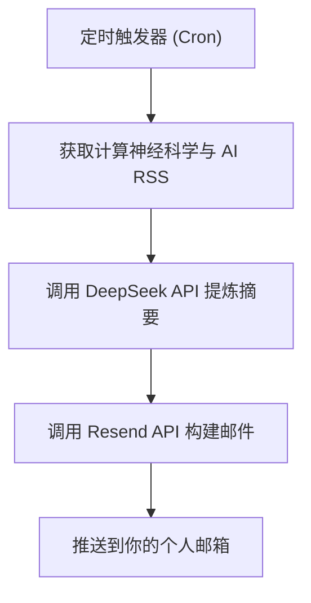

每天只需api费用最多0.35元，平均一个月不到10块（可能只有5块左右？）

这是一个非常极客且高效的方案！将纯代码脚本部署在 **Cloudflare Workers** 上，不仅完全免费、无需维护服务器，还能利用它的 Cron 定时触发器（Cron Triggers）实现完美的自动化。

由于 Cloudflare Workers 原生不支持直接通过 SMTP 发送邮件，我们最优雅的免费方案是结合 **Resend**（一个对开发者极度友好的邮件 API 平台，免费额度每天 100 封，完全足够你一个人使用）。

整体架构如下：

Code snippet


```mermaid
graph TD
    A["定时触发器 (Cron)"] --> B["获取计算神经科学与 AI RSS"]
    B["获取计算神经科学与 AI RSS"] --> C["调用 DeepSeek API 提炼摘要"]
    C["调用 DeepSeek API 提炼摘要"] --> D["调用 Resend API 构建邮件"]
    D["调用 Resend API 构建邮件"] --> E["推送到你的个人邮箱"]
```

📊 Diagram</> Code

<svg id="mermaid-sltgrfs73" width="100%" xmlns="http://www.w3.org/2000/svg" class="flowchart" style="max-width: 276px; animation: auto ease 0s 1 normal none running none; appearance: none; background: none 0% 0% / auto repeat scroll padding-box border-box rgba(0, 0, 0, 0); border: 0px none rgb(31, 31, 31); inset: auto; clear: none; clip: auto; color: rgb(31, 31, 31); columns: auto; contain: none; container: none; content: normal; cursor: zoom-in; cx: 0px; cy: 0px; d: none; direction: ltr; display: inline; fill: rgb(204, 204, 204); filter: none; flex: 0 1 auto; gap: normal; hyphens: manual; isolation: auto; margin-right: 0px; margin-bottom: 0px; margin-left: 0px; marker: none; mask: none; offset: normal; opacity: 1; order: 0; orphans: 2; outline: rgb(31, 31, 31) none 0px; overlay: none; padding: 0px; page: auto; perspective: none; quotes: auto; r: 0px; resize: none; rotate: none; rx: auto; ry: auto; scale: none; speak: normal; stroke: none; transform: none; transition: all; translate: none; visibility: visible; widows: 2; x: 0px; y: 0px; zoom: 1; margin-top: 0px !important; font-family: &quot;Google Sans Text&quot;, sans-serif !important; line-height: 1.15 !important;" viewBox="0.0000152587890625 0 276.00006103515625 486.0000305175781" role="graphics-document document" aria-roledescription="flowchart-v2"><g style="animation: auto ease 0s 1 normal none running none; appearance: none; background: none 0% 0% / auto repeat scroll padding-box border-box rgba(0, 0, 0, 0); border: 0px none rgb(31, 31, 31); inset: auto; clear: none; clip: auto; color: rgb(31, 31, 31); columns: auto; contain: none; container: none; content: normal; cursor: zoom-in; cx: 0px; cy: 0px; d: none; direction: ltr; display: inline; fill: rgb(204, 204, 204); filter: none; flex: 0 1 auto; float: none; gap: normal; hyphens: manual; interactivity: auto; isolation: auto; margin-top: 0px !important; margin-right: 0px; margin-bottom: 0px; margin-left: 0px; marker: none; mask: none; offset: normal; opacity: 1; order: 0; orphans: 2; outline: rgb(31, 31, 31) none 0px; overlay: none; padding: 0px; page: auto; perspective: none; position: static; quotes: auto; r: 0px; resize: none; rotate: none; rx: auto; ry: auto; scale: none; speak: normal; stroke: none; transform: none; transition: all; translate: none; visibility: visible; widows: 2; x: 0px; y: 0px; zoom: 1; font-family: &quot;Google Sans Text&quot;, sans-serif !important; line-height: 1.15 !important;"><marker id="mermaid-sltgrfs73_flowchart-v2-pointEnd" class="marker flowchart-v2" viewBox="0 0 10 10" refX="5" refY="5" markerUnits="userSpaceOnUse" markerWidth="8" markerHeight="8" orient="auto" style="animation: auto ease 0s 1 normal none running none; appearance: none; background: none 0% 0% / auto repeat scroll padding-box border-box rgba(0, 0, 0, 0); border: 0px none rgb(31, 31, 31); inset: auto; clear: none; clip: auto; color: rgb(31, 31, 31); columns: auto; contain: none; container: none; content: normal; cursor: zoom-in; cx: 0px; cy: 0px; d: none; direction: ltr; display: inline; fill: rgb(211, 211, 211); filter: none; flex: 0 1 auto; float: none; gap: normal; hyphens: manual; interactivity: auto; isolation: auto; margin-top: 0px !important; margin-right: 0px; margin-bottom: 0px; margin-left: 0px; marker: none; mask: none; offset: normal; opacity: 1; order: 0; orphans: 2; outline: rgb(31, 31, 31) none 0px; overlay: none; padding: 0px; page: auto; perspective: none; position: static; quotes: auto; r: 0px; resize: none; rotate: none; rx: auto; ry: auto; scale: none; speak: normal; stroke: rgb(211, 211, 211); transform: none; transition: all; translate: none; visibility: visible; widows: 2; x: 0px; y: 0px; zoom: 1; font-family: &quot;Google Sans Text&quot;, sans-serif !important; line-height: 1.15 !important;"><path d="M 0 0 L 10 5 L 0 10 z" class="arrowMarkerPath" style="stroke-width: 1; stroke-dasharray: 1, 0; animation: auto ease 0s 1 normal none running none; appearance: none; background: none 0% 0% / auto repeat scroll padding-box border-box rgba(0, 0, 0, 0); border: 0px none rgb(31, 31, 31); inset: auto; clear: none; clip: auto; color: rgb(31, 31, 31); columns: auto; contain: none; container: none; content: normal; cursor: zoom-in; cx: 0px; cy: 0px; d: path(&quot;M 0 0 L 10 5 L 0 10 Z&quot;); direction: ltr; display: inline; fill: rgb(211, 211, 211); filter: none; flex: 0 1 auto; float: none; gap: normal; hyphens: manual; interactivity: auto; isolation: auto; margin-top: 0px !important; margin-right: 0px; margin-bottom: 0px; margin-left: 0px; marker: none; mask: none; offset: normal; opacity: 1; order: 0; orphans: 2; outline: rgb(31, 31, 31) none 0px; overlay: none; padding: 0px; page: auto; perspective: none; position: static; quotes: auto; r: 0px; resize: none; rotate: none; rx: auto; ry: auto; scale: none; speak: normal; stroke: rgb(211, 211, 211); transform: none; transition: all; translate: none; visibility: visible; widows: 2; x: 0px; y: 0px; zoom: 1; font-family: &quot;Google Sans Text&quot;, sans-serif !important; line-height: 1.15 !important;"></path></marker><marker id="mermaid-sltgrfs73_flowchart-v2-pointStart" class="marker flowchart-v2" viewBox="0 0 10 10" refX="4.5" refY="5" markerUnits="userSpaceOnUse" markerWidth="8" markerHeight="8" orient="auto" style="animation: auto ease 0s 1 normal none running none; appearance: none; background: none 0% 0% / auto repeat scroll padding-box border-box rgba(0, 0, 0, 0); border: 0px none rgb(31, 31, 31); inset: auto; clear: none; clip: auto; color: rgb(31, 31, 31); columns: auto; contain: none; container: none; content: normal; cursor: zoom-in; cx: 0px; cy: 0px; d: none; direction: ltr; display: inline; fill: rgb(211, 211, 211); filter: none; flex: 0 1 auto; float: none; gap: normal; hyphens: manual; interactivity: auto; isolation: auto; margin-top: 0px !important; margin-right: 0px; margin-bottom: 0px; margin-left: 0px; marker: none; mask: none; offset: normal; opacity: 1; order: 0; orphans: 2; outline: rgb(31, 31, 31) none 0px; overlay: none; padding: 0px; page: auto; perspective: none; position: static; quotes: auto; r: 0px; resize: none; rotate: none; rx: auto; ry: auto; scale: none; speak: normal; stroke: rgb(211, 211, 211); transform: none; transition: all; translate: none; visibility: visible; widows: 2; x: 0px; y: 0px; zoom: 1; font-family: &quot;Google Sans Text&quot;, sans-serif !important; line-height: 1.15 !important;"><path d="M 0 5 L 10 10 L 10 0 z" class="arrowMarkerPath" style="stroke-width: 1; stroke-dasharray: 1, 0; animation: auto ease 0s 1 normal none running none; appearance: none; background: none 0% 0% / auto repeat scroll padding-box border-box rgba(0, 0, 0, 0); border: 0px none rgb(31, 31, 31); inset: auto; clear: none; clip: auto; color: rgb(31, 31, 31); columns: auto; contain: none; container: none; content: normal; cursor: zoom-in; cx: 0px; cy: 0px; d: path(&quot;M 0 5 L 10 10 L 10 0 Z&quot;); direction: ltr; display: inline; fill: rgb(211, 211, 211); filter: none; flex: 0 1 auto; float: none; gap: normal; hyphens: manual; interactivity: auto; isolation: auto; margin-top: 0px !important; margin-right: 0px; margin-bottom: 0px; margin-left: 0px; marker: none; mask: none; offset: normal; opacity: 1; order: 0; orphans: 2; outline: rgb(31, 31, 31) none 0px; overlay: none; padding: 0px; page: auto; perspective: none; position: static; quotes: auto; r: 0px; resize: none; rotate: none; rx: auto; ry: auto; scale: none; speak: normal; stroke: rgb(211, 211, 211); transform: none; transition: all; translate: none; visibility: visible; widows: 2; x: 0px; y: 0px; zoom: 1; font-family: &quot;Google Sans Text&quot;, sans-serif !important; line-height: 1.15 !important;"></path></marker><marker id="mermaid-sltgrfs73_flowchart-v2-circleEnd" class="marker flowchart-v2" viewBox="0 0 10 10" refX="11" refY="5" markerUnits="userSpaceOnUse" markerWidth="11" markerHeight="11" orient="auto" style="animation: auto ease 0s 1 normal none running none; appearance: none; background: none 0% 0% / auto repeat scroll padding-box border-box rgba(0, 0, 0, 0); border: 0px none rgb(31, 31, 31); inset: auto; clear: none; clip: auto; color: rgb(31, 31, 31); columns: auto; contain: none; container: none; content: normal; cursor: zoom-in; cx: 0px; cy: 0px; d: none; direction: ltr; display: inline; fill: rgb(211, 211, 211); filter: none; flex: 0 1 auto; float: none; gap: normal; hyphens: manual; interactivity: auto; isolation: auto; margin-top: 0px !important; margin-right: 0px; margin-bottom: 0px; margin-left: 0px; marker: none; mask: none; offset: normal; opacity: 1; order: 0; orphans: 2; outline: rgb(31, 31, 31) none 0px; overlay: none; padding: 0px; page: auto; perspective: none; position: static; quotes: auto; r: 0px; resize: none; rotate: none; rx: auto; ry: auto; scale: none; speak: normal; stroke: rgb(211, 211, 211); transform: none; transition: all; translate: none; visibility: visible; widows: 2; x: 0px; y: 0px; zoom: 1; font-family: &quot;Google Sans Text&quot;, sans-serif !important; line-height: 1.15 !important;"><circle cx="5" cy="5" r="5" class="arrowMarkerPath" style="stroke-width: 1; stroke-dasharray: 1, 0; animation: auto ease 0s 1 normal none running none; appearance: none; background: none 0% 0% / auto repeat scroll padding-box border-box rgba(0, 0, 0, 0); border: 0px none rgb(31, 31, 31); inset: auto; clear: none; clip: auto; color: rgb(31, 31, 31); columns: auto; contain: none; container: none; content: normal; cursor: zoom-in; cx: 5px; cy: 5px; d: none; direction: ltr; display: inline; fill: rgb(211, 211, 211); filter: none; flex: 0 1 auto; float: none; gap: normal; hyphens: manual; interactivity: auto; isolation: auto; margin-top: 0px !important; margin-right: 0px; margin-bottom: 0px; margin-left: 0px; marker: none; mask: none; offset: normal; opacity: 1; order: 0; orphans: 2; outline: rgb(31, 31, 31) none 0px; overlay: none; padding: 0px; page: auto; perspective: none; position: static; quotes: auto; r: 5px; resize: none; rotate: none; rx: auto; ry: auto; scale: none; speak: normal; stroke: rgb(211, 211, 211); transform: none; transition: all; translate: none; visibility: visible; widows: 2; x: 0px; y: 0px; zoom: 1; font-family: &quot;Google Sans Text&quot;, sans-serif !important; line-height: 1.15 !important;"></circle></marker><marker id="mermaid-sltgrfs73_flowchart-v2-circleStart" class="marker flowchart-v2" viewBox="0 0 10 10" refX="-1" refY="5" markerUnits="userSpaceOnUse" markerWidth="11" markerHeight="11" orient="auto" style="animation: auto ease 0s 1 normal none running none; appearance: none; background: none 0% 0% / auto repeat scroll padding-box border-box rgba(0, 0, 0, 0); border: 0px none rgb(31, 31, 31); inset: auto; clear: none; clip: auto; color: rgb(31, 31, 31); columns: auto; contain: none; container: none; content: normal; cursor: zoom-in; cx: 0px; cy: 0px; d: none; direction: ltr; display: inline; fill: rgb(211, 211, 211); filter: none; flex: 0 1 auto; float: none; gap: normal; hyphens: manual; interactivity: auto; isolation: auto; margin-top: 0px !important; margin-right: 0px; margin-bottom: 0px; margin-left: 0px; marker: none; mask: none; offset: normal; opacity: 1; order: 0; orphans: 2; outline: rgb(31, 31, 31) none 0px; overlay: none; padding: 0px; page: auto; perspective: none; position: static; quotes: auto; r: 0px; resize: none; rotate: none; rx: auto; ry: auto; scale: none; speak: normal; stroke: rgb(211, 211, 211); transform: none; transition: all; translate: none; visibility: visible; widows: 2; x: 0px; y: 0px; zoom: 1; font-family: &quot;Google Sans Text&quot;, sans-serif !important; line-height: 1.15 !important;"><circle cx="5" cy="5" r="5" class="arrowMarkerPath" style="stroke-width: 1; stroke-dasharray: 1, 0; animation: auto ease 0s 1 normal none running none; appearance: none; background: none 0% 0% / auto repeat scroll padding-box border-box rgba(0, 0, 0, 0); border: 0px none rgb(31, 31, 31); inset: auto; clear: none; clip: auto; color: rgb(31, 31, 31); columns: auto; contain: none; container: none; content: normal; cursor: zoom-in; cx: 5px; cy: 5px; d: none; direction: ltr; display: inline; fill: rgb(211, 211, 211); filter: none; flex: 0 1 auto; float: none; gap: normal; hyphens: manual; interactivity: auto; isolation: auto; margin-top: 0px !important; margin-right: 0px; margin-bottom: 0px; margin-left: 0px; marker: none; mask: none; offset: normal; opacity: 1; order: 0; orphans: 2; outline: rgb(31, 31, 31) none 0px; overlay: none; padding: 0px; page: auto; perspective: none; position: static; quotes: auto; r: 5px; resize: none; rotate: none; rx: auto; ry: auto; scale: none; speak: normal; stroke: rgb(211, 211, 211); transform: none; transition: all; translate: none; visibility: visible; widows: 2; x: 0px; y: 0px; zoom: 1; font-family: &quot;Google Sans Text&quot;, sans-serif !important; line-height: 1.15 !important;"></circle></marker><marker id="mermaid-sltgrfs73_flowchart-v2-crossEnd" class="marker cross flowchart-v2" viewBox="0 0 11 11" refX="12" refY="5.2" markerUnits="userSpaceOnUse" markerWidth="11" markerHeight="11" orient="auto" style="animation: auto ease 0s 1 normal none running none; appearance: none; background: none 0% 0% / auto repeat scroll padding-box border-box rgba(0, 0, 0, 0); border: 0px none rgb(31, 31, 31); inset: auto; clear: none; clip: auto; color: rgb(31, 31, 31); columns: auto; contain: none; container: none; content: normal; cursor: zoom-in; cx: 0px; cy: 0px; d: none; direction: ltr; display: inline; fill: rgb(211, 211, 211); filter: none; flex: 0 1 auto; float: none; gap: normal; hyphens: manual; interactivity: auto; isolation: auto; margin-top: 0px !important; margin-right: 0px; margin-bottom: 0px; margin-left: 0px; marker: none; mask: none; offset: normal; opacity: 1; order: 0; orphans: 2; outline: rgb(31, 31, 31) none 0px; overlay: none; padding: 0px; page: auto; perspective: none; position: static; quotes: auto; r: 0px; resize: none; rotate: none; rx: auto; ry: auto; scale: none; speak: normal; stroke: rgb(211, 211, 211); transform: none; transition: all; translate: none; visibility: visible; widows: 2; x: 0px; y: 0px; zoom: 1; font-family: &quot;Google Sans Text&quot;, sans-serif !important; line-height: 1.15 !important;"><path d="M 1,1 l 9,9 M 10,1 l -9,9" class="arrowMarkerPath" style="stroke-width: 2; stroke-dasharray: 1, 0; animation: auto ease 0s 1 normal none running none; appearance: none; background: none 0% 0% / auto repeat scroll padding-box border-box rgba(0, 0, 0, 0); border: 0px none rgb(31, 31, 31); inset: auto; clear: none; clip: auto; color: rgb(31, 31, 31); columns: auto; contain: none; container: none; content: normal; cursor: zoom-in; cx: 0px; cy: 0px; d: path(&quot;M 1 1 L 10 10 M 10 1 L 1 10&quot;); direction: ltr; display: inline; fill: rgb(211, 211, 211); filter: none; flex: 0 1 auto; float: none; gap: normal; hyphens: manual; interactivity: auto; isolation: auto; margin-top: 0px !important; margin-right: 0px; margin-bottom: 0px; margin-left: 0px; marker: none; mask: none; offset: normal; opacity: 1; order: 0; orphans: 2; outline: rgb(31, 31, 31) none 0px; overlay: none; padding: 0px; page: auto; perspective: none; position: static; quotes: auto; r: 0px; resize: none; rotate: none; rx: auto; ry: auto; scale: none; speak: normal; stroke: rgb(211, 211, 211); transform: none; transition: all; translate: none; visibility: visible; widows: 2; x: 0px; y: 0px; zoom: 1; font-family: &quot;Google Sans Text&quot;, sans-serif !important; line-height: 1.15 !important;"></path></marker><marker id="mermaid-sltgrfs73_flowchart-v2-crossStart" class="marker cross flowchart-v2" viewBox="0 0 11 11" refX="-1" refY="5.2" markerUnits="userSpaceOnUse" markerWidth="11" markerHeight="11" orient="auto" style="animation: auto ease 0s 1 normal none running none; appearance: none; background: none 0% 0% / auto repeat scroll padding-box border-box rgba(0, 0, 0, 0); border: 0px none rgb(31, 31, 31); inset: auto; clear: none; clip: auto; color: rgb(31, 31, 31); columns: auto; contain: none; container: none; content: normal; cursor: zoom-in; cx: 0px; cy: 0px; d: none; direction: ltr; display: inline; fill: rgb(211, 211, 211); filter: none; flex: 0 1 auto; float: none; gap: normal; hyphens: manual; interactivity: auto; isolation: auto; margin-top: 0px !important; margin-right: 0px; margin-bottom: 0px; margin-left: 0px; marker: none; mask: none; offset: normal; opacity: 1; order: 0; orphans: 2; outline: rgb(31, 31, 31) none 0px; overlay: none; padding: 0px; page: auto; perspective: none; position: static; quotes: auto; r: 0px; resize: none; rotate: none; rx: auto; ry: auto; scale: none; speak: normal; stroke: rgb(211, 211, 211); transform: none; transition: all; translate: none; visibility: visible; widows: 2; x: 0px; y: 0px; zoom: 1; font-family: &quot;Google Sans Text&quot;, sans-serif !important; line-height: 1.15 !important;"><path d="M 1,1 l 9,9 M 10,1 l -9,9" class="arrowMarkerPath" style="stroke-width: 2; stroke-dasharray: 1, 0; animation: auto ease 0s 1 normal none running none; appearance: none; background: none 0% 0% / auto repeat scroll padding-box border-box rgba(0, 0, 0, 0); border: 0px none rgb(31, 31, 31); inset: auto; clear: none; clip: auto; color: rgb(31, 31, 31); columns: auto; contain: none; container: none; content: normal; cursor: zoom-in; cx: 0px; cy: 0px; d: path(&quot;M 1 1 L 10 10 M 10 1 L 1 10&quot;); direction: ltr; display: inline; fill: rgb(211, 211, 211); filter: none; flex: 0 1 auto; float: none; gap: normal; hyphens: manual; interactivity: auto; isolation: auto; margin-top: 0px !important; margin-right: 0px; margin-bottom: 0px; margin-left: 0px; marker: none; mask: none; offset: normal; opacity: 1; order: 0; orphans: 2; outline: rgb(31, 31, 31) none 0px; overlay: none; padding: 0px; page: auto; perspective: none; position: static; quotes: auto; r: 0px; resize: none; rotate: none; rx: auto; ry: auto; scale: none; speak: normal; stroke: rgb(211, 211, 211); transform: none; transition: all; translate: none; visibility: visible; widows: 2; x: 0px; y: 0px; zoom: 1; font-family: &quot;Google Sans Text&quot;, sans-serif !important; line-height: 1.15 !important;"></path></marker><g class="root" style="animation: auto ease 0s 1 normal none running none; appearance: none; background: none 0% 0% / auto repeat scroll padding-box border-box rgba(0, 0, 0, 0); border: 0px none rgb(31, 31, 31); inset: auto; clear: none; clip: auto; color: rgb(31, 31, 31); columns: auto; contain: none; container: none; content: normal; cursor: zoom-in; cx: 0px; cy: 0px; d: none; direction: ltr; display: inline; fill: rgb(204, 204, 204); filter: none; flex: 0 1 auto; float: none; gap: normal; hyphens: manual; interactivity: auto; isolation: auto; margin-top: 0px !important; margin-right: 0px; margin-bottom: 0px; margin-left: 0px; marker: none; mask: none; offset: normal; opacity: 1; order: 0; orphans: 2; outline: rgb(31, 31, 31) none 0px; overlay: none; padding: 0px; page: auto; perspective: none; position: static; quotes: auto; r: 0px; resize: none; rotate: none; rx: auto; ry: auto; scale: none; speak: normal; stroke: none; transform: none; transition: all; translate: none; visibility: visible; widows: 2; x: 0px; y: 0px; zoom: 1; font-family: &quot;Google Sans Text&quot;, sans-serif !important; line-height: 1.15 !important;"><g class="clusters" style="animation: auto ease 0s 1 normal none running none; appearance: none; background: none 0% 0% / auto repeat scroll padding-box border-box rgba(0, 0, 0, 0); border: 0px none rgb(31, 31, 31); inset: auto; clear: none; clip: auto; color: rgb(31, 31, 31); columns: auto; contain: none; container: none; content: normal; cursor: zoom-in; cx: 0px; cy: 0px; d: none; direction: ltr; display: inline; fill: rgb(204, 204, 204); filter: none; flex: 0 1 auto; float: none; gap: normal; hyphens: manual; interactivity: auto; isolation: auto; margin-top: 0px !important; margin-right: 0px; margin-bottom: 0px; margin-left: 0px; marker: none; mask: none; offset: normal; opacity: 1; order: 0; orphans: 2; outline: rgb(31, 31, 31) none 0px; overlay: none; padding: 0px; page: auto; perspective: none; position: static; quotes: auto; r: 0px; resize: none; rotate: none; rx: auto; ry: auto; scale: none; speak: normal; stroke: none; transform: none; transition: all; translate: none; visibility: visible; widows: 2; x: 0px; y: 0px; zoom: 1; font-family: &quot;Google Sans Text&quot;, sans-serif !important; line-height: 1.15 !important;"></g><g class="edgePaths" style="animation: auto ease 0s 1 normal none running none; appearance: none; background: none 0% 0% / auto repeat scroll padding-box border-box rgba(0, 0, 0, 0); border: 0px none rgb(31, 31, 31); inset: auto; clear: none; clip: auto; color: rgb(31, 31, 31); columns: auto; contain: none; container: none; content: normal; cursor: zoom-in; cx: 0px; cy: 0px; d: none; direction: ltr; display: inline; fill: rgb(204, 204, 204); filter: none; flex: 0 1 auto; float: none; gap: normal; hyphens: manual; interactivity: auto; isolation: auto; margin-top: 0px !important; margin-right: 0px; margin-bottom: 0px; margin-left: 0px; marker: none; mask: none; offset: normal; opacity: 1; order: 0; orphans: 2; outline: rgb(31, 31, 31) none 0px; overlay: none; padding: 0px; page: auto; perspective: none; position: static; quotes: auto; r: 0px; resize: none; rotate: none; rx: auto; ry: auto; scale: none; speak: normal; stroke: none; transform: none; transition: all; translate: none; visibility: visible; widows: 2; x: 0px; y: 0px; zoom: 1; font-family: &quot;Google Sans Text&quot;, sans-serif !important; line-height: 1.15 !important;"><path d="M138,62L138,66.167C138,70.333,138,78.667,138,86.333C138,94,138,101,138,104.5L138,108" id="L_A_B_0" class=" edge-thickness-normal edge-pattern-solid edge-thickness-normal edge-pattern-solid flowchart-link" style="animation: auto ease 0s 1 normal none running none; appearance: none; background: none 0% 0% / auto repeat scroll padding-box border-box rgba(0, 0, 0, 0); border: 0px none rgb(31, 31, 31); inset: auto; clear: none; clip: auto; color: rgb(31, 31, 31); columns: auto; contain: none; container: none; content: normal; cursor: zoom-in; cx: 0px; cy: 0px; d: path(&quot;M 138 62 L 138 66.167 C 138 70.333 138 78.667 138 86.333 C 138 94 138 101 138 104.5 L 138 108&quot;); direction: ltr; display: inline; fill: none; filter: none; flex: 0 1 auto; float: none; gap: normal; hyphens: manual; interactivity: auto; isolation: auto; margin-top: 0px !important; margin-right: 0px; margin-bottom: 0px; margin-left: 0px; mask: none; offset: normal; opacity: 1; order: 0; orphans: 2; outline: rgb(31, 31, 31) none 0px; overlay: none; padding: 0px; page: auto; perspective: none; position: static; quotes: auto; r: 0px; resize: none; rotate: none; rx: auto; ry: auto; scale: none; speak: normal; stroke: rgb(211, 211, 211); transform: none; transition: all; translate: none; visibility: visible; widows: 2; x: 0px; y: 0px; zoom: 1; font-family: &quot;Google Sans Text&quot;, sans-serif !important; line-height: 1.15 !important;" data-edge="true" data-et="edge" data-id="L_A_B_0" data-points="W3sieCI6MTM4LjAwMDAxNTI1ODc4OTA2LCJ5Ijo2Mn0seyJ4IjoxMzguMDAwMDE1MjU4Nzg5MDYsInkiOjg3fSx7IngiOjEzOC4wMDAwMTUyNTg3ODkwNiwieSI6MTEyfV0=" marker-end="url(#mermaid-sltgrfs73_flowchart-v2-pointEnd)"></path><path d="M138,166L138,170.167C138,174.333,138,182.667,138,190.333C138,198,138,205,138,208.5L138,212" id="L_B_C_0" class=" edge-thickness-normal edge-pattern-solid edge-thickness-normal edge-pattern-solid flowchart-link" style="animation: auto ease 0s 1 normal none running none; appearance: none; background: none 0% 0% / auto repeat scroll padding-box border-box rgba(0, 0, 0, 0); border: 0px none rgb(31, 31, 31); inset: auto; clear: none; clip: auto; color: rgb(31, 31, 31); columns: auto; contain: none; container: none; content: normal; cursor: zoom-in; cx: 0px; cy: 0px; d: path(&quot;M 138 166 L 138 170.167 C 138 174.333 138 182.667 138 190.333 C 138 198 138 205 138 208.5 L 138 212&quot;); direction: ltr; display: inline; fill: none; filter: none; flex: 0 1 auto; float: none; gap: normal; hyphens: manual; interactivity: auto; isolation: auto; margin-top: 0px !important; margin-right: 0px; margin-bottom: 0px; margin-left: 0px; mask: none; offset: normal; opacity: 1; order: 0; orphans: 2; outline: rgb(31, 31, 31) none 0px; overlay: none; padding: 0px; page: auto; perspective: none; position: static; quotes: auto; r: 0px; resize: none; rotate: none; rx: auto; ry: auto; scale: none; speak: normal; stroke: rgb(211, 211, 211); transform: none; transition: all; translate: none; visibility: visible; widows: 2; x: 0px; y: 0px; zoom: 1; font-family: &quot;Google Sans Text&quot;, sans-serif !important; line-height: 1.15 !important;" data-edge="true" data-et="edge" data-id="L_B_C_0" data-points="W3sieCI6MTM4LjAwMDAxNTI1ODc4OTA2LCJ5IjoxNjZ9LHsieCI6MTM4LjAwMDAxNTI1ODc4OTA2LCJ5IjoxOTF9LHsieCI6MTM4LjAwMDAxNTI1ODc4OTA2LCJ5IjoyMTZ9XQ==" marker-end="url(#mermaid-sltgrfs73_flowchart-v2-pointEnd)"></path><path d="M138,270L138,274.167C138,278.333,138,286.667,138,294.333C138,302,138,309,138,312.5L138,316" id="L_C_D_0" class=" edge-thickness-normal edge-pattern-solid edge-thickness-normal edge-pattern-solid flowchart-link" style="animation: auto ease 0s 1 normal none running none; appearance: none; background: none 0% 0% / auto repeat scroll padding-box border-box rgba(0, 0, 0, 0); border: 0px none rgb(31, 31, 31); inset: auto; clear: none; clip: auto; color: rgb(31, 31, 31); columns: auto; contain: none; container: none; content: normal; cursor: zoom-in; cx: 0px; cy: 0px; d: path(&quot;M 138 270 L 138 274.167 C 138 278.333 138 286.667 138 294.333 C 138 302 138 309 138 312.5 L 138 316&quot;); direction: ltr; display: inline; fill: none; filter: none; flex: 0 1 auto; float: none; gap: normal; hyphens: manual; interactivity: auto; isolation: auto; margin-top: 0px !important; margin-right: 0px; margin-bottom: 0px; margin-left: 0px; mask: none; offset: normal; opacity: 1; order: 0; orphans: 2; outline: rgb(31, 31, 31) none 0px; overlay: none; padding: 0px; page: auto; perspective: none; position: static; quotes: auto; r: 0px; resize: none; rotate: none; rx: auto; ry: auto; scale: none; speak: normal; stroke: rgb(211, 211, 211); transform: none; transition: all; translate: none; visibility: visible; widows: 2; x: 0px; y: 0px; zoom: 1; font-family: &quot;Google Sans Text&quot;, sans-serif !important; line-height: 1.15 !important;" data-edge="true" data-et="edge" data-id="L_C_D_0" data-points="W3sieCI6MTM4LjAwMDAxNTI1ODc4OTA2LCJ5IjoyNzB9LHsieCI6MTM4LjAwMDAxNTI1ODc4OTA2LCJ5IjoyOTV9LHsieCI6MTM4LjAwMDAxNTI1ODc4OTA2LCJ5IjozMjB9XQ==" marker-end="url(#mermaid-sltgrfs73_flowchart-v2-pointEnd)"></path><path d="M138,374L138,378.167C138,382.333,138,390.667,138,398.333C138,406,138,413,138,416.5L138,420" id="L_D_E_0" class=" edge-thickness-normal edge-pattern-solid edge-thickness-normal edge-pattern-solid flowchart-link" style="animation: auto ease 0s 1 normal none running none; appearance: none; background: none 0% 0% / auto repeat scroll padding-box border-box rgba(0, 0, 0, 0); border: 0px none rgb(31, 31, 31); inset: auto; clear: none; clip: auto; color: rgb(31, 31, 31); columns: auto; contain: none; container: none; content: normal; cursor: zoom-in; cx: 0px; cy: 0px; d: path(&quot;M 138 374 L 138 378.167 C 138 382.333 138 390.667 138 398.333 C 138 406 138 413 138 416.5 L 138 420&quot;); direction: ltr; display: inline; fill: none; filter: none; flex: 0 1 auto; float: none; gap: normal; hyphens: manual; interactivity: auto; isolation: auto; margin-top: 0px !important; margin-right: 0px; margin-bottom: 0px; margin-left: 0px; mask: none; offset: normal; opacity: 1; order: 0; orphans: 2; outline: rgb(31, 31, 31) none 0px; overlay: none; padding: 0px; page: auto; perspective: none; position: static; quotes: auto; r: 0px; resize: none; rotate: none; rx: auto; ry: auto; scale: none; speak: normal; stroke: rgb(211, 211, 211); transform: none; transition: all; translate: none; visibility: visible; widows: 2; x: 0px; y: 0px; zoom: 1; font-family: &quot;Google Sans Text&quot;, sans-serif !important; line-height: 1.15 !important;" data-edge="true" data-et="edge" data-id="L_D_E_0" data-points="W3sieCI6MTM4LjAwMDAxNTI1ODc4OTA2LCJ5IjozNzR9LHsieCI6MTM4LjAwMDAxNTI1ODc4OTA2LCJ5IjozOTl9LHsieCI6MTM4LjAwMDAxNTI1ODc4OTA2LCJ5Ijo0MjR9XQ==" marker-end="url(#mermaid-sltgrfs73_flowchart-v2-pointEnd)"></path></g><g class="edgeLabels" style="animation: auto ease 0s 1 normal none running none; appearance: none; background: none 0% 0% / auto repeat scroll padding-box border-box rgba(0, 0, 0, 0); border: 0px none rgb(31, 31, 31); inset: auto; clear: none; clip: auto; color: rgb(31, 31, 31); columns: auto; contain: none; container: none; content: normal; cursor: zoom-in; cx: 0px; cy: 0px; d: none; direction: ltr; display: inline; fill: rgb(204, 204, 204); filter: none; flex: 0 1 auto; float: none; gap: normal; hyphens: manual; interactivity: auto; isolation: auto; margin-top: 0px !important; margin-right: 0px; margin-bottom: 0px; margin-left: 0px; marker: none; mask: none; offset: normal; opacity: 1; order: 0; orphans: 2; outline: rgb(31, 31, 31) none 0px; overlay: none; padding: 0px; page: auto; perspective: none; position: static; quotes: auto; r: 0px; resize: none; rotate: none; rx: auto; ry: auto; scale: none; speak: normal; stroke: none; transform: none; transition: all; translate: none; visibility: visible; widows: 2; x: 0px; y: 0px; zoom: 1; font-family: &quot;Google Sans Text&quot;, sans-serif !important; line-height: 1.15 !important;"><g class="edgeLabel" style="animation: auto ease 0s 1 normal none running none; appearance: none; background: none 0% 0% / auto repeat scroll padding-box border-box rgb(88, 88, 88); border: 0px none rgb(31, 31, 31); inset: auto; clear: none; clip: auto; color: rgb(31, 31, 31); columns: auto; contain: none; container: none; content: normal; cursor: zoom-in; cx: 0px; cy: 0px; d: none; direction: ltr; display: inline; fill: rgb(204, 204, 204); filter: none; flex: 0 1 auto; float: none; gap: normal; hyphens: manual; interactivity: auto; isolation: auto; margin-top: 0px !important; margin-right: 0px; margin-bottom: 0px; margin-left: 0px; marker: none; mask: none; offset: normal; opacity: 1; order: 0; orphans: 2; outline: rgb(31, 31, 31) none 0px; overlay: none; padding: 0px; page: auto; perspective: none; position: static; quotes: auto; r: 0px; resize: none; rotate: none; rx: auto; ry: auto; scale: none; speak: normal; stroke: none; transform: none; transition: all; translate: none; visibility: visible; widows: 2; x: 0px; y: 0px; zoom: 1; font-family: &quot;Google Sans Text&quot;, sans-serif !important; line-height: 1.15 !important;"><g class="label" data-id="L_A_B_0" transform="translate(0, 0)" style="animation: auto ease 0s 1 normal none running none; appearance: none; background: none 0% 0% / auto repeat scroll padding-box border-box rgba(0, 0, 0, 0); border: 0px none rgb(204, 204, 204); inset: auto; clear: none; clip: auto; color: rgb(204, 204, 204); columns: auto; contain: none; container: none; content: normal; cursor: zoom-in; cx: 0px; cy: 0px; d: none; direction: ltr; display: inline; fill: rgb(204, 204, 204); filter: none; flex: 0 1 auto; float: none; gap: normal; hyphens: manual; interactivity: auto; isolation: auto; margin-top: 0px !important; margin-right: 0px; margin-bottom: 0px; margin-left: 0px; marker: none; mask: none; offset: normal; opacity: 1; order: 0; orphans: 2; outline: rgb(204, 204, 204) none 0px; overlay: none; padding: 0px; page: auto; perspective: none; position: static; quotes: auto; r: 0px; resize: none; rotate: none; rx: auto; ry: auto; scale: none; speak: normal; stroke: none; transform: matrix(1, 0, 0, 1, 0, 0); transition: all; translate: none; visibility: visible; widows: 2; x: 0px; y: 0px; zoom: 1; font-family: &quot;Google Sans Text&quot;, sans-serif !important; line-height: 1.15 !important;"><foreignObject width="0" height="0" style="animation: auto ease 0s 1 normal none running none; appearance: none; background: none 0% 0% / auto repeat scroll padding-box border-box rgba(0, 0, 0, 0); border: 0px none rgb(204, 204, 204); inset: auto; clear: none; clip: auto; color: rgb(204, 204, 204); columns: auto; contain: none; container: none; content: normal; cursor: zoom-in; cx: 0px; cy: 0px; d: none; direction: ltr; display: block; fill: rgb(204, 204, 204); filter: none; flex: 0 1 auto; float: none; gap: normal; hyphens: manual; interactivity: auto; isolation: auto; margin-top: 0px !important; margin-right: 0px; margin-bottom: 0px; margin-left: 0px; marker: none; mask: none; offset: normal; opacity: 1; order: 0; orphans: 2; outline: rgb(204, 204, 204) none 0px; overlay: none; padding: 0px; page: auto; perspective: none; position: static; quotes: auto; r: 0px; resize: none; rotate: none; rx: auto; ry: auto; scale: none; speak: normal; stroke: none; transform: none; transition: all; translate: none; visibility: visible; widows: 2; x: 0px; y: 0px; zoom: 1; font-family: &quot;Google Sans Text&quot;, sans-serif !important; line-height: 1.15 !important;"><div xmlns="http://www.w3.org/1999/xhtml" class="labelBkg" style="display: table-cell; white-space: nowrap; line-height: 1.15 !important; max-width: 200px; text-align: center; animation: auto ease 0s 1 normal none running none; appearance: none; background: none 0% 0% / auto repeat scroll padding-box border-box rgba(88, 88, 88, 0.5); border: 0px none rgb(204, 204, 204); inset: auto; clear: none; clip: auto; color: rgb(204, 204, 204); columns: auto; contain: none; container: none; content: normal; cursor: zoom-in; cx: 0px; cy: 0px; d: none; direction: ltr; fill: rgb(204, 204, 204); filter: none; flex: 0 1 auto; float: none; gap: normal; hyphens: manual; interactivity: auto; isolation: auto; margin-top: 0px !important; margin-right: 0px; margin-bottom: 0px; margin-left: 0px; marker: none; mask: none; offset: normal; opacity: 1; order: 0; orphans: 2; outline: rgb(204, 204, 204) none 0px; overlay: none; padding: 0px; page: auto; perspective: none; position: static; quotes: auto; r: 0px; resize: none; rotate: none; rx: auto; ry: auto; scale: none; speak: normal; stroke: none; transform: none; transition: all; translate: none; visibility: visible; widows: 2; x: 0px; y: 0px; zoom: 1; font-family: &quot;Google Sans Text&quot;, sans-serif !important;"><span class="edgeLabel " style="animation: auto ease 0s 1 normal none running none; appearance: none; background: none 0% 0% / auto repeat scroll padding-box border-box rgb(88, 88, 88); border: 0px none rgb(204, 204, 204); inset: auto; clear: none; clip: auto; color: rgb(204, 204, 204); columns: auto; contain: none; container: none; content: normal; cursor: zoom-in; cx: 0px; cy: 0px; d: none; direction: ltr; display: inline; fill: rgb(204, 204, 204); filter: none; flex: 0 1 auto; float: none; gap: normal; hyphens: manual; interactivity: auto; isolation: auto; margin-top: 0px !important; margin-right: 0px; margin-bottom: 0px; margin-left: 0px; marker: none; mask: none; offset: normal; opacity: 1; order: 0; orphans: 2; outline: rgb(204, 204, 204) none 0px; overlay: none; padding: 0px; page: auto; perspective: none; position: static; quotes: auto; r: 0px; resize: none; rotate: none; rx: auto; ry: auto; scale: none; speak: normal; stroke: none; transform: none; transition: all; translate: none; visibility: visible; widows: 2; x: 0px; y: 0px; zoom: 1; font-family: &quot;Google Sans Text&quot;, sans-serif !important; line-height: 1.15 !important;"></span></div></foreignObject></g></g><g class="edgeLabel" style="animation: auto ease 0s 1 normal none running none; appearance: none; background: none 0% 0% / auto repeat scroll padding-box border-box rgb(88, 88, 88); border: 0px none rgb(31, 31, 31); inset: auto; clear: none; clip: auto; color: rgb(31, 31, 31); columns: auto; contain: none; container: none; content: normal; cursor: zoom-in; cx: 0px; cy: 0px; d: none; direction: ltr; display: inline; fill: rgb(204, 204, 204); filter: none; flex: 0 1 auto; float: none; gap: normal; hyphens: manual; interactivity: auto; isolation: auto; margin-top: 0px !important; margin-right: 0px; margin-bottom: 0px; margin-left: 0px; marker: none; mask: none; offset: normal; opacity: 1; order: 0; orphans: 2; outline: rgb(31, 31, 31) none 0px; overlay: none; padding: 0px; page: auto; perspective: none; position: static; quotes: auto; r: 0px; resize: none; rotate: none; rx: auto; ry: auto; scale: none; speak: normal; stroke: none; transform: none; transition: all; translate: none; visibility: visible; widows: 2; x: 0px; y: 0px; zoom: 1; font-family: &quot;Google Sans Text&quot;, sans-serif !important; line-height: 1.15 !important;"><g class="label" data-id="L_B_C_0" transform="translate(0, 0)" style="animation: auto ease 0s 1 normal none running none; appearance: none; background: none 0% 0% / auto repeat scroll padding-box border-box rgba(0, 0, 0, 0); border: 0px none rgb(204, 204, 204); inset: auto; clear: none; clip: auto; color: rgb(204, 204, 204); columns: auto; contain: none; container: none; content: normal; cursor: zoom-in; cx: 0px; cy: 0px; d: none; direction: ltr; display: inline; fill: rgb(204, 204, 204); filter: none; flex: 0 1 auto; float: none; gap: normal; hyphens: manual; interactivity: auto; isolation: auto; margin-top: 0px !important; margin-right: 0px; margin-bottom: 0px; margin-left: 0px; marker: none; mask: none; offset: normal; opacity: 1; order: 0; orphans: 2; outline: rgb(204, 204, 204) none 0px; overlay: none; padding: 0px; page: auto; perspective: none; position: static; quotes: auto; r: 0px; resize: none; rotate: none; rx: auto; ry: auto; scale: none; speak: normal; stroke: none; transform: matrix(1, 0, 0, 1, 0, 0); transition: all; translate: none; visibility: visible; widows: 2; x: 0px; y: 0px; zoom: 1; font-family: &quot;Google Sans Text&quot;, sans-serif !important; line-height: 1.15 !important;"><foreignObject width="0" height="0" style="animation: auto ease 0s 1 normal none running none; appearance: none; background: none 0% 0% / auto repeat scroll padding-box border-box rgba(0, 0, 0, 0); border: 0px none rgb(204, 204, 204); inset: auto; clear: none; clip: auto; color: rgb(204, 204, 204); columns: auto; contain: none; container: none; content: normal; cursor: zoom-in; cx: 0px; cy: 0px; d: none; direction: ltr; display: block; fill: rgb(204, 204, 204); filter: none; flex: 0 1 auto; float: none; gap: normal; hyphens: manual; interactivity: auto; isolation: auto; margin-top: 0px !important; margin-right: 0px; margin-bottom: 0px; margin-left: 0px; marker: none; mask: none; offset: normal; opacity: 1; order: 0; orphans: 2; outline: rgb(204, 204, 204) none 0px; overlay: none; padding: 0px; page: auto; perspective: none; position: static; quotes: auto; r: 0px; resize: none; rotate: none; rx: auto; ry: auto; scale: none; speak: normal; stroke: none; transform: none; transition: all; translate: none; visibility: visible; widows: 2; x: 0px; y: 0px; zoom: 1; font-family: &quot;Google Sans Text&quot;, sans-serif !important; line-height: 1.15 !important;"><div xmlns="http://www.w3.org/1999/xhtml" class="labelBkg" style="display: table-cell; white-space: nowrap; line-height: 1.15 !important; max-width: 200px; text-align: center; animation: auto ease 0s 1 normal none running none; appearance: none; background: none 0% 0% / auto repeat scroll padding-box border-box rgba(88, 88, 88, 0.5); border: 0px none rgb(204, 204, 204); inset: auto; clear: none; clip: auto; color: rgb(204, 204, 204); columns: auto; contain: none; container: none; content: normal; cursor: zoom-in; cx: 0px; cy: 0px; d: none; direction: ltr; fill: rgb(204, 204, 204); filter: none; flex: 0 1 auto; float: none; gap: normal; hyphens: manual; interactivity: auto; isolation: auto; margin-top: 0px !important; margin-right: 0px; margin-bottom: 0px; margin-left: 0px; marker: none; mask: none; offset: normal; opacity: 1; order: 0; orphans: 2; outline: rgb(204, 204, 204) none 0px; overlay: none; padding: 0px; page: auto; perspective: none; position: static; quotes: auto; r: 0px; resize: none; rotate: none; rx: auto; ry: auto; scale: none; speak: normal; stroke: none; transform: none; transition: all; translate: none; visibility: visible; widows: 2; x: 0px; y: 0px; zoom: 1; font-family: &quot;Google Sans Text&quot;, sans-serif !important;"><span class="edgeLabel " style="animation: auto ease 0s 1 normal none running none; appearance: none; background: none 0% 0% / auto repeat scroll padding-box border-box rgb(88, 88, 88); border: 0px none rgb(204, 204, 204); inset: auto; clear: none; clip: auto; color: rgb(204, 204, 204); columns: auto; contain: none; container: none; content: normal; cursor: zoom-in; cx: 0px; cy: 0px; d: none; direction: ltr; display: inline; fill: rgb(204, 204, 204); filter: none; flex: 0 1 auto; float: none; gap: normal; hyphens: manual; interactivity: auto; isolation: auto; margin-top: 0px !important; margin-right: 0px; margin-bottom: 0px; margin-left: 0px; marker: none; mask: none; offset: normal; opacity: 1; order: 0; orphans: 2; outline: rgb(204, 204, 204) none 0px; overlay: none; padding: 0px; page: auto; perspective: none; position: static; quotes: auto; r: 0px; resize: none; rotate: none; rx: auto; ry: auto; scale: none; speak: normal; stroke: none; transform: none; transition: all; translate: none; visibility: visible; widows: 2; x: 0px; y: 0px; zoom: 1; font-family: &quot;Google Sans Text&quot;, sans-serif !important; line-height: 1.15 !important;"></span></div></foreignObject></g></g><g class="edgeLabel" style="animation: auto ease 0s 1 normal none running none; appearance: none; background: none 0% 0% / auto repeat scroll padding-box border-box rgb(88, 88, 88); border: 0px none rgb(31, 31, 31); inset: auto; clear: none; clip: auto; color: rgb(31, 31, 31); columns: auto; contain: none; container: none; content: normal; cursor: zoom-in; cx: 0px; cy: 0px; d: none; direction: ltr; display: inline; fill: rgb(204, 204, 204); filter: none; flex: 0 1 auto; float: none; gap: normal; hyphens: manual; interactivity: auto; isolation: auto; margin-top: 0px !important; margin-right: 0px; margin-bottom: 0px; margin-left: 0px; marker: none; mask: none; offset: normal; opacity: 1; order: 0; orphans: 2; outline: rgb(31, 31, 31) none 0px; overlay: none; padding: 0px; page: auto; perspective: none; position: static; quotes: auto; r: 0px; resize: none; rotate: none; rx: auto; ry: auto; scale: none; speak: normal; stroke: none; transform: none; transition: all; translate: none; visibility: visible; widows: 2; x: 0px; y: 0px; zoom: 1; font-family: &quot;Google Sans Text&quot;, sans-serif !important; line-height: 1.15 !important;"><g class="label" data-id="L_C_D_0" transform="translate(0, 0)" style="animation: auto ease 0s 1 normal none running none; appearance: none; background: none 0% 0% / auto repeat scroll padding-box border-box rgba(0, 0, 0, 0); border: 0px none rgb(204, 204, 204); inset: auto; clear: none; clip: auto; color: rgb(204, 204, 204); columns: auto; contain: none; container: none; content: normal; cursor: zoom-in; cx: 0px; cy: 0px; d: none; direction: ltr; display: inline; fill: rgb(204, 204, 204); filter: none; flex: 0 1 auto; float: none; gap: normal; hyphens: manual; interactivity: auto; isolation: auto; margin-top: 0px !important; margin-right: 0px; margin-bottom: 0px; margin-left: 0px; marker: none; mask: none; offset: normal; opacity: 1; order: 0; orphans: 2; outline: rgb(204, 204, 204) none 0px; overlay: none; padding: 0px; page: auto; perspective: none; position: static; quotes: auto; r: 0px; resize: none; rotate: none; rx: auto; ry: auto; scale: none; speak: normal; stroke: none; transform: matrix(1, 0, 0, 1, 0, 0); transition: all; translate: none; visibility: visible; widows: 2; x: 0px; y: 0px; zoom: 1; font-family: &quot;Google Sans Text&quot;, sans-serif !important; line-height: 1.15 !important;"><foreignObject width="0" height="0" style="animation: auto ease 0s 1 normal none running none; appearance: none; background: none 0% 0% / auto repeat scroll padding-box border-box rgba(0, 0, 0, 0); border: 0px none rgb(204, 204, 204); inset: auto; clear: none; clip: auto; color: rgb(204, 204, 204); columns: auto; contain: none; container: none; content: normal; cursor: zoom-in; cx: 0px; cy: 0px; d: none; direction: ltr; display: block; fill: rgb(204, 204, 204); filter: none; flex: 0 1 auto; float: none; gap: normal; hyphens: manual; interactivity: auto; isolation: auto; margin-top: 0px !important; margin-right: 0px; margin-bottom: 0px; margin-left: 0px; marker: none; mask: none; offset: normal; opacity: 1; order: 0; orphans: 2; outline: rgb(204, 204, 204) none 0px; overlay: none; padding: 0px; page: auto; perspective: none; position: static; quotes: auto; r: 0px; resize: none; rotate: none; rx: auto; ry: auto; scale: none; speak: normal; stroke: none; transform: none; transition: all; translate: none; visibility: visible; widows: 2; x: 0px; y: 0px; zoom: 1; font-family: &quot;Google Sans Text&quot;, sans-serif !important; line-height: 1.15 !important;"><div xmlns="http://www.w3.org/1999/xhtml" class="labelBkg" style="display: table-cell; white-space: nowrap; line-height: 1.15 !important; max-width: 200px; text-align: center; animation: auto ease 0s 1 normal none running none; appearance: none; background: none 0% 0% / auto repeat scroll padding-box border-box rgba(88, 88, 88, 0.5); border: 0px none rgb(204, 204, 204); inset: auto; clear: none; clip: auto; color: rgb(204, 204, 204); columns: auto; contain: none; container: none; content: normal; cursor: zoom-in; cx: 0px; cy: 0px; d: none; direction: ltr; fill: rgb(204, 204, 204); filter: none; flex: 0 1 auto; float: none; gap: normal; hyphens: manual; interactivity: auto; isolation: auto; margin-top: 0px !important; margin-right: 0px; margin-bottom: 0px; margin-left: 0px; marker: none; mask: none; offset: normal; opacity: 1; order: 0; orphans: 2; outline: rgb(204, 204, 204) none 0px; overlay: none; padding: 0px; page: auto; perspective: none; position: static; quotes: auto; r: 0px; resize: none; rotate: none; rx: auto; ry: auto; scale: none; speak: normal; stroke: none; transform: none; transition: all; translate: none; visibility: visible; widows: 2; x: 0px; y: 0px; zoom: 1; font-family: &quot;Google Sans Text&quot;, sans-serif !important;"><span class="edgeLabel " style="animation: auto ease 0s 1 normal none running none; appearance: none; background: none 0% 0% / auto repeat scroll padding-box border-box rgb(88, 88, 88); border: 0px none rgb(204, 204, 204); inset: auto; clear: none; clip: auto; color: rgb(204, 204, 204); columns: auto; contain: none; container: none; content: normal; cursor: zoom-in; cx: 0px; cy: 0px; d: none; direction: ltr; display: inline; fill: rgb(204, 204, 204); filter: none; flex: 0 1 auto; float: none; gap: normal; hyphens: manual; interactivity: auto; isolation: auto; margin-top: 0px !important; margin-right: 0px; margin-bottom: 0px; margin-left: 0px; marker: none; mask: none; offset: normal; opacity: 1; order: 0; orphans: 2; outline: rgb(204, 204, 204) none 0px; overlay: none; padding: 0px; page: auto; perspective: none; position: static; quotes: auto; r: 0px; resize: none; rotate: none; rx: auto; ry: auto; scale: none; speak: normal; stroke: none; transform: none; transition: all; translate: none; visibility: visible; widows: 2; x: 0px; y: 0px; zoom: 1; font-family: &quot;Google Sans Text&quot;, sans-serif !important; line-height: 1.15 !important;"></span></div></foreignObject></g></g><g class="edgeLabel" style="animation: auto ease 0s 1 normal none running none; appearance: none; background: none 0% 0% / auto repeat scroll padding-box border-box rgb(88, 88, 88); border: 0px none rgb(31, 31, 31); inset: auto; clear: none; clip: auto; color: rgb(31, 31, 31); columns: auto; contain: none; container: none; content: normal; cursor: zoom-in; cx: 0px; cy: 0px; d: none; direction: ltr; display: inline; fill: rgb(204, 204, 204); filter: none; flex: 0 1 auto; float: none; gap: normal; hyphens: manual; interactivity: auto; isolation: auto; margin-top: 0px !important; margin-right: 0px; margin-bottom: 0px; margin-left: 0px; marker: none; mask: none; offset: normal; opacity: 1; order: 0; orphans: 2; outline: rgb(31, 31, 31) none 0px; overlay: none; padding: 0px; page: auto; perspective: none; position: static; quotes: auto; r: 0px; resize: none; rotate: none; rx: auto; ry: auto; scale: none; speak: normal; stroke: none; transform: none; transition: all; translate: none; visibility: visible; widows: 2; x: 0px; y: 0px; zoom: 1; font-family: &quot;Google Sans Text&quot;, sans-serif !important; line-height: 1.15 !important;"><g class="label" data-id="L_D_E_0" transform="translate(0, 0)" style="animation: auto ease 0s 1 normal none running none; appearance: none; background: none 0% 0% / auto repeat scroll padding-box border-box rgba(0, 0, 0, 0); border: 0px none rgb(204, 204, 204); inset: auto; clear: none; clip: auto; color: rgb(204, 204, 204); columns: auto; contain: none; container: none; content: normal; cursor: zoom-in; cx: 0px; cy: 0px; d: none; direction: ltr; display: inline; fill: rgb(204, 204, 204); filter: none; flex: 0 1 auto; float: none; gap: normal; hyphens: manual; interactivity: auto; isolation: auto; margin-top: 0px !important; margin-right: 0px; margin-bottom: 0px; margin-left: 0px; marker: none; mask: none; offset: normal; opacity: 1; order: 0; orphans: 2; outline: rgb(204, 204, 204) none 0px; overlay: none; padding: 0px; page: auto; perspective: none; position: static; quotes: auto; r: 0px; resize: none; rotate: none; rx: auto; ry: auto; scale: none; speak: normal; stroke: none; transform: matrix(1, 0, 0, 1, 0, 0); transition: all; translate: none; visibility: visible; widows: 2; x: 0px; y: 0px; zoom: 1; font-family: &quot;Google Sans Text&quot;, sans-serif !important; line-height: 1.15 !important;"><foreignObject width="0" height="0" style="animation: auto ease 0s 1 normal none running none; appearance: none; background: none 0% 0% / auto repeat scroll padding-box border-box rgba(0, 0, 0, 0); border: 0px none rgb(204, 204, 204); inset: auto; clear: none; clip: auto; color: rgb(204, 204, 204); columns: auto; contain: none; container: none; content: normal; cursor: zoom-in; cx: 0px; cy: 0px; d: none; direction: ltr; display: block; fill: rgb(204, 204, 204); filter: none; flex: 0 1 auto; float: none; gap: normal; hyphens: manual; interactivity: auto; isolation: auto; margin-top: 0px !important; margin-right: 0px; margin-bottom: 0px; margin-left: 0px; marker: none; mask: none; offset: normal; opacity: 1; order: 0; orphans: 2; outline: rgb(204, 204, 204) none 0px; overlay: none; padding: 0px; page: auto; perspective: none; position: static; quotes: auto; r: 0px; resize: none; rotate: none; rx: auto; ry: auto; scale: none; speak: normal; stroke: none; transform: none; transition: all; translate: none; visibility: visible; widows: 2; x: 0px; y: 0px; zoom: 1; font-family: &quot;Google Sans Text&quot;, sans-serif !important; line-height: 1.15 !important;"><div xmlns="http://www.w3.org/1999/xhtml" class="labelBkg" style="display: table-cell; white-space: nowrap; line-height: 1.15 !important; max-width: 200px; text-align: center; animation: auto ease 0s 1 normal none running none; appearance: none; background: none 0% 0% / auto repeat scroll padding-box border-box rgba(88, 88, 88, 0.5); border: 0px none rgb(204, 204, 204); inset: auto; clear: none; clip: auto; color: rgb(204, 204, 204); columns: auto; contain: none; container: none; content: normal; cursor: zoom-in; cx: 0px; cy: 0px; d: none; direction: ltr; fill: rgb(204, 204, 204); filter: none; flex: 0 1 auto; float: none; gap: normal; hyphens: manual; interactivity: auto; isolation: auto; margin-top: 0px !important; margin-right: 0px; margin-bottom: 0px; margin-left: 0px; marker: none; mask: none; offset: normal; opacity: 1; order: 0; orphans: 2; outline: rgb(204, 204, 204) none 0px; overlay: none; padding: 0px; page: auto; perspective: none; position: static; quotes: auto; r: 0px; resize: none; rotate: none; rx: auto; ry: auto; scale: none; speak: normal; stroke: none; transform: none; transition: all; translate: none; visibility: visible; widows: 2; x: 0px; y: 0px; zoom: 1; font-family: &quot;Google Sans Text&quot;, sans-serif !important;"><span class="edgeLabel " style="animation: auto ease 0s 1 normal none running none; appearance: none; background: none 0% 0% / auto repeat scroll padding-box border-box rgb(88, 88, 88); border: 0px none rgb(204, 204, 204); inset: auto; clear: none; clip: auto; color: rgb(204, 204, 204); columns: auto; contain: none; container: none; content: normal; cursor: zoom-in; cx: 0px; cy: 0px; d: none; direction: ltr; display: inline; fill: rgb(204, 204, 204); filter: none; flex: 0 1 auto; float: none; gap: normal; hyphens: manual; interactivity: auto; isolation: auto; margin-top: 0px !important; margin-right: 0px; margin-bottom: 0px; margin-left: 0px; marker: none; mask: none; offset: normal; opacity: 1; order: 0; orphans: 2; outline: rgb(204, 204, 204) none 0px; overlay: none; padding: 0px; page: auto; perspective: none; position: static; quotes: auto; r: 0px; resize: none; rotate: none; rx: auto; ry: auto; scale: none; speak: normal; stroke: none; transform: none; transition: all; translate: none; visibility: visible; widows: 2; x: 0px; y: 0px; zoom: 1; font-family: &quot;Google Sans Text&quot;, sans-serif !important; line-height: 1.15 !important;"></span></div></foreignObject></g></g></g><g class="nodes" style="animation: auto ease 0s 1 normal none running none; appearance: none; background: none 0% 0% / auto repeat scroll padding-box border-box rgba(0, 0, 0, 0); border: 0px none rgb(31, 31, 31); inset: auto; clear: none; clip: auto; color: rgb(31, 31, 31); columns: auto; contain: none; container: none; content: normal; cursor: zoom-in; cx: 0px; cy: 0px; d: none; direction: ltr; display: inline; fill: rgb(204, 204, 204); filter: none; flex: 0 1 auto; float: none; gap: normal; hyphens: manual; interactivity: auto; isolation: auto; margin-top: 0px !important; margin-right: 0px; margin-bottom: 0px; margin-left: 0px; marker: none; mask: none; offset: normal; opacity: 1; order: 0; orphans: 2; outline: rgb(31, 31, 31) none 0px; overlay: none; padding: 0px; page: auto; perspective: none; position: static; quotes: auto; r: 0px; resize: none; rotate: none; rx: auto; ry: auto; scale: none; speak: normal; stroke: none; transform: none; transition: all; translate: none; visibility: visible; widows: 2; x: 0px; y: 0px; zoom: 1; font-family: &quot;Google Sans Text&quot;, sans-serif !important; line-height: 1.15 !important;"><g class="node default  " id="flowchart-A-0" transform="translate(138.00001525878906, 35)" style="animation: auto ease 0s 1 normal none running none; appearance: none; background: none 0% 0% / auto repeat scroll padding-box border-box rgba(0, 0, 0, 0); border: 0px none rgb(31, 31, 31); inset: auto; clear: none; clip: auto; color: rgb(31, 31, 31); columns: auto; contain: none; container: none; content: normal; cursor: zoom-in; cx: 0px; cy: 0px; d: none; direction: ltr; display: inline; fill: rgb(204, 204, 204); filter: none; flex: 0 1 auto; float: none; gap: normal; hyphens: manual; interactivity: auto; isolation: auto; margin-top: 0px !important; margin-right: 0px; margin-bottom: 0px; margin-left: 0px; marker: none; mask: none; offset: normal; opacity: 1; order: 0; orphans: 2; outline: rgb(31, 31, 31) none 0px; overlay: none; padding: 0px; page: auto; perspective: none; position: static; quotes: auto; r: 0px; resize: none; rotate: none; rx: auto; ry: auto; scale: none; speak: normal; stroke: none; transform: matrix(1, 0, 0, 1, 138, 35); transition: all; translate: none; visibility: visible; widows: 2; x: 0px; y: 0px; zoom: 1; font-family: &quot;Google Sans Text&quot;, sans-serif !important; line-height: 1.15 !important;"><rect class="basic label-container" style="animation: auto ease 0s 1 normal none running none; appearance: none; background: none 0% 0% / auto repeat scroll padding-box border-box rgba(0, 0, 0, 0); border: 0px none rgb(31, 31, 31); inset: auto; clear: none; clip: auto; color: rgb(31, 31, 31); columns: auto; contain: none; container: none; content: normal; cursor: zoom-in; cx: 0px; cy: 0px; d: none; direction: ltr; display: inline; fill: rgb(31, 32, 32); filter: none; flex: 0 1 auto; float: none; gap: normal; hyphens: manual; interactivity: auto; isolation: auto; margin-top: 0px !important; margin-right: 0px; margin-bottom: 0px; margin-left: 0px; marker: none; mask: none; offset: normal; opacity: 1; order: 0; orphans: 2; outline: rgb(31, 31, 31) none 0px; overlay: none; padding: 0px; page: auto; perspective: none; position: static; quotes: auto; r: 0px; resize: none; rotate: none; rx: auto; ry: auto; scale: none; speak: normal; stroke: rgb(204, 204, 204); transform: none; transition: all; translate: none; visibility: visible; widows: 2; x: -95.2009px; y: -27px; zoom: 1; font-family: &quot;Google Sans Text&quot;, sans-serif !important; line-height: 1.15 !important;" x="-95.20089721679688" y="-27.000000953674316" width="190.40179443359375" height="54.00000190734863"></rect><g class="label" style="animation: auto ease 0s 1 normal none running none; appearance: none; background: none 0% 0% / auto repeat scroll padding-box border-box rgba(0, 0, 0, 0); border: 0px none rgb(204, 204, 204); inset: auto; clear: none; clip: auto; color: rgb(204, 204, 204); columns: auto; contain: none; container: none; content: normal; cursor: zoom-in; cx: 0px; cy: 0px; d: none; direction: ltr; display: inline; fill: rgb(204, 204, 204); filter: none; flex: 0 1 auto; float: none; gap: normal; hyphens: manual; interactivity: auto; isolation: auto; margin-top: 0px !important; margin-right: 0px; margin-bottom: 0px; margin-left: 0px; marker: none; mask: none; offset: normal; opacity: 1; order: 0; orphans: 2; outline: rgb(204, 204, 204) none 0px; overlay: none; padding: 0px; page: auto; perspective: none; position: static; quotes: auto; r: 0px; resize: none; rotate: none; rx: auto; ry: auto; scale: none; speak: normal; stroke: none; transform: matrix(1, 0, 0, 1, -65.2009, -12); transition: all; translate: none; visibility: visible; widows: 2; x: 0px; y: 0px; zoom: 1; font-family: &quot;Google Sans Text&quot;, sans-serif !important; line-height: 1.15 !important;" transform="translate(-65.20089721679688, -12.000000953674316)"><rect style="animation: auto ease 0s 1 normal none running none; appearance: none; background: none 0% 0% / auto repeat scroll padding-box border-box rgba(0, 0, 0, 0); border: 0px none rgb(204, 204, 204); inset: auto; clear: none; clip: auto; color: rgb(204, 204, 204); columns: auto; contain: none; container: none; content: normal; cursor: zoom-in; cx: 0px; cy: 0px; d: none; direction: ltr; display: inline; fill: rgb(31, 32, 32); filter: none; flex: 0 1 auto; float: none; gap: normal; hyphens: manual; interactivity: auto; isolation: auto; margin-top: 0px !important; margin-right: 0px; margin-bottom: 0px; margin-left: 0px; marker: none; mask: none; offset: normal; opacity: 1; order: 0; orphans: 2; outline: rgb(204, 204, 204) none 0px; overlay: none; padding: 0px; page: auto; perspective: none; position: static; quotes: auto; r: 0px; resize: none; rotate: none; rx: auto; ry: auto; scale: none; speak: normal; stroke: rgb(204, 204, 204); transform: none; transition: all; translate: none; visibility: visible; widows: 2; x: 0px; y: 0px; zoom: 1; font-family: &quot;Google Sans Text&quot;, sans-serif !important; line-height: 1.15 !important;"></rect><foreignObject width="130.40179443359375" height="24.000001907348633" style="animation: auto ease 0s 1 normal none running none; appearance: none; background: none 0% 0% / auto repeat scroll padding-box border-box rgba(0, 0, 0, 0); border: 0px none rgb(204, 204, 204); inset: auto; clear: none; clip: auto; color: rgb(204, 204, 204); columns: auto; contain: none; container: none; content: normal; cursor: zoom-in; cx: 0px; cy: 0px; d: none; direction: ltr; display: block; fill: rgb(204, 204, 204); filter: none; flex: 0 1 auto; float: none; gap: normal; hyphens: manual; interactivity: auto; isolation: auto; margin-top: 0px !important; margin-right: 0px; margin-bottom: 0px; margin-left: 0px; marker: none; mask: none; offset: normal; opacity: 1; order: 0; orphans: 2; outline: rgb(204, 204, 204) none 0px; overlay: none; padding: 0px; page: auto; perspective: none; position: static; quotes: auto; r: 0px; resize: none; rotate: none; rx: auto; ry: auto; scale: none; speak: normal; stroke: none; transform: none; transition: all; translate: none; visibility: visible; widows: 2; x: 0px; y: 0px; zoom: 1; font-family: &quot;Google Sans Text&quot;, sans-serif !important; line-height: 1.15 !important;"><div xmlns="http://www.w3.org/1999/xhtml" style="display: table-cell; white-space: nowrap; line-height: 1.15 !important; max-width: 200px; text-align: center; animation: auto ease 0s 1 normal none running none; appearance: none; background: none 0% 0% / auto repeat scroll padding-box border-box rgba(0, 0, 0, 0); border: 0px none rgb(204, 204, 204); inset: auto; clear: none; clip: auto; color: rgb(204, 204, 204); columns: auto; contain: none; container: none; content: normal; cursor: zoom-in; cx: 0px; cy: 0px; d: none; direction: ltr; fill: rgb(204, 204, 204); filter: none; flex: 0 1 auto; float: none; gap: normal; hyphens: manual; interactivity: auto; isolation: auto; margin-top: 0px !important; margin-right: 0px; margin-bottom: 0px; margin-left: 0px; marker: none; mask: none; offset: normal; opacity: 1; order: 0; orphans: 2; outline: rgb(204, 204, 204) none 0px; overlay: none; padding: 0px; page: auto; perspective: none; position: static; quotes: auto; r: 0px; resize: none; rotate: none; rx: auto; ry: auto; scale: none; speak: normal; stroke: none; transform: none; transition: all; translate: none; visibility: visible; widows: 2; x: 0px; y: 0px; zoom: 1; font-family: &quot;Google Sans Text&quot;, sans-serif !important;"><span class="nodeLabel " style="animation: auto ease 0s 1 normal none running none; appearance: none; background: none 0% 0% / auto repeat scroll padding-box border-box rgba(0, 0, 0, 0); border: 0px none rgb(204, 204, 204); inset: auto; clear: none; clip: auto; color: rgb(204, 204, 204); columns: auto; contain: none; container: none; content: normal; cursor: zoom-in; cx: 0px; cy: 0px; d: none; direction: ltr; display: inline; fill: rgb(204, 204, 204); filter: none; flex: 0 1 auto; float: none; gap: normal; hyphens: manual; interactivity: auto; isolation: auto; margin-top: 0px !important; margin-right: 0px; margin-bottom: 0px; margin-left: 0px; marker: none; mask: none; offset: normal; opacity: 1; order: 0; orphans: 2; outline: rgb(204, 204, 204) none 0px; overlay: none; padding: 0px; page: auto; perspective: none; position: static; quotes: auto; r: 0px; resize: none; rotate: none; rx: auto; ry: auto; scale: none; speak: normal; stroke: none; transform: none; transition: all; translate: none; visibility: visible; widows: 2; x: 0px; y: 0px; zoom: 1; font-family: &quot;Google Sans Text&quot;, sans-serif !important; line-height: 1.15 !important;"><p style="animation: auto ease 0s 1 normal none running none; appearance: none; background: none 0% 0% / auto repeat scroll padding-box border-box rgba(0, 0, 0, 0); border: 0px none rgb(204, 204, 204); inset: auto; clear: none; clip: auto; color: rgb(204, 204, 204); columns: auto; contain: none; container: none; content: normal; cursor: zoom-in; cx: 0px; cy: 0px; d: none; direction: ltr; display: block; fill: rgb(204, 204, 204); filter: none; flex: 0 1 auto; float: none; gap: normal; hyphens: manual; interactivity: auto; isolation: auto; margin-top: 0px !important; margin-right: 0px; margin-bottom: 0px; margin-left: 0px; marker: none; mask: none; offset: normal; opacity: 1; order: 0; orphans: 2; outline: rgb(204, 204, 204) none 0px; overlay: none; padding: 0px; page: auto; perspective: none; position: static; quotes: auto; r: 0px; resize: none; rotate: none; rx: auto; ry: auto; scale: none; speak: normal; stroke: none; transform: none; transition: all; translate: none; visibility: visible; widows: 2; x: 0px; y: 0px; zoom: 1; font-family: &quot;Google Sans Text&quot;, sans-serif !important; line-height: 1.15 !important;">定时触发器 (Cron)</p></span></div></foreignObject></g></g><g class="node default  " id="flowchart-B-1" transform="translate(138.00001525878906, 139)" style="animation: auto ease 0s 1 normal none running none; appearance: none; background: none 0% 0% / auto repeat scroll padding-box border-box rgba(0, 0, 0, 0); border: 0px none rgb(31, 31, 31); inset: auto; clear: none; clip: auto; color: rgb(31, 31, 31); columns: auto; contain: none; container: none; content: normal; cursor: zoom-in; cx: 0px; cy: 0px; d: none; direction: ltr; display: inline; fill: rgb(204, 204, 204); filter: none; flex: 0 1 auto; float: none; gap: normal; hyphens: manual; interactivity: auto; isolation: auto; margin-top: 0px !important; margin-right: 0px; margin-bottom: 0px; margin-left: 0px; marker: none; mask: none; offset: normal; opacity: 1; order: 0; orphans: 2; outline: rgb(31, 31, 31) none 0px; overlay: none; padding: 0px; page: auto; perspective: none; position: static; quotes: auto; r: 0px; resize: none; rotate: none; rx: auto; ry: auto; scale: none; speak: normal; stroke: none; transform: matrix(1, 0, 0, 1, 138, 139); transition: all; translate: none; visibility: visible; widows: 2; x: 0px; y: 0px; zoom: 1; font-family: &quot;Google Sans Text&quot;, sans-serif !important; line-height: 1.15 !important;"><rect class="basic label-container" style="animation: auto ease 0s 1 normal none running none; appearance: none; background: none 0% 0% / auto repeat scroll padding-box border-box rgba(0, 0, 0, 0); border: 0px none rgb(31, 31, 31); inset: auto; clear: none; clip: auto; color: rgb(31, 31, 31); columns: auto; contain: none; container: none; content: normal; cursor: zoom-in; cx: 0px; cy: 0px; d: none; direction: ltr; display: inline; fill: rgb(31, 32, 32); filter: none; flex: 0 1 auto; float: none; gap: normal; hyphens: manual; interactivity: auto; isolation: auto; margin-top: 0px !important; margin-right: 0px; margin-bottom: 0px; margin-left: 0px; marker: none; mask: none; offset: normal; opacity: 1; order: 0; orphans: 2; outline: rgb(31, 31, 31) none 0px; overlay: none; padding: 0px; page: auto; perspective: none; position: static; quotes: auto; r: 0px; resize: none; rotate: none; rx: auto; ry: auto; scale: none; speak: normal; stroke: rgb(204, 204, 204); transform: none; transition: all; translate: none; visibility: visible; widows: 2; x: -127.746px; y: -27px; zoom: 1; font-family: &quot;Google Sans Text&quot;, sans-serif !important; line-height: 1.15 !important;" x="-127.74553680419922" y="-27.000000953674316" width="255.49107360839844" height="54.00000190734863"></rect><g class="label" style="animation: auto ease 0s 1 normal none running none; appearance: none; background: none 0% 0% / auto repeat scroll padding-box border-box rgba(0, 0, 0, 0); border: 0px none rgb(204, 204, 204); inset: auto; clear: none; clip: auto; color: rgb(204, 204, 204); columns: auto; contain: none; container: none; content: normal; cursor: zoom-in; cx: 0px; cy: 0px; d: none; direction: ltr; display: inline; fill: rgb(204, 204, 204); filter: none; flex: 0 1 auto; float: none; gap: normal; hyphens: manual; interactivity: auto; isolation: auto; margin-top: 0px !important; margin-right: 0px; margin-bottom: 0px; margin-left: 0px; marker: none; mask: none; offset: normal; opacity: 1; order: 0; orphans: 2; outline: rgb(204, 204, 204) none 0px; overlay: none; padding: 0px; page: auto; perspective: none; position: static; quotes: auto; r: 0px; resize: none; rotate: none; rx: auto; ry: auto; scale: none; speak: normal; stroke: none; transform: matrix(1, 0, 0, 1, -97.7455, -12); transition: all; translate: none; visibility: visible; widows: 2; x: 0px; y: 0px; zoom: 1; font-family: &quot;Google Sans Text&quot;, sans-serif !important; line-height: 1.15 !important;" transform="translate(-97.74553680419922, -12.000000953674316)"><rect style="animation: auto ease 0s 1 normal none running none; appearance: none; background: none 0% 0% / auto repeat scroll padding-box border-box rgba(0, 0, 0, 0); border: 0px none rgb(204, 204, 204); inset: auto; clear: none; clip: auto; color: rgb(204, 204, 204); columns: auto; contain: none; container: none; content: normal; cursor: zoom-in; cx: 0px; cy: 0px; d: none; direction: ltr; display: inline; fill: rgb(31, 32, 32); filter: none; flex: 0 1 auto; float: none; gap: normal; hyphens: manual; interactivity: auto; isolation: auto; margin-top: 0px !important; margin-right: 0px; margin-bottom: 0px; margin-left: 0px; marker: none; mask: none; offset: normal; opacity: 1; order: 0; orphans: 2; outline: rgb(204, 204, 204) none 0px; overlay: none; padding: 0px; page: auto; perspective: none; position: static; quotes: auto; r: 0px; resize: none; rotate: none; rx: auto; ry: auto; scale: none; speak: normal; stroke: rgb(204, 204, 204); transform: none; transition: all; translate: none; visibility: visible; widows: 2; x: 0px; y: 0px; zoom: 1; font-family: &quot;Google Sans Text&quot;, sans-serif !important; line-height: 1.15 !important;"></rect><foreignObject width="195.49107360839844" height="24.000001907348633" style="animation: auto ease 0s 1 normal none running none; appearance: none; background: none 0% 0% / auto repeat scroll padding-box border-box rgba(0, 0, 0, 0); border: 0px none rgb(204, 204, 204); inset: auto; clear: none; clip: auto; color: rgb(204, 204, 204); columns: auto; contain: none; container: none; content: normal; cursor: zoom-in; cx: 0px; cy: 0px; d: none; direction: ltr; display: block; fill: rgb(204, 204, 204); filter: none; flex: 0 1 auto; float: none; gap: normal; hyphens: manual; interactivity: auto; isolation: auto; margin-top: 0px !important; margin-right: 0px; margin-bottom: 0px; margin-left: 0px; marker: none; mask: none; offset: normal; opacity: 1; order: 0; orphans: 2; outline: rgb(204, 204, 204) none 0px; overlay: none; padding: 0px; page: auto; perspective: none; position: static; quotes: auto; r: 0px; resize: none; rotate: none; rx: auto; ry: auto; scale: none; speak: normal; stroke: none; transform: none; transition: all; translate: none; visibility: visible; widows: 2; x: 0px; y: 0px; zoom: 1; font-family: &quot;Google Sans Text&quot;, sans-serif !important; line-height: 1.15 !important;"><div xmlns="http://www.w3.org/1999/xhtml" style="display: table-cell; white-space: nowrap; line-height: 1.15 !important; max-width: 200px; text-align: center; animation: auto ease 0s 1 normal none running none; appearance: none; background: none 0% 0% / auto repeat scroll padding-box border-box rgba(0, 0, 0, 0); border: 0px none rgb(204, 204, 204); inset: auto; clear: none; clip: auto; color: rgb(204, 204, 204); columns: auto; contain: none; container: none; content: normal; cursor: zoom-in; cx: 0px; cy: 0px; d: none; direction: ltr; fill: rgb(204, 204, 204); filter: none; flex: 0 1 auto; float: none; gap: normal; hyphens: manual; interactivity: auto; isolation: auto; margin-top: 0px !important; margin-right: 0px; margin-bottom: 0px; margin-left: 0px; marker: none; mask: none; offset: normal; opacity: 1; order: 0; orphans: 2; outline: rgb(204, 204, 204) none 0px; overlay: none; padding: 0px; page: auto; perspective: none; position: static; quotes: auto; r: 0px; resize: none; rotate: none; rx: auto; ry: auto; scale: none; speak: normal; stroke: none; transform: none; transition: all; translate: none; visibility: visible; widows: 2; x: 0px; y: 0px; zoom: 1; font-family: &quot;Google Sans Text&quot;, sans-serif !important;"><span class="nodeLabel " style="animation: auto ease 0s 1 normal none running none; appearance: none; background: none 0% 0% / auto repeat scroll padding-box border-box rgba(0, 0, 0, 0); border: 0px none rgb(204, 204, 204); inset: auto; clear: none; clip: auto; color: rgb(204, 204, 204); columns: auto; contain: none; container: none; content: normal; cursor: zoom-in; cx: 0px; cy: 0px; d: none; direction: ltr; display: inline; fill: rgb(204, 204, 204); filter: none; flex: 0 1 auto; float: none; gap: normal; hyphens: manual; interactivity: auto; isolation: auto; margin-top: 0px !important; margin-right: 0px; margin-bottom: 0px; margin-left: 0px; marker: none; mask: none; offset: normal; opacity: 1; order: 0; orphans: 2; outline: rgb(204, 204, 204) none 0px; overlay: none; padding: 0px; page: auto; perspective: none; position: static; quotes: auto; r: 0px; resize: none; rotate: none; rx: auto; ry: auto; scale: none; speak: normal; stroke: none; transform: none; transition: all; translate: none; visibility: visible; widows: 2; x: 0px; y: 0px; zoom: 1; font-family: &quot;Google Sans Text&quot;, sans-serif !important; line-height: 1.15 !important;"><p style="animation: auto ease 0s 1 normal none running none; appearance: none; background: none 0% 0% / auto repeat scroll padding-box border-box rgba(0, 0, 0, 0); border: 0px none rgb(204, 204, 204); inset: auto; clear: none; clip: auto; color: rgb(204, 204, 204); columns: auto; contain: none; container: none; content: normal; cursor: zoom-in; cx: 0px; cy: 0px; d: none; direction: ltr; display: block; fill: rgb(204, 204, 204); filter: none; flex: 0 1 auto; float: none; gap: normal; hyphens: manual; interactivity: auto; isolation: auto; margin-top: 0px !important; margin-right: 0px; margin-bottom: 0px; margin-left: 0px; marker: none; mask: none; offset: normal; opacity: 1; order: 0; orphans: 2; outline: rgb(204, 204, 204) none 0px; overlay: none; padding: 0px; page: auto; perspective: none; position: static; quotes: auto; r: 0px; resize: none; rotate: none; rx: auto; ry: auto; scale: none; speak: normal; stroke: none; transform: none; transition: all; translate: none; visibility: visible; widows: 2; x: 0px; y: 0px; zoom: 1; font-family: &quot;Google Sans Text&quot;, sans-serif !important; line-height: 1.15 !important;">获取计算神经科学与 AI RSS</p></span></div></foreignObject></g></g><g class="node default  " id="flowchart-C-3" transform="translate(138.00001525878906, 243)" style="animation: auto ease 0s 1 normal none running none; appearance: none; background: none 0% 0% / auto repeat scroll padding-box border-box rgba(0, 0, 0, 0); border: 0px none rgb(31, 31, 31); inset: auto; clear: none; clip: auto; color: rgb(31, 31, 31); columns: auto; contain: none; container: none; content: normal; cursor: zoom-in; cx: 0px; cy: 0px; d: none; direction: ltr; display: inline; fill: rgb(204, 204, 204); filter: none; flex: 0 1 auto; float: none; gap: normal; hyphens: manual; interactivity: auto; isolation: auto; margin-top: 0px !important; margin-right: 0px; margin-bottom: 0px; margin-left: 0px; marker: none; mask: none; offset: normal; opacity: 1; order: 0; orphans: 2; outline: rgb(31, 31, 31) none 0px; overlay: none; padding: 0px; page: auto; perspective: none; position: static; quotes: auto; r: 0px; resize: none; rotate: none; rx: auto; ry: auto; scale: none; speak: normal; stroke: none; transform: matrix(1, 0, 0, 1, 138, 243); transition: all; translate: none; visibility: visible; widows: 2; x: 0px; y: 0px; zoom: 1; font-family: &quot;Google Sans Text&quot;, sans-serif !important; line-height: 1.15 !important;"><rect class="basic label-container" style="animation: auto ease 0s 1 normal none running none; appearance: none; background: none 0% 0% / auto repeat scroll padding-box border-box rgba(0, 0, 0, 0); border: 0px none rgb(31, 31, 31); inset: auto; clear: none; clip: auto; color: rgb(31, 31, 31); columns: auto; contain: none; container: none; content: normal; cursor: zoom-in; cx: 0px; cy: 0px; d: none; direction: ltr; display: inline; fill: rgb(31, 32, 32); filter: none; flex: 0 1 auto; float: none; gap: normal; hyphens: manual; interactivity: auto; isolation: auto; margin-top: 0px !important; margin-right: 0px; margin-bottom: 0px; margin-left: 0px; marker: none; mask: none; offset: normal; opacity: 1; order: 0; orphans: 2; outline: rgb(31, 31, 31) none 0px; overlay: none; padding: 0px; page: auto; perspective: none; position: static; quotes: auto; r: 0px; resize: none; rotate: none; rx: auto; ry: auto; scale: none; speak: normal; stroke: rgb(204, 204, 204); transform: none; transition: all; translate: none; visibility: visible; widows: 2; x: -130px; y: -27px; zoom: 1; font-family: &quot;Google Sans Text&quot;, sans-serif !important; line-height: 1.15 !important;" x="-130.00001525878906" y="-27.000000953674316" width="260.0000305175781" height="54.00000190734863"></rect><g class="label" style="animation: auto ease 0s 1 normal none running none; appearance: none; background: none 0% 0% / auto repeat scroll padding-box border-box rgba(0, 0, 0, 0); border: 0px none rgb(204, 204, 204); inset: auto; clear: none; clip: auto; color: rgb(204, 204, 204); columns: auto; contain: none; container: none; content: normal; cursor: zoom-in; cx: 0px; cy: 0px; d: none; direction: ltr; display: inline; fill: rgb(204, 204, 204); filter: none; flex: 0 1 auto; float: none; gap: normal; hyphens: manual; interactivity: auto; isolation: auto; margin-top: 0px !important; margin-right: 0px; margin-bottom: 0px; margin-left: 0px; marker: none; mask: none; offset: normal; opacity: 1; order: 0; orphans: 2; outline: rgb(204, 204, 204) none 0px; overlay: none; padding: 0px; page: auto; perspective: none; position: static; quotes: auto; r: 0px; resize: none; rotate: none; rx: auto; ry: auto; scale: none; speak: normal; stroke: none; transform: matrix(1, 0, 0, 1, -100, -12); transition: all; translate: none; visibility: visible; widows: 2; x: 0px; y: 0px; zoom: 1; font-family: &quot;Google Sans Text&quot;, sans-serif !important; line-height: 1.15 !important;" transform="translate(-100.00001525878906, -12.000000953674316)"><rect style="animation: auto ease 0s 1 normal none running none; appearance: none; background: none 0% 0% / auto repeat scroll padding-box border-box rgba(0, 0, 0, 0); border: 0px none rgb(204, 204, 204); inset: auto; clear: none; clip: auto; color: rgb(204, 204, 204); columns: auto; contain: none; container: none; content: normal; cursor: zoom-in; cx: 0px; cy: 0px; d: none; direction: ltr; display: inline; fill: rgb(31, 32, 32); filter: none; flex: 0 1 auto; float: none; gap: normal; hyphens: manual; interactivity: auto; isolation: auto; margin-top: 0px !important; margin-right: 0px; margin-bottom: 0px; margin-left: 0px; marker: none; mask: none; offset: normal; opacity: 1; order: 0; orphans: 2; outline: rgb(204, 204, 204) none 0px; overlay: none; padding: 0px; page: auto; perspective: none; position: static; quotes: auto; r: 0px; resize: none; rotate: none; rx: auto; ry: auto; scale: none; speak: normal; stroke: rgb(204, 204, 204); transform: none; transition: all; translate: none; visibility: visible; widows: 2; x: 0px; y: 0px; zoom: 1; font-family: &quot;Google Sans Text&quot;, sans-serif !important; line-height: 1.15 !important;"></rect><foreignObject width="200.00003051757812" height="24.000001907348633" style="animation: auto ease 0s 1 normal none running none; appearance: none; background: none 0% 0% / auto repeat scroll padding-box border-box rgba(0, 0, 0, 0); border: 0px none rgb(204, 204, 204); inset: auto; clear: none; clip: auto; color: rgb(204, 204, 204); columns: auto; contain: none; container: none; content: normal; cursor: zoom-in; cx: 0px; cy: 0px; d: none; direction: ltr; display: block; fill: rgb(204, 204, 204); filter: none; flex: 0 1 auto; float: none; gap: normal; hyphens: manual; interactivity: auto; isolation: auto; margin-top: 0px !important; margin-right: 0px; margin-bottom: 0px; margin-left: 0px; marker: none; mask: none; offset: normal; opacity: 1; order: 0; orphans: 2; outline: rgb(204, 204, 204) none 0px; overlay: none; padding: 0px; page: auto; perspective: none; position: static; quotes: auto; r: 0px; resize: none; rotate: none; rx: auto; ry: auto; scale: none; speak: normal; stroke: none; transform: none; transition: all; translate: none; visibility: visible; widows: 2; x: 0px; y: 0px; zoom: 1; font-family: &quot;Google Sans Text&quot;, sans-serif !important; line-height: 1.15 !important;"><div xmlns="http://www.w3.org/1999/xhtml" style="display: table-cell; white-space: nowrap; line-height: 1.15 !important; max-width: 200px; text-align: center; animation: auto ease 0s 1 normal none running none; appearance: none; background: none 0% 0% / auto repeat scroll padding-box border-box rgba(0, 0, 0, 0); border: 0px none rgb(204, 204, 204); inset: auto; clear: none; clip: auto; color: rgb(204, 204, 204); columns: auto; contain: none; container: none; content: normal; cursor: zoom-in; cx: 0px; cy: 0px; d: none; direction: ltr; fill: rgb(204, 204, 204); filter: none; flex: 0 1 auto; float: none; gap: normal; hyphens: manual; interactivity: auto; isolation: auto; margin-top: 0px !important; margin-right: 0px; margin-bottom: 0px; margin-left: 0px; marker: none; mask: none; offset: normal; opacity: 1; order: 0; orphans: 2; outline: rgb(204, 204, 204) none 0px; overlay: none; padding: 0px; page: auto; perspective: none; position: static; quotes: auto; r: 0px; resize: none; rotate: none; rx: auto; ry: auto; scale: none; speak: normal; stroke: none; transform: none; transition: all; translate: none; visibility: visible; widows: 2; x: 0px; y: 0px; zoom: 1; font-family: &quot;Google Sans Text&quot;, sans-serif !important;"><span class="nodeLabel " style="animation: auto ease 0s 1 normal none running none; appearance: none; background: none 0% 0% / auto repeat scroll padding-box border-box rgba(0, 0, 0, 0); border: 0px none rgb(204, 204, 204); inset: auto; clear: none; clip: auto; color: rgb(204, 204, 204); columns: auto; contain: none; container: none; content: normal; cursor: zoom-in; cx: 0px; cy: 0px; d: none; direction: ltr; display: inline; fill: rgb(204, 204, 204); filter: none; flex: 0 1 auto; float: none; gap: normal; hyphens: manual; interactivity: auto; isolation: auto; margin-top: 0px !important; margin-right: 0px; margin-bottom: 0px; margin-left: 0px; marker: none; mask: none; offset: normal; opacity: 1; order: 0; orphans: 2; outline: rgb(204, 204, 204) none 0px; overlay: none; padding: 0px; page: auto; perspective: none; position: static; quotes: auto; r: 0px; resize: none; rotate: none; rx: auto; ry: auto; scale: none; speak: normal; stroke: none; transform: none; transition: all; translate: none; visibility: visible; widows: 2; x: 0px; y: 0px; zoom: 1; font-family: &quot;Google Sans Text&quot;, sans-serif !important; line-height: 1.15 !important;"><p style="animation: auto ease 0s 1 normal none running none; appearance: none; background: none 0% 0% / auto repeat scroll padding-box border-box rgba(0, 0, 0, 0); border: 0px none rgb(204, 204, 204); inset: auto; clear: none; clip: auto; color: rgb(204, 204, 204); columns: auto; contain: none; container: none; content: normal; cursor: zoom-in; cx: 0px; cy: 0px; d: none; direction: ltr; display: block; fill: rgb(204, 204, 204); filter: none; flex: 0 1 auto; float: none; gap: normal; hyphens: manual; interactivity: auto; isolation: auto; margin-top: 0px !important; margin-right: 0px; margin-bottom: 0px; margin-left: 0px; marker: none; mask: none; offset: normal; opacity: 1; order: 0; orphans: 2; outline: rgb(204, 204, 204) none 0px; overlay: none; padding: 0px; page: auto; perspective: none; position: static; quotes: auto; r: 0px; resize: none; rotate: none; rx: auto; ry: auto; scale: none; speak: normal; stroke: none; transform: none; transition: all; translate: none; visibility: visible; widows: 2; x: 0px; y: 0px; zoom: 1; font-family: &quot;Google Sans Text&quot;, sans-serif !important; line-height: 1.15 !important;">调用 DeepSeek API 提炼摘要</p></span></div></foreignObject></g></g><g class="node default  " id="flowchart-D-5" transform="translate(138.00001525878906, 347)" style="animation: auto ease 0s 1 normal none running none; appearance: none; background: none 0% 0% / auto repeat scroll padding-box border-box rgba(0, 0, 0, 0); border: 0px none rgb(31, 31, 31); inset: auto; clear: none; clip: auto; color: rgb(31, 31, 31); columns: auto; contain: none; container: none; content: normal; cursor: zoom-in; cx: 0px; cy: 0px; d: none; direction: ltr; display: inline; fill: rgb(204, 204, 204); filter: none; flex: 0 1 auto; float: none; gap: normal; hyphens: manual; interactivity: auto; isolation: auto; margin-top: 0px !important; margin-right: 0px; margin-bottom: 0px; margin-left: 0px; marker: none; mask: none; offset: normal; opacity: 1; order: 0; orphans: 2; outline: rgb(31, 31, 31) none 0px; overlay: none; padding: 0px; page: auto; perspective: none; position: static; quotes: auto; r: 0px; resize: none; rotate: none; rx: auto; ry: auto; scale: none; speak: normal; stroke: none; transform: matrix(1, 0, 0, 1, 138, 347); transition: all; translate: none; visibility: visible; widows: 2; x: 0px; y: 0px; zoom: 1; font-family: &quot;Google Sans Text&quot;, sans-serif !important; line-height: 1.15 !important;"><rect class="basic label-container" style="animation: auto ease 0s 1 normal none running none; appearance: none; background: none 0% 0% / auto repeat scroll padding-box border-box rgba(0, 0, 0, 0); border: 0px none rgb(31, 31, 31); inset: auto; clear: none; clip: auto; color: rgb(31, 31, 31); columns: auto; contain: none; container: none; content: normal; cursor: zoom-in; cx: 0px; cy: 0px; d: none; direction: ltr; display: inline; fill: rgb(31, 32, 32); filter: none; flex: 0 1 auto; float: none; gap: normal; hyphens: manual; interactivity: auto; isolation: auto; margin-top: 0px !important; margin-right: 0px; margin-bottom: 0px; margin-left: 0px; marker: none; mask: none; offset: normal; opacity: 1; order: 0; orphans: 2; outline: rgb(31, 31, 31) none 0px; overlay: none; padding: 0px; page: auto; perspective: none; position: static; quotes: auto; r: 0px; resize: none; rotate: none; rx: auto; ry: auto; scale: none; speak: normal; stroke: rgb(204, 204, 204); transform: none; transition: all; translate: none; visibility: visible; widows: 2; x: -123.027px; y: -27px; zoom: 1; font-family: &quot;Google Sans Text&quot;, sans-serif !important; line-height: 1.15 !important;" x="-123.02678680419922" y="-27.000000953674316" width="246.05357360839844" height="54.00000190734863"></rect><g class="label" style="animation: auto ease 0s 1 normal none running none; appearance: none; background: none 0% 0% / auto repeat scroll padding-box border-box rgba(0, 0, 0, 0); border: 0px none rgb(204, 204, 204); inset: auto; clear: none; clip: auto; color: rgb(204, 204, 204); columns: auto; contain: none; container: none; content: normal; cursor: zoom-in; cx: 0px; cy: 0px; d: none; direction: ltr; display: inline; fill: rgb(204, 204, 204); filter: none; flex: 0 1 auto; float: none; gap: normal; hyphens: manual; interactivity: auto; isolation: auto; margin-top: 0px !important; margin-right: 0px; margin-bottom: 0px; margin-left: 0px; marker: none; mask: none; offset: normal; opacity: 1; order: 0; orphans: 2; outline: rgb(204, 204, 204) none 0px; overlay: none; padding: 0px; page: auto; perspective: none; position: static; quotes: auto; r: 0px; resize: none; rotate: none; rx: auto; ry: auto; scale: none; speak: normal; stroke: none; transform: matrix(1, 0, 0, 1, -93.0268, -12); transition: all; translate: none; visibility: visible; widows: 2; x: 0px; y: 0px; zoom: 1; font-family: &quot;Google Sans Text&quot;, sans-serif !important; line-height: 1.15 !important;" transform="translate(-93.02678680419922, -12.000000953674316)"><rect style="animation: auto ease 0s 1 normal none running none; appearance: none; background: none 0% 0% / auto repeat scroll padding-box border-box rgba(0, 0, 0, 0); border: 0px none rgb(204, 204, 204); inset: auto; clear: none; clip: auto; color: rgb(204, 204, 204); columns: auto; contain: none; container: none; content: normal; cursor: zoom-in; cx: 0px; cy: 0px; d: none; direction: ltr; display: inline; fill: rgb(31, 32, 32); filter: none; flex: 0 1 auto; float: none; gap: normal; hyphens: manual; interactivity: auto; isolation: auto; margin-top: 0px !important; margin-right: 0px; margin-bottom: 0px; margin-left: 0px; marker: none; mask: none; offset: normal; opacity: 1; order: 0; orphans: 2; outline: rgb(204, 204, 204) none 0px; overlay: none; padding: 0px; page: auto; perspective: none; position: static; quotes: auto; r: 0px; resize: none; rotate: none; rx: auto; ry: auto; scale: none; speak: normal; stroke: rgb(204, 204, 204); transform: none; transition: all; translate: none; visibility: visible; widows: 2; x: 0px; y: 0px; zoom: 1; font-family: &quot;Google Sans Text&quot;, sans-serif !important; line-height: 1.15 !important;"></rect><foreignObject width="186.05357360839844" height="24.000001907348633" style="animation: auto ease 0s 1 normal none running none; appearance: none; background: none 0% 0% / auto repeat scroll padding-box border-box rgba(0, 0, 0, 0); border: 0px none rgb(204, 204, 204); inset: auto; clear: none; clip: auto; color: rgb(204, 204, 204); columns: auto; contain: none; container: none; content: normal; cursor: zoom-in; cx: 0px; cy: 0px; d: none; direction: ltr; display: block; fill: rgb(204, 204, 204); filter: none; flex: 0 1 auto; float: none; gap: normal; hyphens: manual; interactivity: auto; isolation: auto; margin-top: 0px !important; margin-right: 0px; margin-bottom: 0px; margin-left: 0px; marker: none; mask: none; offset: normal; opacity: 1; order: 0; orphans: 2; outline: rgb(204, 204, 204) none 0px; overlay: none; padding: 0px; page: auto; perspective: none; position: static; quotes: auto; r: 0px; resize: none; rotate: none; rx: auto; ry: auto; scale: none; speak: normal; stroke: none; transform: none; transition: all; translate: none; visibility: visible; widows: 2; x: 0px; y: 0px; zoom: 1; font-family: &quot;Google Sans Text&quot;, sans-serif !important; line-height: 1.15 !important;"><div xmlns="http://www.w3.org/1999/xhtml" style="display: table-cell; white-space: nowrap; line-height: 1.15 !important; max-width: 200px; text-align: center; animation: auto ease 0s 1 normal none running none; appearance: none; background: none 0% 0% / auto repeat scroll padding-box border-box rgba(0, 0, 0, 0); border: 0px none rgb(204, 204, 204); inset: auto; clear: none; clip: auto; color: rgb(204, 204, 204); columns: auto; contain: none; container: none; content: normal; cursor: zoom-in; cx: 0px; cy: 0px; d: none; direction: ltr; fill: rgb(204, 204, 204); filter: none; flex: 0 1 auto; float: none; gap: normal; hyphens: manual; interactivity: auto; isolation: auto; margin-top: 0px !important; margin-right: 0px; margin-bottom: 0px; margin-left: 0px; marker: none; mask: none; offset: normal; opacity: 1; order: 0; orphans: 2; outline: rgb(204, 204, 204) none 0px; overlay: none; padding: 0px; page: auto; perspective: none; position: static; quotes: auto; r: 0px; resize: none; rotate: none; rx: auto; ry: auto; scale: none; speak: normal; stroke: none; transform: none; transition: all; translate: none; visibility: visible; widows: 2; x: 0px; y: 0px; zoom: 1; font-family: &quot;Google Sans Text&quot;, sans-serif !important;"><span class="nodeLabel " style="animation: auto ease 0s 1 normal none running none; appearance: none; background: none 0% 0% / auto repeat scroll padding-box border-box rgba(0, 0, 0, 0); border: 0px none rgb(204, 204, 204); inset: auto; clear: none; clip: auto; color: rgb(204, 204, 204); columns: auto; contain: none; container: none; content: normal; cursor: zoom-in; cx: 0px; cy: 0px; d: none; direction: ltr; display: inline; fill: rgb(204, 204, 204); filter: none; flex: 0 1 auto; float: none; gap: normal; hyphens: manual; interactivity: auto; isolation: auto; margin-top: 0px !important; margin-right: 0px; margin-bottom: 0px; margin-left: 0px; marker: none; mask: none; offset: normal; opacity: 1; order: 0; orphans: 2; outline: rgb(204, 204, 204) none 0px; overlay: none; padding: 0px; page: auto; perspective: none; position: static; quotes: auto; r: 0px; resize: none; rotate: none; rx: auto; ry: auto; scale: none; speak: normal; stroke: none; transform: none; transition: all; translate: none; visibility: visible; widows: 2; x: 0px; y: 0px; zoom: 1; font-family: &quot;Google Sans Text&quot;, sans-serif !important; line-height: 1.15 !important;"><p style="animation: auto ease 0s 1 normal none running none; appearance: none; background: none 0% 0% / auto repeat scroll padding-box border-box rgba(0, 0, 0, 0); border: 0px none rgb(204, 204, 204); inset: auto; clear: none; clip: auto; color: rgb(204, 204, 204); columns: auto; contain: none; container: none; content: normal; cursor: zoom-in; cx: 0px; cy: 0px; d: none; direction: ltr; display: block; fill: rgb(204, 204, 204); filter: none; flex: 0 1 auto; float: none; gap: normal; hyphens: manual; interactivity: auto; isolation: auto; margin-top: 0px !important; margin-right: 0px; margin-bottom: 0px; margin-left: 0px; marker: none; mask: none; offset: normal; opacity: 1; order: 0; orphans: 2; outline: rgb(204, 204, 204) none 0px; overlay: none; padding: 0px; page: auto; perspective: none; position: static; quotes: auto; r: 0px; resize: none; rotate: none; rx: auto; ry: auto; scale: none; speak: normal; stroke: none; transform: none; transition: all; translate: none; visibility: visible; widows: 2; x: 0px; y: 0px; zoom: 1; font-family: &quot;Google Sans Text&quot;, sans-serif !important; line-height: 1.15 !important;">调用 Resend API 构建邮件</p></span></div></foreignObject></g></g><g class="node default  " id="flowchart-E-7" transform="translate(138.00001525878906, 451)" style="animation: auto ease 0s 1 normal none running none; appearance: none; background: none 0% 0% / auto repeat scroll padding-box border-box rgba(0, 0, 0, 0); border: 0px none rgb(31, 31, 31); inset: auto; clear: none; clip: auto; color: rgb(31, 31, 31); columns: auto; contain: none; container: none; content: normal; cursor: zoom-in; cx: 0px; cy: 0px; d: none; direction: ltr; display: inline; fill: rgb(204, 204, 204); filter: none; flex: 0 1 auto; float: none; gap: normal; hyphens: manual; interactivity: auto; isolation: auto; margin-top: 0px !important; margin-right: 0px; margin-bottom: 0px; margin-left: 0px; marker: none; mask: none; offset: normal; opacity: 1; order: 0; orphans: 2; outline: rgb(31, 31, 31) none 0px; overlay: none; padding: 0px; page: auto; perspective: none; position: static; quotes: auto; r: 0px; resize: none; rotate: none; rx: auto; ry: auto; scale: none; speak: normal; stroke: none; transform: matrix(1, 0, 0, 1, 138, 451); transition: all; translate: none; visibility: visible; widows: 2; x: 0px; y: 0px; zoom: 1; font-family: &quot;Google Sans Text&quot;, sans-serif !important; line-height: 1.15 !important;"><rect class="basic label-container" style="animation: auto ease 0s 1 normal none running none; appearance: none; background: none 0% 0% / auto repeat scroll padding-box border-box rgba(0, 0, 0, 0); border: 0px none rgb(31, 31, 31); inset: auto; clear: none; clip: auto; color: rgb(31, 31, 31); columns: auto; contain: none; container: none; content: normal; cursor: zoom-in; cx: 0px; cy: 0px; d: none; direction: ltr; display: inline; fill: rgb(31, 32, 32); filter: none; flex: 0 1 auto; float: none; gap: normal; hyphens: manual; interactivity: auto; isolation: auto; margin-top: 0px !important; margin-right: 0px; margin-bottom: 0px; margin-left: 0px; marker: none; mask: none; offset: normal; opacity: 1; order: 0; orphans: 2; outline: rgb(31, 31, 31) none 0px; overlay: none; padding: 0px; page: auto; perspective: none; position: static; quotes: auto; r: 0px; resize: none; rotate: none; rx: auto; ry: auto; scale: none; speak: normal; stroke: rgb(204, 204, 204); transform: none; transition: all; translate: none; visibility: visible; widows: 2; x: -102px; y: -27px; zoom: 1; font-family: &quot;Google Sans Text&quot;, sans-serif !important; line-height: 1.15 !important;" x="-102" y="-27.000000953674316" width="204" height="54.00000190734863"></rect><g class="label" style="animation: auto ease 0s 1 normal none running none; appearance: none; background: none 0% 0% / auto repeat scroll padding-box border-box rgba(0, 0, 0, 0); border: 0px none rgb(204, 204, 204); inset: auto; clear: none; clip: auto; color: rgb(204, 204, 204); columns: auto; contain: none; container: none; content: normal; cursor: zoom-in; cx: 0px; cy: 0px; d: none; direction: ltr; display: inline; fill: rgb(204, 204, 204); filter: none; flex: 0 1 auto; float: none; gap: normal; hyphens: manual; interactivity: auto; isolation: auto; margin-top: 0px !important; margin-right: 0px; margin-bottom: 0px; margin-left: 0px; marker: none; mask: none; offset: normal; opacity: 1; order: 0; orphans: 2; outline: rgb(204, 204, 204) none 0px; overlay: none; padding: 0px; page: auto; perspective: none; position: static; quotes: auto; r: 0px; resize: none; rotate: none; rx: auto; ry: auto; scale: none; speak: normal; stroke: none; transform: matrix(1, 0, 0, 1, -72, -12); transition: all; translate: none; visibility: visible; widows: 2; x: 0px; y: 0px; zoom: 1; font-family: &quot;Google Sans Text&quot;, sans-serif !important; line-height: 1.15 !important;" transform="translate(-72, -12.000000953674316)"><rect style="animation: auto ease 0s 1 normal none running none; appearance: none; background: none 0% 0% / auto repeat scroll padding-box border-box rgba(0, 0, 0, 0); border: 0px none rgb(204, 204, 204); inset: auto; clear: none; clip: auto; color: rgb(204, 204, 204); columns: auto; contain: none; container: none; content: normal; cursor: zoom-in; cx: 0px; cy: 0px; d: none; direction: ltr; display: inline; fill: rgb(31, 32, 32); filter: none; flex: 0 1 auto; float: none; gap: normal; hyphens: manual; interactivity: auto; isolation: auto; margin-top: 0px !important; margin-right: 0px; margin-bottom: 0px; margin-left: 0px; marker: none; mask: none; offset: normal; opacity: 1; order: 0; orphans: 2; outline: rgb(204, 204, 204) none 0px; overlay: none; padding: 0px; page: auto; perspective: none; position: static; quotes: auto; r: 0px; resize: none; rotate: none; rx: auto; ry: auto; scale: none; speak: normal; stroke: rgb(204, 204, 204); transform: none; transition: all; translate: none; visibility: visible; widows: 2; x: 0px; y: 0px; zoom: 1; font-family: &quot;Google Sans Text&quot;, sans-serif !important; line-height: 1.15 !important;"></rect><foreignObject width="144" height="24.000001907348633" style="animation: auto ease 0s 1 normal none running none; appearance: none; background: none 0% 0% / auto repeat scroll padding-box border-box rgba(0, 0, 0, 0); border: 0px none rgb(204, 204, 204); inset: auto; clear: none; clip: auto; color: rgb(204, 204, 204); columns: auto; contain: none; container: none; content: normal; cursor: zoom-in; cx: 0px; cy: 0px; d: none; direction: ltr; display: block; fill: rgb(204, 204, 204); filter: none; flex: 0 1 auto; float: none; gap: normal; hyphens: manual; interactivity: auto; isolation: auto; margin-top: 0px !important; margin-right: 0px; margin-bottom: 0px; margin-left: 0px; marker: none; mask: none; offset: normal; opacity: 1; order: 0; orphans: 2; outline: rgb(204, 204, 204) none 0px; overlay: none; padding: 0px; page: auto; perspective: none; position: static; quotes: auto; r: 0px; resize: none; rotate: none; rx: auto; ry: auto; scale: none; speak: normal; stroke: none; transform: none; transition: all; translate: none; visibility: visible; widows: 2; x: 0px; y: 0px; zoom: 1; font-family: &quot;Google Sans Text&quot;, sans-serif !important; line-height: 1.15 !important;"><div xmlns="http://www.w3.org/1999/xhtml" style="display: table-cell; white-space: nowrap; line-height: 1.15 !important; max-width: 200px; text-align: center; animation: auto ease 0s 1 normal none running none; appearance: none; background: none 0% 0% / auto repeat scroll padding-box border-box rgba(0, 0, 0, 0); border: 0px none rgb(204, 204, 204); inset: auto; clear: none; clip: auto; color: rgb(204, 204, 204); columns: auto; contain: none; container: none; content: normal; cursor: zoom-in; cx: 0px; cy: 0px; d: none; direction: ltr; fill: rgb(204, 204, 204); filter: none; flex: 0 1 auto; float: none; gap: normal; hyphens: manual; interactivity: auto; isolation: auto; margin-top: 0px !important; margin-right: 0px; margin-bottom: 0px; margin-left: 0px; marker: none; mask: none; offset: normal; opacity: 1; order: 0; orphans: 2; outline: rgb(204, 204, 204) none 0px; overlay: none; padding: 0px; page: auto; perspective: none; position: static; quotes: auto; r: 0px; resize: none; rotate: none; rx: auto; ry: auto; scale: none; speak: normal; stroke: none; transform: none; transition: all; translate: none; visibility: visible; widows: 2; x: 0px; y: 0px; zoom: 1; font-family: &quot;Google Sans Text&quot;, sans-serif !important;"><span class="nodeLabel " style="animation: auto ease 0s 1 normal none running none; appearance: none; background: none 0% 0% / auto repeat scroll padding-box border-box rgba(0, 0, 0, 0); border: 0px none rgb(204, 204, 204); inset: auto; clear: none; clip: auto; color: rgb(204, 204, 204); columns: auto; contain: none; container: none; content: normal; cursor: zoom-in; cx: 0px; cy: 0px; d: none; direction: ltr; display: inline; fill: rgb(204, 204, 204); filter: none; flex: 0 1 auto; float: none; gap: normal; hyphens: manual; interactivity: auto; isolation: auto; margin-top: 0px !important; margin-right: 0px; margin-bottom: 0px; margin-left: 0px; marker: none; mask: none; offset: normal; opacity: 1; order: 0; orphans: 2; outline: rgb(204, 204, 204) none 0px; overlay: none; padding: 0px; page: auto; perspective: none; position: static; quotes: auto; r: 0px; resize: none; rotate: none; rx: auto; ry: auto; scale: none; speak: normal; stroke: none; transform: none; transition: all; translate: none; visibility: visible; widows: 2; x: 0px; y: 0px; zoom: 1; font-family: &quot;Google Sans Text&quot;, sans-serif !important; line-height: 1.15 !important;"><p style="animation: auto ease 0s 1 normal none running none; appearance: none; background: none 0% 0% / auto repeat scroll padding-box border-box rgba(0, 0, 0, 0); border: 0px none rgb(204, 204, 204); inset: auto; clear: none; clip: auto; color: rgb(204, 204, 204); columns: auto; contain: none; container: none; content: normal; cursor: zoom-in; cx: 0px; cy: 0px; d: none; direction: ltr; display: block; fill: rgb(204, 204, 204); filter: none; flex: 0 1 auto; float: none; gap: normal; hyphens: manual; interactivity: auto; isolation: auto; margin-top: 0px !important; margin-right: 0px; margin-bottom: 0px; margin-left: 0px; marker: none; mask: none; offset: normal; opacity: 1; order: 0; orphans: 2; outline: rgb(204, 204, 204) none 0px; overlay: none; padding: 0px; page: auto; perspective: none; position: static; quotes: auto; r: 0px; resize: none; rotate: none; rx: auto; ry: auto; scale: none; speak: normal; stroke: none; transform: none; transition: all; translate: none; visibility: visible; widows: 2; x: 0px; y: 0px; zoom: 1; font-family: &quot;Google Sans Text&quot;, sans-serif !important; line-height: 1.15 !important;">推送到你的个人邮箱</p></span></div></foreignObject></g></g></g></g></g></svg>

以下是手把手带你搭建这套“零成本学术晨报”流的详细步骤：

### Step 1: 准备好免费的 API Keys

1. **AI 模型 (DeepSeek)**：前往 DeepSeek 开放平台，生成一个 API Key（因为它的模型能力极强且 API 极其便宜/兼容 OpenAI 格式）。但我选择kimi。
2. **邮件服务 (Resend)**：
   * 前往 [Resend.com](https://resend.com/) 注册账号。
   * 在 `API Keys` 页面生成一个秘钥。
   * （可选但推荐）在 `Domains` 验证你的个人域名（比如你之前提到的 zikaifang.link），这样发件人看起来更正式。如果不验证，也可以使用 Resend 提供的测试域名发送到你注册时的邮箱。

### Step 2: 初始化 Cloudflare Worker 项目

在你电脑的本地终端执行以下命令来初始化项目：

Bash

```powershell
# 使用官方工具创建 Worker，起名为 my-rss-digest
npm create cloudflare@latest my-rss-digest

# 在提示中选择：
# - What would you like to start with? : Hello World Example
# - Which template would you like to use? : Scheduled Worker (Cron Trigger)
# - Which language do you want to use? : Typescript
# - Do you want to add an AGENTs.md file to help AI coding tools understand Cloudflare APIs? ：Yes
# - Do you want to use git for version control? ：Yes
# - Do you want to deploy your application? ：No

cd my-rss-digest
```

为了方便解析 RSS 的 XML 格式，我们可以安装一个轻量级的解析库：

Bash

```powershell
npm install fast-xml-parser
```

### Step 3: 编写核心逻辑代码

打开 `src/index.ts`（或者 `index.js`），将里面的代码替换为以下核心逻辑。这段代码实现了“抓取 -> 让 AI 总结 -> 发邮件”的完整流水线：

TypeScript

```

```

### Step 4: 配置环境变量与定时器

打开项目根目录下的 `wrangler.toml` 文件，配置你的定时任务时间。这里采用标准的 Cron 语法。

Ini, TOML

```
name = "my-rss-digest"
main = "src/index.ts"
compatibility_date = "2024-02-22"

# 配置定时触发器 (UTC 时间，如果北京时间早上 8 点，对应 UTC 是 0 点)
[triggers]
crons = ["0 0 * * *"] 

# 我们不在代码里硬编码秘钥，稍后通过命令行上传这些变量
# DEEPSEEK_API_KEY
# RESEND_API_KEY
# TARGET_EMAIL
```

### Step 5: 部署并注入环境变量

1. 在终端运行部署命令，按提示登录你的 Cloudflare 账号：

   Bash

   ```
   npx wrangler deploy
   ```

2. 部署成功后，将你的 API 秘钥安全地注入到 Cloudflare 的环境变量中：

   Bash

   ```
   npx wrangler secret put OPENAI_API_KEY
   # 粘贴你的 DeepSeek 秘钥并回车
   
   npx wrangler secret put RESEND_API_KEY
   # 粘贴你的 Resend 秘钥并回车
   
   npx wrangler secret put TARGET_EMAIL
   # 粘贴你要接收邮件的邮箱地址并回车
   
   npx wrangler secret put OPENAI_MODEL
   # kimi-k2.5
   # kimi-k2-0905-preview
   
   npx wrangler secret put RESEND_FROM_EMAIL
   
   npm run deploy
   # 重新部署
   
   npm run run:brief
   # 使用这个命令立刻本地运行查看结果
   ```

### 完成！

现在，这套系统已经免费托管在 Cloudflare 全球边缘网络上了。它每天早上都会自动抓取 arXiv 的最新论文，发送给大模型进行阅读和提炼，然后将排版好的中文晨报稳稳地投递到你的邮箱里。

你可以先通过分配给你的 `*.workers.dev` 域名在浏览器里访问一次触发它，测试看看你的邮箱是否能立刻收到这份专属的 AI 学术总结！如果遇到 XML 结构解析的小问题，你可以随时在代码中微调。


验证RSS：

```powershell
curl.exe -A "Mozilla/5.0 (Windows NT 10.0; Win64; x64) AppleWebKit/537.36" -I "http://connect.biorxiv.org/biorxiv_xml.php?subject=neuroscience"
```

---

《Journal of Vision》和《Vision Research》都被 PubMed 完整收录。PubMed 的接口不仅极其稳定、永远在线，而且返回的 XML 结构非常干净规范，解析起来比出版商乱七八糟的网页结构舒服得多。

### 获取这两个期刊稳定 RSS 的步骤：

1. **访问 PubMed 官网** (pubmed.ncbi.nlm.nih.gov)
2. **输入精准的期刊检索式**：
   * 检索 JOV：`"Journal of Vision"[Journal]`
   * 检索 Vision Research：`"Vision Research"[Journal]`
3. **生成专属链接**：在搜索框正下方，点击 **"Create RSS"** 按钮。
4. **自定义设置**：你可以将 "Number of items displayed" 设置为 15 或 50，然后点击 "Create RSS" 获取专属的 XML 链接，直接填入你的代码配置中即可。

### 💡 一个进阶技巧

使用 PubMed 作为 RSS 生成器最大的优势在于它支持复杂的布尔逻辑（Boolean logic）。你不仅可以订阅整个期刊，还可以直接在源头加上极其垂直的关键词过滤。

例如，你可以构造这样一个高级检索式来生成聚合 RSS： `("Journal of Vision"[Journal] OR "Vision Research"[Journal]) AND (orientation-selective cells OR mouse visual cortex)`

这样生成的专属 RSS 源，只要有关于小鼠视觉皮层或方向选择性细胞等核心机制的新文章发表，你的晨报系统就能第一时间精准捕获，完全不需要耗费大模型的 Token 去做海量文章的二次筛选。
